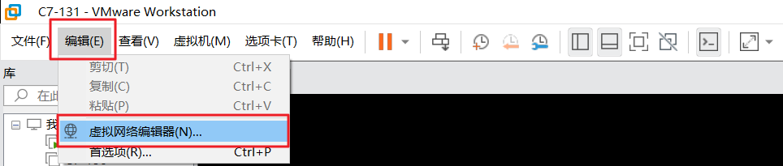
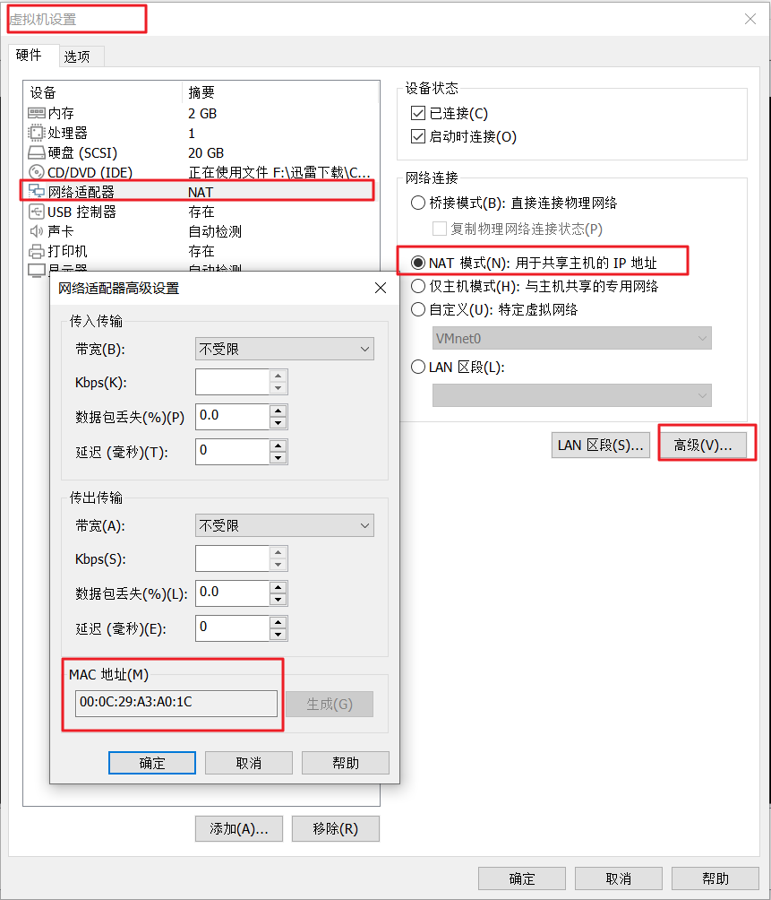

<h1 align="center">Linux配置静态ip地址</h1>


配置Linux静态Ip地址，只需要下列三步骤

1. 配置虚拟网卡
2. 配置vmware
3. 配置静态ip地址


## 配置虚拟网卡


```html
1. 通常，安装完毕VMware，VMnet8虚拟网卡会自动创建如果在网络连接中看不到VMnet8虚拟网卡请自行百度如何添加出来
2. ip地址设置 ： xxx.xxx.xxx.1，例如，这里是192.168.160.1
3. 子网掩码设置：255.255.255.0
4. 默认网关设置：xxx.xxx.xxx.2，例如，这里是192.168.160.2
5. 注意：ip和网关中的xxx.xxx.xxx要保持一致。例如，这里ip和网关都是192.168.160
```


## 配置vmware





```html
子网IP必须参照虚拟网卡中的ip来设置
子网掩码必须和虚拟网卡中的子网掩码一致

子网IP : 输入xxx.xxx.xxx.0,这里的xxx.xxx.xxx要和虚拟网卡中的xxx.xxx.xxx保持一致，例如都是192.168.160
子网掩码 ： 输入255.255.255.0
```

**点击 NAT设置**


```html
网关IP 和 虚拟网卡中的网关保持一致
输入xxx.xxx.xxx.2,这里的xxx.xxx.xxx要和虚拟网卡中的xxx.xxx.xxx保持一致，例如都是192.168.160
```


## 配置静态ip地址


```html
[root@bogon network-scripts]# cat /etc/sysconfig/network-scripts/ifcfg-ens33
TYPE=Ethernet
PROXY_METHOD=none
BROWSER_ONLY=no
BOOTPROTO=static
DEFROUTE=yes
IPV4_FAILURE_FATAL=no
IPV6INIT=yes
IPV6_AUTOCONF=yes
IPV6_DEFROUTE=yes
IPV6_FAILURE_FATAL=no
IPV6_ADDR_GEN_MODE=stable-privacy
NAME=ens33
UUID=73d49c62-7f72-4c27-b868-b52c46c8ee7f
DEVICE=ens33
ONBOOT=yes
IPADDR=192.168.160.160 		//IPADDR取值范围 ： xxx.xxx.xxx.3-254
GATEWAY=192.168.160.2
DNS1=192.168.160.2
HWADDR=00:0C:29:A3:A0:1C   //下图有该值的来源
[root@bogon network-scripts]#
```


HWADDR的来源




最后，重启网络服务即可

```html
[root@bogon network-scripts]# systemctl restart network
```


