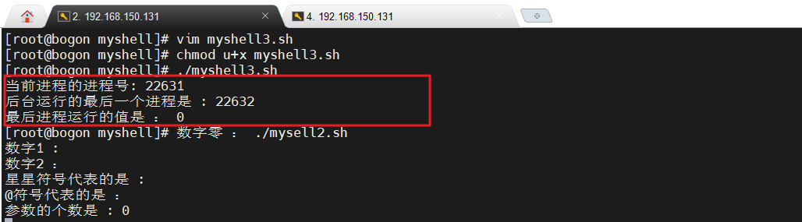

# Linux课件

## 概述

### 操作系统简介

操作系统（operating system，简称OS）是管理[计算机硬件](https://baike.baidu.com/item/计算机硬件/5459592)与[软件](https://baike.baidu.com/item/软件/12053)资源的[计算机程序](https://baike.baidu.com/item/计算机程序/3220205)。操作系统需要处理如管理与[配置](https://baike.baidu.com/item/配置/2394679)[内存](https://baike.baidu.com/item/内存/103614)、决定[系统资源](https://baike.baidu.com/item/系统资源/974435)供需的优先次序、控制[输入设备](https://baike.baidu.com/item/输入设备/10823368)与[输出设备](https://baike.baidu.com/item/输出设备/10823333)、操作网络与管理[文件系统](https://baike.baidu.com/item/文件系统/4827215)等基本事务。操作系统也提供一个让用户与系统[交互](https://baike.baidu.com/item/交互/6964417)操作的界面。


**常见的操作系统**

[iOS](https://baike.baidu.com/item/iOS/45705)是由[苹果公司](https://baike.baidu.com/item/苹果公司/304038)开发的手持设备操作系统。苹果公司于2007年1月9日的Macworld 大会上公布这个系统，以Darwin为基础，属于类Unix 的商业操作系统。最初是设计给 [iPhone](https://baike.baidu.com/item/iPhone/238239) 使用的，后来陆续套用到 [iPod touch](https://baike.baidu.com/item/iPod touch/7424923) 、[iPad](https://baike.baidu.com/item/iPad/9849885) 以及 [Apple TV](https://baike.baidu.com/item/Apple TV/4035034) 等产品上。iOS与苹果的 [Mac OS X](https://baike.baidu.com/item/Mac OS X/470629) 操作系统一样，属于类Unix的商业操作系统。原本这个系统名为 iPhone OS，因为 iPad，iPhone，iPod touch 都使用 iPhone OS，所以 2010 年 WWDC 大会上宣布改名为 iOS（iOS 为美国 Cisco 公司网络设备操作系统注册商标，苹果改名已获得 Cisco 公司授权）。


[Android](https://baike.baidu.com/item/Android/60243)是一种基于Linux的自由及开放源代码的操作系统。主要使用于移动设备，如智能手机和平板电脑，由Google公司和开放手机联盟领导及开发。尚未有统一中文名称，中国大陆地区较多人使用“安卓”。Android操作系统最初由Andy Rubin开发，主要支持手机。2005年8月由Google收购注资。2007年11月，Google与84家硬件制造商、软件开发商及电信营运商组建开放手机联盟共同研发改良Android系统。随后Google以Apache开源许可证的授权方式，发布了Android的源代码。第一部Android智能手机发布于2008年10月。Android逐渐扩展到平板电脑及其他领域上，如电视、数码相机、游戏机、智能手表等。2011年第一季度，Android在全球的市场份额首次超过塞班系统，跃居全球第一。 2013年的第四季度，Android平台手机的全球市场份额已经达到78.1%。2013年09月24日谷歌开发的操作系统Android在迎来了5岁生日，全世界采用这款系统的设备数量已经达到10亿台。


所谓的类Unix家族指的是一族种类繁多的OS，此族包含了[System V](https://baike.baidu.com/item/System V)、[BSD](https://baike.baidu.com/item/BSD)与[Linux](https://baike.baidu.com/item/Linux)。由于Unix是[The Open Group](https://baike.baidu.com/item/The Open Group)的注册商标，特指遵守此公司定义的行为的操作系统。而类Unix通常指的是比原先的Unix包含更多特征的OS。

类Unix系统可在非常多的处理器架构下运行，在[服务器](https://baike.baidu.com/item/服务器)系统上有很高的使用率，例如大专院校或工程应用的[工作站](https://baike.baidu.com/item/工作站)。


[Microsoft Windows](https://baike.baidu.com/item/Microsoft Windows/3304184)系列操作系统是在微软给IBM机器设计的[MS-DOS](https://baike.baidu.com/item/MS-DOS/1120792)的基础上设计的图形操作系统。现在的Windows系统，如Windows 2000、Windows XP皆是创建于现代的[Windows NT](https://baike.baidu.com/item/Windows NT/759962)内核。NT内核是由[OS/2](https://baike.baidu.com/item/OS%2F2/1958699)和[OpenVMS](https://baike.baidu.com/item/OpenVMS/6303004)等系统上借用来的。Windows可以在32位和64位的[Intel](https://baike.baidu.com/item/Intel/125450)和[AMD](https://baike.baidu.com/item/AMD/5905)的处理器上运行，但是早期的版本也可以在[DEC Alpha](https://baike.baidu.com/item/DEC Alpha/828624)、[MIPS](https://baike.baidu.com/item/MIPS/2173143)与[PowerPC](https://baike.baidu.com/item/PowerPC/7381773)架构上运行。

虽然由于人们对于开放源代码操作系统兴趣的提升，Windows的市场占有率有所下降，但是到2004年为止，Windows操作系统在世界范围内占据了桌面操作系统90%的市场。


**macOS**，前称“MacOS X”或“OS X”，是一套运行于苹果[Macintosh](https://baike.baidu.com/item/Macintosh)系列计算机上的操作系统。Mac OS是首个在商用领域成功的[图形用户界面](https://baike.baidu.com/item/图形用户界面)系统。Macintosh开发成员包括比尔·阿特金森（Bill Atkinson）、[杰夫·拉斯金](https://baike.baidu.com/item/杰夫·拉斯金)（Jef Raskin）和安迪·赫茨菲尔德（Andy Hertzfeld）。从OS X 10.8开始在名字中去掉Mac，仅保留OS X和版本号。2016年6月13日在WWDC2016上，苹果公司将OS X更名为macOS，现行的最新的系统版本是13.X，即macOS Ventura。 [11] 


Google Chrome OS是一项Google的轻型的、基于网络的计算机操作系统计划，其基于Google的浏览器[Google Chrome](https://baike.baidu.com/item/Google Chrome)的Linux内核。

2021年6月，华为鸿蒙系统正式亮相，国产操作系统迈出市场化和商业化重要一步。9月30日，面向数字基础设施的开源操作系统欧拉（openEuler）全新发布，与鸿蒙实现内核技术共享。11月9日，华为携手社区全体伙伴共同将欧拉开源操作系统正式捐赠给开放原子开源基金会，以推动操作系统产业快速发展。从服务器操作系统，升级为数字基础设施的操作系统，欧拉能够支持IT、CT、OT等数字基础设施全场景，覆盖服务器、云、边、嵌入式等各种设备形态的需求，更好地满足千行百业数字化转型的需求。 [8] 


### Linux系统简介

Linux内核最初只是由芬兰人林纳斯·托瓦兹（(Linus Torvalds）在赫尔辛基大学上学时出于个人爱好而编写的。

Linux是一套免费使用和自由传播的类Unix操作系统，是一个基于POSIX和UNIX的多用户、多任务、支持多线程和多CPU的操作系统。Linux能运行主要的UNIX工具软件、应用程序和网络协议。它支持32位和64位硬件。Linux继承了Unix以网络为核心的设计思想，是一个性能稳定的多用户网络操作系统。

目前市面上较知名的发行版有:Ubuntu、RedHat、CentOS、Debain、Fedora,SuSE、OpenSUSE。


### Linux和Windows的主要区别


### 虚拟机简介

虚拟机（Virtual Machine）指通过[软件](https://baike.baidu.com/item/软件/12053)模拟的具有完整[硬件](https://baike.baidu.com/item/硬件)系统功能的、运行在一个完全[隔离](https://baike.baidu.com/item/隔离/33079)环境中的完整[计算机系统](https://baike.baidu.com/item/计算机系统/7210959)。在实体计算机中能够完成的工作在虚拟机中都能够实现。在[计算机](https://baike.baidu.com/item/计算机/140338)中创建虚拟机时，需要将实体机的部分硬盘和内存容量作为虚拟机的硬盘和内存容量。每个虚拟机都有独立的[CMOS](https://baike.baidu.com/item/CMOS/428167)、硬盘和[操作系统](https://baike.baidu.com/item/操作系统/192)，可以像使用实体机一样对虚拟机进行操作。


本课程虚拟机我们使用VMware。


### 虚拟机软件安装


### 创建虚拟机


### Linux系统安装


安装引导界面：这里有一个题外话，大家可以看到这个安装引导界面已经是图形界面，比起以前 的纯命令行界面Linux已经是越来越人性化了。这里有五个选项，下面分别对这五个选项做出说明。

1. Install or upgrade an existing system:安装一个新系统或者更新一个现有的系统

2. Install system with basic video driver:用基础的多媒体驱动安装系统;

   第一项和第二项并没有太大区别。第一项会在安装过程中尽可能的驱动多媒体的功能，比如显卡。当使用第一项安装过程出现无法驱动，比如花屏等，则可以使用第二项来安装系统。它使用最基本的多媒体驱动来安装程序。 例如：使用第一项安装，不仅安装显卡驱动，还要让显卡高质量工作 使用第二项安装，则只要让显卡能运行即可，至于分辨率是否清晰则牺牲掉。VGA

3. Rescue installed system:启动救援环境。

   当物理机上的操作系统损坏，甚至无法启动的时候，可以启动营救环境。这是使用一个基于光盘运行的小型linux系统，用这个系统去营救物理机上的操作系统。

4. Boot from local drive:使用本地硬盘启动【跳过光盘引导】

5. Memory test:内存测试，用于检查内存是否可用，是否足够用，硬盘是否有坏道。

**注意：** 实际上Linux的安装程序也是一个小型的Linux系统，它是一个基于光盘运行的小型系统，用这个小型的系统来完成Linux系统的安装过程 所以在跳到下个界面之前，会有一段小小的加载过程一闪而过，注意观看。


这里是一个基于命令行的对话框类型的图形界面，虽然没有Windows做的美观，但是比起来以前已经人性化很多 校验安装光盘，以免安装光盘有问题。实际上这个校验过程耗时漫长，所以一般选择skip，跳过校验，直接安装。


这里可以看到CentOS的全称： Community Enterprise Operating System。 这里可以看出来CentOS是一个诞生于社区的企业版操作系统。 一般来讲社区版就意味着是开源免费，不带任何商业限制的。所以CentOS可以随意使用。 虽然CentOS是拿REDHAT的源代码编译过来的，但是注意REDHAT是注册的自有商标，不可以随意使用。


选择语言：尽量选择英文，因为几乎所有的资料都是英文的，所以要养成使用英文的习惯，会带来很多的方便。


根据自己的使用习惯选择键盘，一般国内都使用美式键盘


这里有两个选项，是用来指定当前Linux系统的安装位置

选择第一个选项： 安装在一个普通PC的服务器上，没有任何的iSCSI设备要驱动。或者是安装在试验机上。

选择第二个选项： 生产情况复杂多变，可能服务器使用iSCSI硬盘，可能服务器上只有系统，而数据则是使用专门的存储设备 甚至极端环境下，操作系统也是安装在存储设备上。大家可以看到第二个选项是当使用SAN存储环境,或者使用FCOE,ISCSI,ZFCP等存储环境的时候选择它。


可以看到检测出来当前硬盘是由VMWARE虚拟出来的一块硬盘，是否抹除所有数据，选择是


Linux并不是用主机名标志唯一的一台主机，所以命名一个有意义的名称即可

这里还可以配置网络，这样在安装过程中就会把网络给配置好。后面会专门学习配置网络，所以这里就不配置了。


时区：国内选择上海。UTC是格林威治时间，所以对勾要勾上，表示统一使用格林威治时间


设置root(超级管理员)用户的密码，学习阶段统一设置成小写的root，免得给忘记密码喽


第一个选项：删除硬盘上所有的数据，并自动重新分区 由于生产环境下肯定对分区有要求，所以，不建议使用该项

第二个选项：删除原来的操作系统，重新安装

第三/四个选项：顾名思义

第五项：自定义分区，选择它


来到分区的界面
Linux中的硬盘都用abc表示数量 ，串口硬盘用sda(第一块硬盘),sdb(第二块硬盘),表示，老式的IDE接口硬盘用HDA(第一块硬盘),HDB(第二块硬盘)表示


交换分区实际上就是虚拟内存，它没有挂载点，只需要把文件系统设置成swap即可。一般设置成物理内存的两倍。 然而这样设置没有任何意义。因为硬盘的运行速度是很慢的，当服务器用到交换分区的时候意味着应该升级内存。 所以在生产环境下，最多把交换分区设置成16G即可，而在实验环境下，我们依然遵守这个约定俗成的规则：设 置成物理内存的两倍。


无论是/boot分区还是/home分区都是挂载在根分区下的，所以没必要将/boot分区和/home分区单独分离出来。 只需要设置交换分区，剩下的全部设置成根分区即可。


Centos6以前是在安装的时候才格式化硬盘，而6以后只要一点地处的格式化按钮就会立刻格式化硬盘，确定无误以后点击格式化。


选择引导程序的安装位置，如果有多块硬盘，可以点击更换设备按钮来确认引导程序的安装位置是否正确 同时下面的选项还可以给引导程序添加密码。引导程序可以进入BIOS更改root用户密码，所以有必要给引导程序设置密码。


Linux的安装光盘通常很大，而安装完毕以后操作系统却没有很大。这是因为光盘中有很多可供选择安装的软件。 本界面就是选择安装操作系统的时候，再安装哪些软件。初学者建议选择桌面环境

Desktop:桌面环境，此项会安装图形化界面，同时安装一般常用的桌面软件，例如浏览器，文本编辑器等

Minimal Desktop:迷你桌面环境，此项只会安装图形化界面

Basic Server:基本服务，只安装基本服务，这个环境下，打开Linux就只有控制台，没有图形化界面

Database Server:数据库服务环境，会安装例如MySQL数据库管理系统

Web Server:Web服务器环境，会安装例如阿帕奇的服务器软件

Virtual Host:虚拟化环境

Software Development Workstation:开发者工作站


检查软件之间的依赖。
开源的精髓是不要重复造轮子。假设你需要一个浏览器，那么你不需要自己写一个浏览器，只需要拿过来使用即可。 在Linux的安装过程中，A软件需要B软件，B软件需要C软件，这种依赖关系Linux会自动解决。而每次安装软件 的时候都会检查这些依赖关系。


安装完毕以后，第一次启动系统会进行一些初始化的设置。


## GNOME图形界面基本操作

​		 GNOME是当前Linux默认的图形化界面，应该说它是一个仿苹果界面的图形界面。当然除了GNOME之外还有例如：KDE等很多其它的图形界面。 

## BASH

### SHELL简介


kernel
		操作系统的内核，它负责所有上层应用所需要的一些基本功能。
		例如底层磁盘读写，网络连接，网络通信，进程调度，内存管理，键盘驱动等。
		由于kernel如此直接操作底层，所以不允许用户直接操作kerner。
		
shell
	shell负责将用户的指令传递并翻译成kernel可以识别的指令。这是shell的功能。所以用户都是给shell打交道。
注意：shell只是一个概念，不同的shell有不同的具体实现。
CLI : Command Line Interface  命令行界面的shell，所有操作通过命令完成，CentOS中的CLI类型的shell是BASH程序
	这是Linux操作系统的主要操作方式。
	GUI : Graphical User Interface  图形界面的shell，普通用户所熟悉的操作方式，通过点击图标,拖拽图标来完成操作。
CentOS中的GUI类型的shell就是GNOME桌面程序

​	当今主流操作系统(Windows,Mac OS, Android)的shell都是GUI的,因为让普通用户操作命令实在太难实现了。当然它们也有
​	基于命令行运行的操作，例如Windows中的CMD,只不过很少被普通用户使用而已。

注意：命令行的方式虽然一开始很别扭，但是熟悉以后会发现命令行界面比图形界面操作效率更高，功能更强大。
		也就是说，凡是图形界面能实现的，命令行界面一定能实现，而命令行界面能实现的，图形界面则不一定（很少）能实现。		
		

### BASH命令行的基本操作

#### 		打开BASH命令行终端

​			应用程序---系统工具---终端
​			实际上该终端是一个运行在图形界面的模拟终端，我们可以在该终端中输入命令来运行，这和真正的命令行界面是没有任何区别的。
​			提供这样一个"窗口"是为了方便开发者在图形界面运行命令。
​		

#### 		BASH的组成部分

​			提示符：	

​		#：符号代表当前登陆用户是超级管理员用户。

​		$ ：符号代表当前登陆用户是普通用户
​			[root@xiaoka ~]	: 登陆用户@登陆主机 当前目录。
​			 所以这里的意思是当前是以root用户登陆到xiaoka主机，当前所在目录是用户家目录（~是用户家目录，以后详解）
​			由于#代表是超级管理员用户，所以root用户就是当前主机的超级管理员用户
​		
​		命令的组成
​			既然Linux系统的主要操作方式是命令行，所以有必要介绍命令的构成
​			格式：命令 选项 参数，其中选项和参数不是必须的。
​		
​		Tab键简化输入
​			按两次Tab键可以看到所以能够运行的命令
​			Tab键可以自动补齐命令
​			Tab键可以自动补齐文件名
​			Tab建不能自动补齐参数
​		
​		历史记录
​			Bash会保存所有的命令历史记录。
​			↑：上一条历史命令，每按一次，获得一个
​			↓：下一条历史命令，每按一次，获得一个
​			history:查看所有命令的历史记录
​		
​		历史记录的简化操作
​			通过history命令可以查看所有命令的历史记录，而通过历史记录则可以简化操作。
​			运行history命令以后
​			!!   :重复前一个命令
​			!字符 :重复前一个以"字符"开头的命令
​			!num :按照历史记录的序号执行命令
​			!?abc:重复之前包含abc的命令
​			!-n  :重复第n个命令（倒数）
​		
​		搜索历史命令
​			CTRL+R可以搜索历史命令，按下以后提示符变成(reverse-i-search)，这个时候输入命令中包含的
​			字符就可以自动匹配出来包含该字母的命令。
​		
​		ESC和点
​			按下ESC以后再按·就可以在当前命令中使用上一个命令中的参数。
​		
​		命令行通配符
​			Bash shell支持通配符
​				*     ： 匹配零个或多个
​				?     : 匹配任意一个字符
​				[0-9] : 匹配一个数字范围
​				[abc] : 匹配列表中的任意一个字符
​	[^abc]: 匹配列表以外的字符
​	
​				命令：ls m* 查看以m开头的目录中的文件
​	​			命令：ls m? 查看以m开头，目录名称是两位的目录中的文件
​	​			命令：ls doc[abc]ment 查看docament,docbment,doccment三个目录中的文件
​	​	
​	​	

### BASH的作业管理

#### 		在后台运行进程

​			在命令后面添加一个&符号即可
​			例如：firefox &
​		

#### 		查看后台运行的作业

​			jobs
​		

#### 		暂停某个程序

​			CTRL+Z,实际上是通过CTRL+Z发送信号17
​		

#### 		结束某个命令的运行

​			CTRL+C
​		

#### 		重新执行后台程序

​			通过bg命令可以让后台暂停的某个进程继续执行。
​			bg  后台命令编号
​		

#### 		将后台命令重新调入前台执行

​			通过fg命令可以让某个在后台运行的命令重新在前台执行
​			fg 后台命令编号

## Linux的文件系统结构

### Linux的文件系统结构

​			Linux文件系统是一个严格的倒转的单根树状结构，所有的类NUIX系统都是这样的一个结构
​			文件系统的根路径是"/"
​			文件系统严格区分大小写,Windows不区分大小写
​			路径使用"/"分割，（Windows中使用"\\"）
​			在Linux中无论是普通的文件还是文件夹都统称为文件，为了区分普通文件和文件夹，你可以刻意的说它是一个普通文件，它是一个目录文件
​			文件的名称大小写敏感，即区分大小写
​			文件名称最多可以为255个字符
​			除了正斜线，都是有效字符
​			以"."开头的文件是隐藏文件


```html
bin:二进制目录，保存所有的常用的可执行的二进制文件，也就是命令。以后所有常用的命令都在bin目录中。每个用户都有权限访问。
boot:引导目录，整个操作系统的引导启动所需要的文件都在该目录中。
				 该目录中最重要的是vmlinuz-x.x.xx-xxx.eix.i868文件，该文件就是操作系统的内核文件。系统启动的时候第一个加载的就是该文件。
				 包括initrd-x.x.xx-xxx.elx.i868.dump.img文件，该文件中保存的是相关的驱动和插件模块。
dev:设备目录，该目录中保存的是计算机中所有的硬件设备，例如硬盘，网卡，显卡等。在Linux中所有的硬件设备都会抽象成一个文件，所以Liunx中一切皆文件。
etc:配置目录，系统中所有的配置都在该目录中，所以该目录中大部分都是.conf结尾的纯文本文件。
home：家目录，Linux中每创建一个用户，都会在home目录中创建一个跟用户名称相同的目录，这个目录就是用户的家目录。该目录用于保存该用户的私有数据，比如用户的桌面，用户的文档等。
lib: 库目录，所有系统运行，程序运行所需要的库文件都保存在该目录下，基本都以.so作文件扩展名。
lost+found:该文件属于文件系统的，每一个ext文件系统中都有这么一个目录。
media:挂载目录，插入的U盘，光盘都会自动挂载在该目录中。但是某些系统中没有该目录。
mnt : 挂载目录，几乎所有的系统都有该目录，用于挂载外接的设备，例如U盘，硬盘，光盘等。
opt:该目录一般是空的，通常用来装一些大型软件，例如oracle等。
proc:它是一个虚拟的目录，用于保存系统的一些实时信息，该目录不存在与硬盘上，它只存在在内存中。所以每次系统启动才会创建。
			该目录下有很多以数字命名的目录，这些数字命名的目录都是系统中的进程，每个目录下保存与该进程相关的信息。			
			用ll命令查看，可以看到所有的文件更新时间几乎和操作系统时间是一致的。
root：超级管理员家目录。由于超级管理员比较特殊，所以超级管理员的家目录直接在根目录下，并没有在home目录中
sbin:二进制目录，存放只有超级管理员root才能执行的命令。普通用户若想执行该目录下的命令，需要具有超级管理员权限。
sys :系统底层相关信息目录，通常包含一些底层硬件的信息。
tmp:临时目录，所有放在tmp目录中的文件都认为是临时的文件，它会定期自动清空。
usr:应用目录，通常将用户自己安装的应用软件放在该目录中。
var:保存一些经常变化的文件，比如系统的log，应用的log，邮件等。
```


### Linux文件基本操作

#### 			列出文件列表

ls(list)是一个非常有用的命令，用来显示当前目录下的内容。配合参数的使用，能以不同的方式显示目录内容
​				格式：ls[参数] [路径或文件名]

ls

ls -a  显示所有文件或目录（包含隐藏的文件）

ls -l  缩写成ll，显示详细信息

ll -h  友好显示文件

ls -R  递归显示子目录结构

ls -ld 显示目录和链接信息
例如： ls Downloads 是显示Downloads目录中所有的文件
	   ls -ld Downloads是显示Downloads目录本身的信息和它的链接信息

#### 显示当前所在目录

​	每一个shell或者系统进程都有一个当前的工作目录，使用pwd命令可以显示当前的工作目录
​	[root@xiaoka ~]pwd

#### 绝对路径与相对路径

​	绝对路径：以"/"开头，递归每级目录，直到目标目录的路径，不受当前所在工作目录限制。
​	相对路径：以当前工作目录为起点，到达目标目录的路径，受当前所在工作目录限制。

#### 切换目录命令

​	cd app	切换到app目录 
​	cd ..	切换到上一层目录 
​	cd /		切换到系统根目录 
​	cd ~		切换到用户主目录 ，~符号可以省略
​	cd -		切换到上一个所在目录

#### 创建/删除目录

​	mkdir(make directory)命令可用来创建目录
​					mkdir app 	在当前目录下创建app目录 
​					mkdir –p app2/test 	级联创建aap2以及test目录
​			

​		​	rmdir(remove directory)命令只能删除"空"目录
​		​		rmdir app  删除app目录


​			

​		​	
​		
**​创建/删除文件**

​		​	touch fileName 创建一个空白的文件
​		​		注意，touch fileName如果文件不存在则创建，如果该文件已经存在那么是更新该文件的时间。
​		​			  所以touch命令不仅可以创建新文件，还可以更新一个已有文件的时间。
​		
​删除文件和目录

​		​	通过rm命令可以删除文件或者目录
​		

i : 交互式删除，删除前会询问是否删除，yes删除，no不删除

f : 强制删除文件，不询问是否删除

r : 级联删除目录 ，不询问是否删除

rm a.txt 删除a.txt文件，询问是否删除
rm -f a.txt 直接删除文件，不询问是否删除
rm -r b 级联删除b目录，不询问
通常把rf参数一起使用，这样无论要删除的是文件还是目录，无论目录中是否有内容，都可以直接删除。
rm -rf filename 直接删除
rm -rf * 删除所有的文件
rm -rf /* 删除根目录下所有文件[慎用]
尝试rm -rfi *命令

#### 查看文件类型

​	file命令可以查看一个文件的类型，该命令可以查看某个文件是普通文件，目录文件，可执行文件等等文件类型。
​	例如：file Downloads 结果：Downloads：directory，说明Downloads是一个目录文件。

#### 复制文件

​	cp，copy的缩写，用来复制文件或者目录的命令。
​	cp a.txt b.txt         将a.txt复制到当前目录中，命名为b.txt文件
​	cp a.txt ../	  		将a.txt文件复制到上一层目录中，名称依然是a.txt
​	cp a.txt ../c.txt 	 将a.txt文件复制到上一层目录中，命名为c.txt文件

#### 复制目录

​	cp命令复制目录的时候需要加参数
​	-r : 递归复制整个目录树
​	-v : 显示复制的详细信息，使用-v参数可以查看整个复制的过程，类似于Windos中复制目录时候点击详细信息。
​		  例如当复制的目录较大，不使用-v参数那么视觉上会让人感觉系统卡顿死机了。

#### 移动或者重命名

​	mv命令用来移动（剪切）或者重命名文件 
​	mv a.txt ../    将a.txt文件移动到上一层目录中(移动但是不重命名)
​	mv a.txt b.txt  将a.txt文件重命名为b.txt(移动并且重命名)
​	mv d /xiaoka/     将目录d移动到/xiaoka/目录中(移动但是不重命名)
​	mv d /xiaoka/c    将目录d移动到/xiaoka/目录中，重命名为c目录(移动且重命名)


#### 文本处理

​			**文件浏览**

​				· cat  : 查看文件内容
​				· more : 以翻页形式查看文件内容(只能向下翻页)
​				· less : 以翻页形式查看文件内容(能上下翻页)
​				· head : 查看文件的前10行(或指定行数)
​				· tail : 查看文件的后10行(或指定行数)
​			
**​			基于关键字进行搜索**
​				命令grep用于基于关键字搜索文本，它最强大的地方是基于正则表达式来搜索文本。
​				格式 ： grep 关键字   目录

grep xiaoka /etc
			

​		常用参数
​			· -i 	在搜索的时候忽略大小写
​			· -n    显示结果所在行数
​			· -v    输出不带关键字的行(取反)
​			· -Ax   输出查询结果所在行之后的x行(包含)
​			· -Bx   输出查询结果所在行之前的x行(包含)
​	
**​	基于列处理文本**
​		cut命令是基于列处理文本内容的命令。
​		常用参数
​			· -d  指定分割字符(默认是TAB)
​			· -f  指定输出的列号
​			· -c  基于字符进行切割


cut -d: -f3 /etc/passwd 	-- 使用冒号作为分割符号分割/etc/passwd文件，显示分割以后的第3行

grep xiaoka /etc/passwd | cut -d: -f3 -- 将grep的结果作为cut命令的参数

cut -c2-6 /etc/passwd  -- 显示/etc/passwd文件的第2-6个字符 

**文本统计**
	wc命令用于统计文本信息
	常见参数
		· -l 只统计行数
		· -w 只统计单词数
		· -c 只统计字节数
		· -m 只统计字符数

wc -l xiaoka  -- 查看xiaoka文件有多少行

wc -l /etc/passwd  -- 查看/etc/passwd文件有多少行，每一行都是一个用户，所以这其实是查看系统中有多少个用户

wc -w xiaoka  --查看xiaoka文件的单词数量

**文本排序**
	sort命令用于对文本内容进行排序，注意，只能基于英文或数字排序
	常见参数
		· -r 进行倒叙排序
		· -n 基于数字进行排序
		· -f 忽略大小写
		· -u 删除重复行
		· -tc 使用c作为分割符号分割，为列进行排序
		· kx 当进行基于指定分割字符分割为列的排序，指定基于那个列排序

sort xiaoka

sort -r xiaoka

sort -n xiaoka

**删除重复行**
	· uniq命令用于删除重复行
	

cat xiaoka | uniq --命令默认只能删除相邻的重复行

sort -u xiaoka  --sort命令删除重复行，不受限制

**文本比较**
	diff命令用于比较两个文件的区别
	常用参数
		· -i 忽略大小写
		· -b 忽略空格数量的变化
		· -u 统一显示比较信息(一般用于生产patch文件)

diff -u xiaoka xiaoka-new > xiaoka.patch

**拼写检查**
	aspell命令用以检查英文拼写

aspell check xiaoka

aspell list < xiaoka

**处理文本内容**
	· 删除关键字

tr -d 'xiaoka' < xiaoka
· 转换大小写

tr 'a-z' 'A-Z' < xiaoka

**搜索替换**
	sed命令用于搜索一个文本中的关键字，并用其它字符给替换

sed 's/linux/xiaoka/g' xiaoka
搜索xiaoka文件，将其中所有的linux替换成xiaoka

sed '1,50s/linux/xiaoka/g' xiaoka 
搜索xiaoka文件，将其中的1-50行中的linux替换成xiaoka


## Vi/Vim文本编辑器

### 			VI编辑器简介

​				vi是一个命令行界面下的文本编辑工具，它最早在1976年由SUN公司的联合创始人Bill Joy开发。
​				当时的名字叫做ex。vi支持绝大多数的操作系统，最早在BSD（一款类UNIX操作系统）上发布，并且功能已经十分强大。
​				vi已经不仅仅是普通意义上的文本编辑器（例如Windows中的记事本就是普通的文本编辑器），而是被广泛的作为在
​				文本编辑，文本处理，代码开发等用途。世界上有一大批狂热的vi粉丝，做什么都用vi。
​				Linux中知名的文本编辑器还有emacs,它的功能比vi还有强大。
​			

### 			Vim编译器简介

​				vi是开源的，在1991年Bram Moolenaar基于vi进行了改进，发布了vim，最大的改变是加入了对GUI的支持。
​				绝大多数的Linux系统上都安装有vim编辑器，vim比vi功能更强大，所以建议大家使用vim，它的用法跟vi是一样的。
​				实际上，即使现在使用vi命令打开vi编辑器，它也是启动的vim编辑器。
​				
​				命令vim可以启动vim编辑器
​				一般通过vim + 目标文件的形式使用vim
​				如果目标文件存在，则用vim打开文件
​				如果目标文件不存在，则用vim创建一个该文件并打开
​			

### 			VIM的三种模式

​				vim拥有三种模式

#### 					命令模式（常规模式）

​						vim启动后，默认进入命令模式，命令模式不能编辑文本，该模式下可以通过键入不同的命令完成选择，复制，粘贴，撤销等操作。

#### 					插入模式

​						在命令模式下按"i"则进入插入模式，在插入模式下才能够编辑文本内容，按ESC键退出到命令模式。

#### 					ex模式

​						该模式也叫底行模式，在命令模式下按:进入底行模式，这个时候光标在底部，用于保存文本或者退出vim。按ESC退出到命令模式。
​			
​			命令模式
​				任何模式下按ESC都会进入命令模式。该模式下的常见操作如下
​			 		i 在光标前前插入文本
​    				I 在当前行首插入文本
​    				a 在光标后插入文本
​    				A 在当前行尾插入文本
​    				o 在当前行的下面插入新行
​    				O 在当前行的上面插入新行
​    				dd 删除整行
​    				yy 将当前行的内容放入缓冲区（复制当前行）
​    				p  将缓冲区中的文本放入光标后(粘贴)
​    				n+yy ： 先按数字n，然后再按yy 将n行的内容放入缓冲区(复制)
​    				u 撤销上一个操作
​    				r 替换当前字符，先按r，再按要输入的字符
​    				/ 查找字符，按/以后输入想要查找的字符，按n键在多个查找结果中切换
​			
​			插入模式
​				插入模式下进行文本的编辑工作。
​			
​			ex模式
​				在命令模式下按:进入ex模式，光标会移动到底部，在这里进行保存修改或者退出操作。
​				w 	保存当前修改
​				q 	退出
​				q! 强制退出，不保存修改
​				x 	保存并退出，相当于wq
​				set number 	显示行号，简写成set nu
​				! 系统命令 	执行一个系统命令并显示结果
​				sh 	切换到命令行，使用CTRL+D切回VIM。
​			
​			注意
​				vim的功能远不止如此，这仅仅是冰山一角，更多功能有待学习。


## Linux的常用命令

### 日期时间命令

Linux系统的主要操作方式是使用命令操作，所以很有必要掌握这些最常用的命令。		 

​			date命令
​				date命令用于查看，设置当前系统时间。

date : 查看当前系统时间

date - u:查看格林威治时间，UTC是格林威治时间，CST是代表中国时间

格式化显示时间
	date +%Y自定义符号%m自定义符号%d 可以用来自己定义显示日期的格式

date +%Y-%m-%d 

date +%Y/%m/%d 


设置系统时间
	date命令使用-s参数可以用来设置系统时间

date -s "23:23:23"


查看硬件时钟时间
	每台计算机的主板上都有一个硬件时钟，用来保存时间，使用hwclock(clock)命令可以查看该时间

hwclock


查看日历
	cal

查看系统运行时间
	uptime,不仅可以看到系统已经运行的时间，还可以看到系统的运行负载

uptime

main uptime


### 输出查看命令

echo命令
				echo命令优点类似于编程语言中的打印语句，它是将输入的内容原封不动的显示出来

echo "xiaozuanfeng"
	

cat命令

cat命令用于查看文件内容

它会直接将文件中所有的内容全部显示出来从上到下显示，直接定格到文件末尾，不支持翻页，只能拖动滚动条。

cat filename 


more命令
	more是只能向下翻页查看文件内容的命令，直接打开第一页，使用空格向下翻页。

more fileName


less命令
	less是可以前后翻页查看文件内容的命令，空格，pagedown,方向键下都是向后翻页，pageup,方向键上是向前翻页。
	按q退出。

less fileName 

q


head命令
	head命令用于显示文件的前n行，默认是10行。

head a.txt  显示a.txt的前10行

head -n 3 a.txt 显示a.txt的前3行（-n是参数，用于指定显示几行）


tail命令
	tail命令用于显示文件的后n行，默认是10行。

tail a.txt 显示a.txt的后10行

tail -n 3 a.txt 显示a.txt的后3行（-n是参数，用于指定显示几行）

-f 参数用于追踪显示文件更新（一般用于查看日志，命令不会退出，而是持续显示新加入的内容）

tail -f a.txt


查看硬件信息
	lspci 用于查看PCI类型的设备，计算机中大部分是PCI类型的设备，例如声卡，网卡。
	-v 查看详细信息

lspci 列出来的每一行都是一个设备信息

lspci -v 


查看USB设备
	lsusb命令可以查看USB设备的信息
	-v 查看详细信息

lsusb

lsusb -v


lsmod命令
	在windows中的驱动程序在linux中叫做模块，lsmod命令可以查看加载的模块

lsmod


### 关机重启命令

shutdown命令
				shutdown命令用于关闭，重启动计算机
				格式：shutdown [关机，重启，休眠] 时间
				-h 关闭计算机
				-r 重新计算机

立即关机 shutdown -h now

10分钟后关机 shutdown -h +10

23:23分关机 shutdown -h 23:23

立即重启	shutdown -r now


关机重启的快捷命令
	poweroff 命令用于立即关机
	reboot 命令用于立即重启


### 归档压缩命令

rar压缩文件是带版权的，zip是不带版权的压缩格式，所以国外很多压缩文档都是.zip的。		 

​			zip压缩命令
​				格式：zip target.zip myfile  将myfile压缩成target.zip文件
​			
​			unzip解压缩命令
​				格式：unzip source.zip 将source.zip文件解压缩
​			
​			gzip命令
​				该命令使用gzip算法压缩文件，一般很少直接使用该命令
​			
​			tar命令
​				tar命令是一个归档命令，它是将多个文件打包到一个文件中，并不是压缩命令，这点要注意。
​				常用参数
​					-c：创建一个新tar文件 	
​					-v：显示运行过程的信息 	
​					-f：指定文件名 	
​					-z：调用gzip压缩命令进行压缩 	
​					-t：查看压缩文件的内容 	
​					-x：解开tar文件
​				格式: tar 参数 文件名 要打包|解压的文件目录
​				常用的组合
​					-cvf :打包一个文件或者目录
​					-zcvf:打包并压缩一个文件或者目录 压缩的格式:gzip
​					-xvf:解压或者打开一个tar文件
​				
​				例如:
​					将当前目录下的所有文件打包成test1.tar，注意，这里并不会对文件进行压缩
​					tar -cvf test1.tar ./* 
​					
​					将当前目录下的所有文件打包并压缩成test2.tar.gz
​					tar -zcvf test2.tar.gz ./*
​					
​					将test1.tar解开到当前目录
​					tar -xvf test1.tar 
​					
​					将test1.tar解开到b目录
​					tar -xvf test1.tar -C b

### 查找命令

locate命令
				用于快速查找文件，文件夹
				locate keyword
				此命令需要预先建立数据库，数据库默认每天更新一次。可用updatedb命令手工建立，更新数据库。

updatedb 如果没有数据库则建立，如果已经有则更新数据库

locate xiaozuanfeng 这样会将操作系统中所有包含xiaozuanfeng的文件查找出来。

find命令
	它用于高级查找文件，文件夹。
	格式：find 查找位置  查找参数
	
	find . -name *xiaozuanfeng* 在当前目录中查找所有文件名中包含xiaozuanfeng的文件（-name参数是基于文件名查找，*是通配符）
	find / -name *.conf 在根目录下查找所有以.conf结尾的文件
	find / -perm 777 查找所有权限是777的文件，注意这里只能用数字
	find . -type d 查找当前目录中所有的目录文件
	
	find命令还可以将查询出来的结果作为某个执行命令的参数
	格式 ：find 查找位置 查找参数 -exec 执行命令 {}\;
	find . -name "a*" -exec ls -l {}\;


​				

​			find命令常用参数
​			-name,-prem,-user,-group,-ctime(基于文件修改时间),-type,-size
​		
​		注意
​			locate 只能通过关键字查找，速度快，实际上它是查询数据库的，缺点是新创建的文件不一定能查找到，必须更新数据库以后才能查找到。
​			find 缺点是查找慢，但是它是在指定位置找出所有符合条件的，能够保证实时性。


## 网络管理

### 网络基础

网络编址

​		互联网中的每一台设备都需要有一个唯一的编号，用来确定它的唯一。这种给网络中的设备命名编号的方法技术就叫做网络编址。
​			
IP编址
​		IP编址是网络编址中最常见的一种编址方法。IP编址是一个双层编址方案，一个IP地址标识一台唯一的主机。
​		现在应用最为广泛的是IPV4编址，随着时代的发展，IPV4的地址池渐渐不够使用，已经逐渐向IPV6编址切换。
​			
注意
​		实际上一个IP地址对应的是一个网卡接口，如果某台设备上有两个网卡，那么这台设备就具有两个IP地址。
​			
IP地址的组成
​		· IPV4的地址长度是32位。那么IPV4的地址总数量则是232 = 4294967296个
​		· IPV6的地址长度是128位。IPV6的地址总数量是 2128 = 3.40282*1038
​		 坊间传说，IPV6可以给地球上的没一粒沙子分配一个IP地址。
​		· 一个IP地址分为两部分：网络部分和主机部分，网络部分长度x和主机部分长度y并不是固定值，只有x+y=32是固定的。
​		网络部分 ： 用来标识所属区域，类似与身份证上的地址
​		主机部分 ： 用来标识该区域中的哪个主机，类似于身份证上的姓名


点分十进制


IPV4是一个长度为32位的二进制数字，总共分为4个部分，每个部分有8位长。
				然而二进制数字记忆实在是太麻烦，所以，将每一部分都转换成十进制，中间使用点分割，这就是点分十进制表示法
			

​		子网掩码
​			子网掩码与IP地址一样，长度是32位，每一位与IP地址中的每一位一一对应。
​			我们通过子网掩码来确定IP地址中的网络部分，除去网络部分，剩下的就是主机部分
​			IP地址中对应子网掩码中为1的部分就是网络部分


由图可知道，当前IP的前24位是网络部分，仅当网络部分相同才能处于同一个网络。
				也就是说与此IP处在同一个网络的其它主机的前24位也是192.168.1.x
			
子网掩码示意图


### 网络配置

​			查看网卡硬件信息
​				在Linux中，以太网接口被命名为eth0,eth1等，0和1代表网卡的编号。
​				· lspci命令可以查看pci类型网卡信息

lspci
			· lsusb命令可以查看usb类型网卡信息

lsusb	
	查看接口信息
		查看接口信息其实就是查看网卡的IP地址，MAC地址等信息
		· ifconfig -a   查看所有接口 
		

​	· ifconfig eth0  查看特定接口

启用/禁用接口
	· ifup eth0     启用接口(网卡)
	· ifdown eth0 禁用接口(网卡)

配置网络
setup
	setup是一个基于命令行的文本界面的配置网络命令，也就是说即使没有安装图形界面，它也可以使用
	纯文本界面下类图形界面的方式来配置网络参数

setup


选择网络配置 ： 这里边是配置IP,子网掩码，网管，DNS服务


如果要专门配置DNS，请选择DNS配置
				设备配置中则可以配置某块网卡所需要的IP,子网掩码，网管，DNS服务


目前只有一块网卡eth0，如果有多个则会都列出来


使用DHCP[*] 代表自动获取IP地址，这种方式一般是家用，它不关心IP地址是多少，只关心能够连接网络即可


手动配置IP等信息
				(1) : 编辑使用DHCP[*] 使用空格键盘在[*] 和 []之间切换，[]状态下表示是配置静态IP地址
				(2) : 配置静态IP地址，自动获取IP地址下IP地址是不固定的，所谓静态IP地址就是该IP地址固定不变
				(3) : 配置子网掩码
				(4) : 配置默认网关，网关一般都是1或者254
				(5) : 配置DNS服务器的IP地址
				(6) : 第二个DNS服务器地址，可以理解成备用DNS服务器，写不写都行
				注意 : 以上六个配置选项并不是必须的，而是根据自己的需求选择性的配置。
					配置完成以后需要使用ifup eth0启动网卡
			

​		网络相关配置文件
​		网卡配置文件
​			每一块网卡在操作系统中都有一个对应的配置文件，里边记录了该网卡的配置信息，它们统一保存在/etc/sysconfig/network-scripts/目录中
​			/etc/sysconfig/network-scripts/ifcfg-eth0 文件记录eth0网卡信息
​			/etc/sysconfig/network-scripts/ifcfg-eth1 文件记录eth1网卡信息
​			依次类推
​		
​		查看网卡配置文件
​			文件中的每一行都代表一个配置信息，直接使用VI编辑器编辑该文件就能修改网络配置信息，它比setup命令复杂，但是支持的配置信息比setup多。
​			也就是说每次启动网卡其实都是读取的该文件中的信息。
​			
​			DEVICE=eth0 	#设备名称
​			TYPE=Ethernet 	#网络类型
​			UUID=55a78e7c-5742-434b-9413-9467c43fcc5d
​			ONBOOT=yes 		#yes系统启动就激活当前网卡，no系统启动不会激活当前网卡
​			NM_CONTROLLED=yes
​			BOOTPROTO=none
​			IPADDR=192.168.200.11 	#IPV4的地址
​			PREFIX=24
​			GATEWAY=192.168.200.2 	#网关的地址
​			DNS1=192.168.1.1 		#主DNS服务的IP地址
​			DNS2=192.168.5.7 		#备用DNS服务的IP地址
​			DEFROUTE=yes
​			IPV4_FAILURE_FATAL=yes
​			IPV6INIT=no
​			NAME="System eth0"
​			HWADDR=00:0c:29:10:24:0f 	#eth0的MAC地址
​			LAST_CONNECT=1451425869
​			USERCTL=no


**实操练习-重要**

配置Linux系统静态ip

```php+HTML
vim /etc/sysconfig/network-scripts/ifcfg-ens33 
```

以下的项必须修改，有值的按照下面的值修改，没有该项的则需要增加。

```html
TYPE="Ethernet" #网络类型（通常是 Ethemet）
PROXY_METHOD="none"
BROWSER_ONLY="no"
BOOTPROTO="static" 			#IP 的配置方法[none|static|bootp|dhcp]（引导时不使用协议|静态分配 IP|BOOTP 协议|DHCP 协议）
DEFROUTE="yes"
IPV4_FAILURE_FATAL="no"
IPV6INIT="yes"
IPV6_AUTOCONF="yes"
IPV6_DEFROUTE="yes"
IPV6_FAILURE_FATAL="no"
IPV6_ADDR_GEN_MODE="stable-privacy"
NAME="ens33"
UUID="e83804c1-3257-4584-81bb-660665ac22f6" 	#随机 id
DEVICE="ens33" 			#接口名（设备,网卡）
ONBOOT="yes" 			#系统启动的时候网络接口是否有效（yes/no）
IPADDR=192.168.10.100	#IP 地址
GATEWAY=192.168.10.2	#网关
DNS1=192.168.10.2	#域名解析器
HWADDR=00:0C:29:A3:A0:1C	#虚拟网卡MAC地址
```

执行 systemctl restart network 命令，重启网络服务。如果报错，则执行“reboot” 命令，重启虚拟机。


​		DNS配置文件
​			/etc/resolv.conf
​			所有的DNS配置信息也会在该文件中保存一份，同样每一行代表一个DNS配置信息
​			同样直接使用VI编辑器编辑该文件也是生效的


Generated by NetworkManager

​				nameserver 192.168.1.1
​			
​		主机名配置文件
​				· hostname  : 查看主机名
​				· hostname xiaoka ：配置主机名称为xiaoka，重启以后失效
​				
​				/etc/sysconfig/network
​				该文件配置了本机的主机名称，直接修改这个配置文件即可修改计算机的主机名称
​				
​				NETWORKING=yes
​				HOSTNAME=wangxiaoka
​			
​			静态主机名配置文件
​				/etc/hosts
​			
​			网络测试命令
​			测试网络联通性
​				· ping 127.0.0.1 -- 直接测试一个IP地址
​				· ping localhost -- 直接测试一个域名
​				
​				该命令可以测试是否能够连接上指定计算机
​			
​			测试DNS解析
​				· host www.wangxiaoka.com
​					该命令返回结果很简单，只要它能够返回值就表示DNS的配置是正确的
​					www.wangxiaoka.com has address  = 127.0.0.1
​				· dig www.wangxiaoka.com
​					该命令比较专业一些，返回的值也比较多
​			
​			显示路由表
​				· ip route 
​				显示路由表，本机环境简单，所以只显示了默认的路由，如果本机还作为路由功能使用，则会显示更多
​			
​			追踪到达目标地址的网络路径
​				· traceroute www.wangxiaoka.com
​				该命令会显示追踪到达目标地址的路由设备，但是有些设备是不允许查看的，所以显示***
​			
​			网络质量测试
​				· mtr www.wangxiaoka.com
​				mtr是一个很好用的命令，它首先可以显示经过的路由设备，其次会动态更新每台设备的丢包率。
​			
​			修改主机名
​			实时修改主机名
​				· hostname wangxiaoka
​				将本机主机名称修改成wangxiaoka，重启终端后终端上显示才生效，重启计算机，主机名称失效。
​				注意，终端上只显示主机名的第一部分，例如wangxiaoka.com则只显示成wangxiaoka
​			
​			永久性修改主机名
​				/etc/sysconfig/network
​				HOSTNAME=wangxiaoka


## 系统管理

### 进程和服务

计算机中，一个正在执行的程序或命令，被叫做“进程”（process）。 

启动之后一只存在、常驻内存的进程，一般被称作“服务”（service）


### 服务管理

**基本语法**

```html
systemctl start | stop | restart | status 服务
```


**查看服务的方法**

```html
在/usr/lib/systemd/system目录中，执行ls -al命令
```


### **实操案例**-防火墙

查看防火墙服务的状态

```html
systemctl status firewalld 
```


临时停止防火墙服务

```html
systemctl stop firewalld 
```


启动防火墙服务 

```html
systemctl start firewalld 
```


重启防火墙服务

```html
systemctl restart firewalld
```


查看防火墙开机启动状态

```html
systemctl enable firewalld.service
```


设置开机时关闭防火墙

```html
systemctl disable firewalld.service
```


### 进程管理

进程是正在执行的一个程序或命令，每一个进程都是一个运行的实体，都有自己的地 址空间，并占用一定的系统资源。

在LINUX中，每个执行的程序（代码）都称为一个进程。每一个进程都分配一个ID号。

每一个进程，都会对应一个父进程，而这个父进程可以复制多个子进程。例如www服务器。

每个进程都可能以两种方式存在的。前台与后台，所谓前台进程就是用户目前的屏幕上可以进行操作的。后台进程则是实际在操作，但由于屏幕上无法着到的进程,通常使用后台方式执行。

一般系统的服务都是以后台进程的方式存在，而且都会常驻在系统中。直到关机才才结束。


**查看进程**

```html
ps
参数
-a	显示当前终端所有进程信息
-u	以用户的格式显示进程信息
-x	显示后台进程运行的参数
```

ps命令结果解释

| 字段 | 说明                   |
| ---- | ---------------------- |
| PID  | 进程编号               |
| TTY  | 终端机号               |
| TIME | 此进程所消耗CUP时间    |
| CMD  | 正在执行的命令或进程名 |


**查看所有进程**

```html
ps -aux
ps -aux | more
```


| 标识     | 说明                                                         |
| -------- | ------------------------------------------------------------ |
| System v | 展示风格                                                     |
| USER     | 用户名称                                                     |
| PID      | 进程号                                                       |
| %CPU     | 进程占用CPU的百分比                                          |
| %MEM     | 进程占用物理内存的百分比                                     |
| VSZ      | 进程占用的虚拟内存大小(单位:KB)                              |
| RSS      | 进程占用的物理内存大小(单位:KB)                              |
| TT       | 终端名称,缩写                                                |
| STAT     | 进程状态(s-表示该进程是会话的先导进程，N-表示进程拥有比普通优先级更低的优先级，R-正在运行，o-短期等待，z-僵死进程，T-被跟踪或者被停止等等) |
| STARTED  | 进程的启动时间                                               |
| TIME     | 进程使用CPU的总时间                                          |
| COMMAND  | 启动进程所用的命令和参数,如果过长会被截断显示                |


**练习：查看init进程**

```html
ps -aux | grep init
```


**查看进程的父进程**

```html
ps -ef	
以全格式显示（BSD风格），当前所有进程
参数
-e	显示所有进程
-f	全格式
```


| 标识  | 说明                                                         |
| ----- | ------------------------------------------------------------ |
| PPID  | 父进程ID                                                     |
| C     | CPu用于计算执行优先级的因子。数值越大，表明进程是CPU密集型运算，执行优先级会降低;数值越小，表明进程是I/O密集型运算，执行优先级会提高 |
| STIME | 进程启动的时间                                               |
| TTY   | 完整的终端名称                                               |
| TIME  | CPU时间                                                      |
| CMD   | 启动进程所用的命令和参数                                     |


**终止进程**

若是某个进程执行一半需要停止时，或是已消了很大的系统资源时，此时可以考虑停止该进程。使用kill命令来完成此项任务。


**基本语法**

```html
kill [选项] 进程号
功能描述 : 通过进程号杀死进程
常用选项:-9:表示强迫进程立即停止
```


```html
killall 进程名称 
功能描述 : 通过进程名称杀死进程，也支持通配符，这在系统因负载过大而变得很慢时很有用
```


**查看进程树**

```html
pstree [选项] 
参数
-p 显示进程的PID
-u 显示进程的所属用户
```


### 服务管理


服务(service)本质就是进程，但是是运行在后台的，通常都会监听某个端口，等待其它程序的请求，比如(mysql , sshd防火墙等)，因此我们又称服务为守护进程，是Linux中非常重要的知识点。

**service管理指令**

```html
service 服务名	start [ stop [ restart [ reload | status
CentOS7以后，service指令被systemctl替换
```


**查看服务的两种方式**

**方式一 ： setup命令**


**方式二 ： /etc/init.d/服务名称**


**修改服务的运行级别**

```html

chkconfig
参数
--list	查看所有的服务的各个运行级别
--level

```


**查看指定服务的运行级别**


**修改sshd服务，在运行级别5关闭**


**查看端口是否被监听**

```html
telnet ip 端口号
```


### 监控服务

top与ps命令很相似。它们都用来显示正在执行的进程。top与ps最大的不同之处，在于top在执行一段时间可以更新正在运行的的进程。


**基本语法**

```html
top 
参数
-d	指定top命令的刷新间隔，默认是3秒
-i	不显示任何闲置或者僵死进程
-p	监控指定进程状态
交互参数
P	以CUP使用率排序
M	以内存使用率排序
N	以PID排序
Q	退出top
```


**应用实例**

1. 监视特定用户
2. 终止指定进程
3. 指定系统更新时间为10秒


**监视特定用户**

输入top命令，回车，按u进入交互模式（不要回车），然后，再输入用户名即可监控特定用户


**终止指定进程**

输入top命令，回车，按k进入交互模式（不要回车），然后，再输入进程的PID即可。


**指定系统更新时间为10秒**

```html
top -d 10
```


**监控网络状态**


**查看系统网络情况**

```html
netstat
-an   按一定顺序排列输出
-p    显示哪个进程在调用
```


**查看所有的网络服务**


**检测主机连接**

```html
ping
```

是一种网络检测检测工具，它主要是用检测远程主机是否正常，或是两部主机间的介质是否为断、网线是否脱落或网卡故障。


## 用户管理

### 用户管理

​			用户的概念
​				所有的操作系统都有用户的机制。当我们使用操作系统的时候，需要以一个用户的身份登陆。
​				在Windows中常见的是自己设置的用户名称或者Administrator，在Linux学习中，大部分人使用root用户。
​				每一个进程也需要以一个用户的身份运行，用户是用来限制使用者或者进程可以访问的资源的。
​			
​			用户的特征
​				(1):每一个用户都有一个唯一的UserID,简称UID.操作系统实际使用的是用户的ID，而非用户名。
​				(2):用户ID为32位,从0开始，但是为了兼容老系统，用户ID限制在60000一下。
​				(3):每一个用户属于一个主组，属于一个或多个附属组。
​				(4):每一个组拥有一个GroupID
​				(5):每一个进程以一个用户身份运行，并受该用户可访问资源的限制
​				(6):每一个可登陆用户拥有一个指定shell。
​				(7):系统中的文件都有一个所属用户及所属组
​			
​			用户的分类
​				(1):超级管理员用户：
​					凡ID为0的用户就是超级管理员用户，用户名称随意，默认名称通常是root，或者Administrator。
​					为了安全原因，生产环境下最好不使用该名称。
​				(2):系统用户(1-499)：
​					系统用户最大的特点是没有shell。我们知道，进程需要以一个用户的身份运行，用户的机制用来限制进程可访问的资源。
​					所以系统服务(进程)也需要一个对应的用户身份来运行，用来限制不同的系统服务可以访问不同的资源。
​					系统用户就是为了这些系统服务(进程)而创建的用户，比如WEB服务，FTP服务，文件共享服务，打印服务等。所以系统用户不需要登陆的shell。
​				(3):普通用户：
​					除了超级管理员和系统用户之外，被创建的其它的用户都属于普通用户。
​				注意：只有超级管理员的ID是强制为0，其它用户的ID都不是强制的，1-499和500以上这两个范围也并不是强制的。
​			
​			
​			用户相关的文件
​				·/etc/passwd
​					该文件是用户文件。所有的用户信息都保存在该文件中。
​					格式：每一行都是一个用户信息，每一行中以冒号作为分割符
​						用户名称:x:用户ID:组ID:用户描述信息:家目录:用户shell路径
​							x:表示用户密码存在shadow文件中。
​							描述信息:对于该用户的一些描述
​							用户shell路径:用户登陆的shell，普通用户一般是/bin/bash，系统用户一般是/nologin表示没有登陆的shell
​				·/etc/shadow
​					该文件是用户的密码文件。所有的用户密码信息都保存在该文件中。
​					格式：每一行都是一个用户的密码信息，每一行中以冒号作为分割符
​						用户名称:用户密码:::::
​						!!:代表该用户没有创建过密码
​						加密的结果由三部分组成，使用$分割。
​							A:数字，不同的数字代表不同的加密算法
​							B:盐
​							C:加密以后的结果
​					注意：没有绝对安全的加密算法，几乎所有的加密都可以使用暴力破解或者穷举法来破解。
​				·/etc/group
​					该文件是用户的组文件，所有的组信息都保存在该文件中。
​					格式：每一行都是一个组信息，每一行中以冒号作为分割符
​						组名称:组密码:组ID:组用户
​			
​			查看登陆的用户
​				(1):whoami
​					显示当前用户
​				(2):who
​					显示有哪些用户已经登陆系统
​				(3):w
​					显示有哪些用户已经登陆系统并且在干什么
​				Linux中有一个不成文的约定：命令越长显示的内容越少，命令越短，显示的内容越多
​			
​			创建用户
​				useradd命令用于创建一个用户
​				格式 : useradd userName

useradd xiaozuanfeng
				

​		这个命令会执行以下操作
​		
​			(1): 在/etc/passwd文件中添加用户信息
​			(2): 如果使用passwd命令创建密码，则将密码保存在/etc/shadow中
​			(3): 为用户建立一个新的家目录/home/userName
​			(4): 将/etc/skel中的文件复制到用户的家目录中
​					/etc/skel中的文件都是用户初始化相关的一些文件
​					.bash_logout : 用户退出所需要执行的命令可以写入该文件
​					.bashrc : 用户登陆时所需要执行的命令可以写入该文件
​			(5): 建立一个与用户名相同的组，新建用户默认属于这个同名组
​	
​	useradd的常见参数
​		· -d 指定用户家目录
​		· -s 指定用户登陆shell
​		· -u 指定用户的ID
​		· -g 指定用户所属主组
​		· -G 指定用户所属附属组，最多31个，用逗号分割
​		也可以通过修改/etc/passwd方式实现，但是不建议
​	
​	修改用户信息
​		命令usermod用来修改用户信息
​		格式 ： usermod 参数 userName
​			参数 ： 
​				· -l 新用户名
​				· -u 新用户ID
​				· -d 用户家目录
​				· -g 用户所属主组
​				· -G 用户所属附属组
​				· -L 锁定用户使其不能登陆
​				· -U 解除锁定
​	
​	删除用户
​		删除用户的命令有两个
​		· userdel userName (保留用户家目录)
​		· userdel -r userName (同时删除用户的家目录)
​	
​	组的概念
​		几乎所有的操作系统都有组的概念，通过组，可以将用户进行分类，管理。
​		通常使用部门，职能，地理区域的分类方式来创建使用组。
​	
​	组的特征
​		(1) 每一个组有一个组ID
​		(2) 组信息保存在/etc/group文件中
​		(3) 每一个用户拥有一个主组，同时还可以拥有最多31个复数组
​	
​	创建组
​		groupadd groupName
​	
​	修改组
​		· groupmod -n newgroupName oldgroupName 修改组名称
​		· groupmod -g newGID oldGID   修改组ID
​	
​	删除组
​		groupdel groupName


​		

​	切换用户
​		su - userName : 切换用户
​		su - : 使用一个新的运行环境(终端)切换到root用户
​		su   : 在当前用户环境中切换到root用户
​			所以在这里exit一下是退到当前用户环境中，
​			而su - 过去以后exit是logout，通过前边的提示符可以看出来区别


​		
​		

​	使用管理员身份来运行命令
​		sudo，当普通用户没有权限执行某个命令的时候，可以在命令前加sudo表示以管理员身份来运行该命令
​		这样可以避免root用户带来的安全隐患。


​		

​	显示当前用户信息
​		id


​		

​	修改当前用户的密码
​		passwd 注意，如果密码太短或者太简单，是不允许的。

### 权限管理

​			权限简介
​				权限是操作系统用来限制对资源访问的一种机制。它具有以下特点
​				(1) 权限分为读，写，执行三种
​				(2) 系统中的每个文件都拥有特定权限，所属用户，所属组，通过这种机制限制特定用户，特定组对特定		文件进行特定的操作
​				(3) 每个进程都以一个用户的身份运行，所以进程的权限与该用户的权限一样。
​			
​			权限的分类


注意：对于目录而言，只拥有r权限是不能够查看其内容的，必须同时拥有rx权限才能够查看目录中有哪些文件和目录。
			

​		查看文件的权限
​			ls -l 命令可以查看目录中文件的详细信息，包括权限信息

ls -l 
			drwxr-xr-- 2 xiaozuanfeng linuxtest 208 Oct 1 23:23 xiaozuanfeng.txt
		

​	Linux中的三种文件类型

​		普通文件： 包括文本文件、数据文件、可执行的二进制程序文件等。 

 		目录文件： Linux系统把目录看成是一种特殊的文件，利用它构成文件系统的树型结构。   

​		设备文件： Linux系统把每一个设备都看成是一个文件
​		

​	文件类型标识
​		普通文件（-） 
​		目录（d） 
​		符号链接（l）

​		*进入etc可以查看，相当于快捷方式 
​		字符设备文件（c） 
​		块设备文件（s） 
​		套接字（s） 
​		命名管道（p）
​	

UGO权限模型
	

	 每一个文件拥有一个所属用户和所属于组
	每一个文件的权限都基于UGO进行设置
	 权限三个一组，总共三组。第一组权限表示U的权限，第二组权限表示G的权限，第三组权限对应O的权限
	
	Linux的权限是基于UGO模型进行控制的：
		U : 代表User,表示文件所属于用户对该文件所拥有的权限
		G : 代表Group,表示文件所属组对该文件拥有的权限
		O : 代表Others,表示除了文件所属用户和所属组之外的的用户对该文件拥有的权限


​	

权限解释


​	

修改文件所属用户
	命令格式：chown userName fileName
			将fileName文件的所属用户修改成userName
	参数 -R : 递归修改目录下所有文件的所属用户

修改文件所属组
	命令格式：chgrp groupName fileName
			将fileName文件的所属组修改成groupName
	参数 -R : 递归修改目录下所有的文件的所属组

修改文件权限
	命令格式 ： chmod model fileName
		model : 
			u,g,o 分别代表用户,组和其它
			+，- 分别代表添加，删除权限
			r w x分别代表读取，写入和执行三个权限
			a 可以指代ugo三者
	示例代码
		chmod u+rw test.txt
		chmod u-r test.txt
		chmod go +rx test.txt
		chmod a-x rest.txt

数字权限

如果使用guo直接添加或者删除权限太麻烦，因此Linux中还可以使用数字来表示权限


0代表没有那个权限
			

​		示例代码
​			chmod 660 test.txt // rw-rw----
​			chmod 755 text.txt // rwxr-xr-x
​		
​		权限练习


默认权限
				每一个终端都有一个umask属性，来确定新建文件，新建目录的默认权限。
				umask使用数字权限方式表示，其值是四位 分别对应 特殊权限 U权限G权限O权限
			

​		查看/设置umask属性值
​			一般，普通用户umask的默认值是002，root用户umask的默认值是022
​			命令umask用来查看当前终端umask属性值

umask
			命令umask 后跟数字则是设置终端的umask属性值

umask 022
	

umask使用
	目录的默认权限是 ： 777 - umask
	文件的默认权限是 ： 666 - umask
	也就是说设置完毕umask属性值以后，就确定了新建文件和新建目录的默认权限。
	新建文件和新建目录默认属于当前用户和当前用户所属主组
	超级管理员不受文件权限限制，也就是说无论该文件权限是怎样的，超级管理员都可以访问和修改。

特殊权限
	除了普通权限外，还有三个特殊权限


which passwd

ls -ld /usr/bin/passwd
可以看到被设置了sid特殊权限的文件，代表可执行权限的x变成了s。
		同样，通常sid也是被设置给可执行的命令文件


## 多命令协作

### 多命令协作

管道及重定向

​			简介
​				在Linux中，大多数命令都很简单，很少出现复杂功能的命令，每个命令往往只实现一个或几个很简单的功能
​				我们可以将不同功能的命令组合在一起，以达到完成某个复杂功能的目的。
​				
​				Linux中几乎所有的命令返回数据都是纯文本的（因为命令都是运行在CLI下），而纯文本形式的数据又是绝大多数
​				命令的输入格式，这就让多命令协作成为可能
​				
​				Linux的命令行为为我们提供了管道和重定向机制，多命令协作就是通过管道和重定向完成的。
​			
​			数据流介绍
​				命令行shell的数据流有以下定义


管道和重定向
		管道和重定向是命令行里边的概念，通过它可以控制CLI的数据流方向，也就是说可以让输入流输出流输出到指定地方，而不是其默认的地方。


示例代码
				-- 如果没有文件则创建，如果有则覆盖文件中的内容

echo "wangxiaoka" > outfile.txt   -- 覆盖操作

cat outfile.txt

ls - l > outfile.txt

cat outfile.txt

echo "wangxiaoka" >> outfile.txt  -- 追加操作
注意 ：命令 ls -l 不存在的文件  > outfile，这个时候会报错
因为> 和 >> 只能将标准输出流中的信息重定向，所以 这个命令不会将错误信息重定向到outfile。
这个错误信息则是使用标准错误流来重定向

ls -l 不存在的文件 2> outfile.txt
命令会正常执行正常输出，但是仅仅将标准错误流中的信息重定向到outfile.txt中。
应用场景 ： 某个命令会有大量的操作，这个时候只想保存里面的错误信息，这个时候可以使用重定向标准错误流来生成日志。
-- 当需要保存正常的输出信息，以及保存其中的错误信息，则可以将标准输出和标准错误结合起来使用

ls -l 2>&1 outfile.txt
-- 重定向标准输入流 ： 将passwd文件作为输入，给命令grep使用 ： 查找/etc/passwd文件中包含xiaoka的行

grep xiaoka < /etc/passwd

管道

ls -l | grep xiaoka
把ls -l的结果作为grep命令的参数 ： 查找包含xiaoka的文件

find / -user xiaoka | grep video 
在根目录中查看xiaohu用户中包含video的文件

find / -user xiaoka 2> /dev/null  | grep video 
在根目录中查找xiaoka用户包含viedo的文件，其中将find命令运行的错误信息重定向到null设备
 null设备相当于垃圾桶，里边的信息会被丢弃

小结
	管道命令通常用来组合不同的命令，以实现一个复杂的功能
	重定向通常用来保存某命令的输出信息或错误信息，可以用来记录执行结果或保存错误信息到一个指定文件


## 任务调度

概述
任务调度:是指系统在某个时间执行的特定的命令或程序。

任务调度分类:

1. 系统工作:有些重要的工作必须周而复始地执行。如病毒扫描等
2. 个别用户工作:个别用户可能希望执行某些程序，比如对mysql数据库的备份。


**基本语法**

```html
crontab
-e			编辑crontab任务
-l			查询crontab任务
-r			终止任务调度
-f			删除当前用户所有的crontab任务

service crond restart 重启任务调度
```


**任务调度快速入门**

1. 设置任务调度文件 /etc/crontab
2. 设置个人任务调度，执行crontab -e 命令
3. 输入任务到调度文件，例如 ： \*/1 \****  ls - l  /etc  >>  /tmp/to.txt（每一分钟都执行一次ls -l /etc  >> /tmp/to.txt命令）

**参数说明**

| 符号    | 含义                 | 范围                  |
| ------- | -------------------- | --------------------- |
| 第一个* | 一小时当中的第几分钟 | 0-59                  |
| 第二个* | 一天当中的第几个小时 | 0-23                  |
| 第三个* | 一月当中的第几天     | 1-31                  |
| 第四个* | 一年当中的第几月     | 1-12                  |
| 第五个* | 一周当中的星期几     | 0-7（0和7都是星期日） |


**实操演练**


这样，每一分钟，都会执行一次ls - l  /etc  >>  /tmp/to.txt命令，可以在/tmp目录中看到to.txt文件每分钟都在发生变化。


**特殊符号说明**

| 特殊符号   | 说明                                                         |
| ---------- | ------------------------------------------------------------ |
| *（星号）  | 代表任何时间，比如第一个“\*"就代表一小时中任何分钟（每分钟）都执行一次的意思。 |
| ，（逗号） | 代表不连续的时间，比如“ 0 8,12,16  * * *  " 命令，就代表在每天的8点0分,12点0分，16点0分都执行一次命令 |
| -（杠）    | 代表连续的时间范围，比如“ 05 * * * 1-6 " 命令,代表在周一到周六的凌晨5点0分执行命令 |
| */n        | 代表每隔多久执行一次，比如"\*/10 \* \* \* \*  " 命令，代表每隔10分钟就执行一遍命令 |


**特定时间执行任务案例**

| 时间         | 含义                                                         |
| ------------ | ------------------------------------------------------------ |
| 45 22 * * *  | 在22点45分执行命令                                           |
| 0 17 * * 1   | 每周1的17点0分执行命令                                       |
| 0 5 1,15 * * | 每月1号和15号的凌晨5点0分执行命令                            |
| 40 4* * 1-5  | 每周一到周五的凌晨4点40分执行命令                            |
| */10 4 * * * | 每天的凌晨4点，每隔10分钟执行一次命令                        |
| 0 0 1,15 * 1 | 每月1号和15号，每周1的0点0分都会执行命令。<br>注意:星期几和几号最好不要同时出现，因为他们定义的都是天。非常容易让管理员混乱。 |


**练习**

案例1:每隔1分钟，将当前的日期信息，追加到/tmp/mydate文件中

1. 编辑任务命令 ： vim /home/mytask1.sh

    

   

2. 修改文件权限 : 给文件添加可执行权限

    

   

3. 添加到任务调度 ： crontab -e

    

   

案例2:每隔1分钟，将当前日期和日历都追加到/home/mycal文件中

案例3:每天凌晨2:00 将mysq1数据库testdb ，备份到文件中。


## 磁盘管理

### 磁盘简介

磁盘，又叫硬盘，是电脑的主要存储媒介之一。由一个或者多个铝制或者玻璃制的碟片组成，碟片外覆盖有铁磁性材料，用于记录数据。
				1956年，IBM的IBM 350RAMAC是现代硬盘的雏形，它相当于两个冰箱的体积，不过其储存容量只有5MB。1973年IBM 3340问世，
				它拥有“温彻斯特”这个绰号，来源于他两个30MB的储存单元，恰是当时出名的“温彻斯特来福枪”的口径和填弹量。至此，硬盘的基本架构就被确立。
				1980年，两位前IBM员工创立的公司开发出5.25英寸规格的5MB硬盘，这是首款面向台式机的产品，而该公司正是希捷（Seagate）公司。


### 磁盘的分类

磁盘的大概分类为如下几种：
					机械硬盘：HDD,英文名称Hard Disk Driver，意思为硬盘驱动器，通常简称硬盘。
					固态硬盘：SSD,英文名称Solid State Disk,字面意思就是固态硬盘，简称固盘。
					混合硬盘：一种基于传统的机械硬盘诞生出来的新硬盘。


### 磁盘的基本概念

#### 磁道

​				当磁盘旋转时，磁头若保持在一个位置上，则每个磁头都会在磁盘表面划出一个圆形轨迹，这些圆形轨		迹就叫做磁道。
​				这些磁道用肉眼是根本看不到的，因为它们仅是盘面上以特殊方式磁化了的一些磁化区，磁盘上的信息		便是沿着这样的轨道存放的。
​				硬盘上的磁道有成千上万，磁道的磁化方式一般由磁头迅速切换正负极改变磁道所代表的0和1。
​				上图中的7个黑色同心圆，每一个同心圆都代表1条磁道，我们可以看到第3条磁道我们刻意进行加粗并分		颜色，用来阐述其它概念。			
​			

#### 			扇区

​				磁盘上的每个磁道被等分为若干个弧段，这些弧段便是磁盘的扇区，每个扇区可以存放512个字节的信		息，磁盘在向磁盘读取和写入数据时，要以扇区为单位。
​				上图中将每一张磁盘分为12个弧段，第三条磁道的蓝色部分就代表一个扇区。
​			

#### 			扇区簇

​				操作系统将相邻的一组扇区作为一个整体管理，这个就是扇区簇。
​				文件系统是操作系统与硬盘之间的接口，当操作系统请求从硬盘里读取一个文件时，会请求相应的文件		系统（FAT 16/32/NTFS）打开文件。
​				扇区是磁盘最小的物理存储单元，但由于操作系统无法对数目众多的扇区进行寻址，所以操作系统就将		相邻的扇区组合在一起，形成一个簇，然后再对簇进行管理。
​				每个簇可以包括2、4、8、16、32或64个扇区。显然，簇是操作系统所使用的逻辑概念，而非磁盘的物		理特性。
​				为了更好地管理磁盘空间和更高效地从硬盘读取数据，操作系统规定一个簇中只能放置一个文件的内		容，因此文件所占用的空间，只能是簇的整数倍；
​				而如果文件实际大小小于一簇，它也要占一簇的空间。所以，一般情况下文件所占空间要略大于文件的		实际大小，
​				只有在少数情况下，即文件的实际大小恰好是簇的整数倍时，文件的实际大小才会与所占空间完全一		致。
​				上图中第三条磁道的红色部分就代表一个扇区簇。
​			

#### 			柱面

​				英文名称Cylinder。硬盘通常由重叠的一组盘片构成，每个盘面都被划分为数目相等的磁道，并从外缘		的“0”开始编号，具有相同编号的磁道形成一个圆柱，称之为磁盘的柱面。
​				磁盘的柱面数与一个盘单面上的磁道数是相等的。
​				上图中有三张盘片，磁道有7个，所以总共有7个柱面。

#### 			硬盘的容量

​				硬盘的容量=柱面数*磁头数*扇区数*512Byte。
​				
​				磁头数：磁头用来读取硬盘中的数据，一块硬盘中有多个盘片，每个盘片可以有多个磁头。

### 磁盘在Linux中的表示

Linux中所有的设备都被抽象成一个文件，保存在/dev目录中。
				设备名称一般是Hd[a-z]或者是sd[a-z],其中[a-z]代表的是第几块硬盘。
				IDE设备的名称是hd[a-z],SATA,SCSI,SAS,USB等设备的名称是sd[a-z]。

​			第一块硬盘 hda / sda
​			第二块硬盘 hdb / sdb
​			第三块硬盘 hdc / sdc

### 分区的概念

分区是将一个完整的硬盘进行逻辑上的分区。每个区当作独立磁盘，以方便使用和管理。
				注意，分区并不是硬盘的物理功能，而是一种软件功能。常见的分区软件有Fdisk,PQ Magic,DM等。

### 分区的表示

不同的分区用 ： 设备编号 + 分区号来表示，例如sda1,sda2等。


主流的分区机制有MBR和GPT两种。

### MBR分区机制

MBR，英文全称Master Boot Record，中文含义主引导记录。它是传统的分区机制，应用于绝大多数使用BIOS（基本输入输出系统）的PC设备。
		MBR是位于磁盘最前边的一段引导（Loader）代码。它负责磁盘操作系统(DOS)对磁盘进行读写时分区合法性的判别、分区引导信息的定位，
		它由磁盘操作系统(DOS)在对硬盘进行初始化时产生的。
				

​		MBR扇区位于物理硬盘的0柱面，0磁头，1扇区，也就是整个硬盘的第一个扇区，共占512个字节（即一个扇区），每个物理硬盘只有一个MBR扇区。

### MBR的特点

MBR支持32bit和64bit系统
				MBR支持的分区数量有限
				MBR支持不超过2T的硬盘，超过2T的硬盘只能使用2T空间（有第三方解决方案）。

### MBR的结构

MBR扇区由三部分构成：
		第一部分是446字节的引导代码，也就是上面提到的MBR；
		第二部分是DPT（Disk Partition Table，硬盘分区表），包含4个表项，每个表项16字节，共占用64字节；
		第三部分是2个字节的结束标志，0x55AA。注意，这两个字节标志MBR结束，其里边的数字含义是启动标志。
		所有可启动的设备的第一个512字节的最后两个字节永远是55AA,如果硬盘完好无损，但是这两个字节的数据不是55AA，那么硬盘也不会被启动，因为BIOS根本无法识别。


### DBR

分区引导扇区也称DBR（DOS BOOT RECORD），是由FORMAT高级格式化命令写到该扇区的内容，DBR是由硬盘的MBR装载的程序段。
	DBR装入内存后，即开始执行该引导程序段，其主要功能是完成操作系统的自举并将控制权交给操作系统。
	每个分区都有引导扇区，但只有被设为活动分区才会被MBR装的DBR入内存运行。

​	在对硬盘分区之后，每一个分区均有一个DBR与之对应。DBR位于每个分区的第一个扇区，大小为512字节。

​	DBR的结构与分区格式有关，NTFS与FAT32的DBR格式是不同的。

### EBR

EBR（Extended Boot Record）是与MBR相对应的一个概念。前边已经讲过，MBR里有一个DPT(Disk Partition Table，磁盘分区表)的区域，它一共是64字节，按每16个字节作为一个分区表项，它最多只能容纳4个分区。
能够在MBR的DPT里进行说明的分区称为主分区。
如果我们想分区多于4个的时候，MBR的DPT里就会容纳不下来，于是微软就想出了另一个解决方案，在MBR里，只放不多于三个主分区，剩下的分区，则由与MBR结构很相像的另一种分区结构（EBR，也就是扩展分区引导记录）进行说明。
一个EBR不够用时，可以增加另一个EBR，如此像一根链条一样地接下去，直到够用为止。

实际上，EBR中有用的部分仅为其DPT的前两个表项，第一个表项记录了扩展分区中该EBR对应的逻辑分区(逻辑驱动器)的偏移地址和扇区个数，第二个表项记录了下一个逻辑分区的必要信息，本质上是一个链表的结点。

### MBR分区

主分区：最多只能创建四个主分区，因为MBR分区机制中硬盘分区表只有四项。
				扩展分区：一个扩展分区会占用一个主分区位置，注意扩展分区不能够直接使用。
				逻辑分区：扩展分区不能够使用，在扩展分区内部创建逻辑分区，逻辑分区就是最终可以使用的分区。
						 Linux最多支持63个IDE分区和15个SCSI分区。


​				灰色：代表一块物理硬盘，有一个
​				蓝色：代表一个主分区，有3个
​				黄色：代表一个扩展分区，有1个
​				绿色：代表一个逻辑分区，有多个

### GPT

GPT(GUID Partition Table)是一个较新的分区机制，解决了MBR的许多缺点。
				
GPT的特点
				支持超过2T的硬盘，虽然GPT支持的容量也有限度，但是这是一个非常大的数字，可以理解成"无限制"，虽然GPT无限制，但是可能操作系统又会有限制，比如Windows系统就只支持128个分区。
				向后兼容MBR
				必须在支持UEFI的硬件上才能使用
				必须使用64位操作系统

### FDISK分区工具

#### FDISK简介

​				fdisk是来自IBM的老牌分区工具，支持绝大多数操作系统，几乎所有的Linux发行版本都装有fdisk
​				包括在Linux的rescue模式下依然能够使用。
​			
​				注意：fdisk是一个基于MBR的分区工具，如果需要使用GPT，则无法使用fdisk进行分区。
​			
​			在这之前请新加入一块虚拟硬盘sdb

#### fdisk -l

​				该命令用于列出所有硬盘的所有分区信息


#### 开始分区

​				fdisk 目标硬盘 就可以直接对目标硬盘进行分区

fdisk sdb
			
			[root@wangxiaoka ~]# fdisk /dev/sdb
			Device contains neither a valid DOS partition table, nor Sun, SGI or OSF disklabel
			Building a new DOS disklabel with disk identifier 0x2521c707.
			Changes will remain in memory only, until you decide to write them.
			After that, of course, the previous content won't be recoverable.

​			Warning: invalid flag 0x0000 of partition table 4 will be corrected by w(rite)

​			WARNING: DOS-compatible mode is deprecated. It's strongly recommended to
​         			switch off the mode (command 'c') and change display units to
​         			sectors (command 'u').

​			Command (m for help):
​			我们输入m查看帮助信息
​		
​		帮助信息
​			
​			Command (m for help): m
​			Command action
​			   a   toggle a bootable flag
​			   b   edit bsd disklabel
​			   c   toggle the dos compatibility flag
​			   d   delete a partition
​			   l   list known partition types
​			   m   print this menu
​			   n   add a new partition (添加一个新的分区)
​			   o   create a new empty DOS partition table
​			   p   print the partition table （查看当前分区信息）
​			   q   quit without saving changes 
​			   s   create a new empty Sun disklabel
​			   t   change a partition's system id （更给分区id：更新分区的类型）
​			   u   change display/entry units
​			   v   verify the partition table
​			   w   write table to disk and exit （将分区信息写入磁盘并退出）
​			   x   extra functionality (experts only)
​			Command (m for help): 
​			
​			用户可以根据帮助信息选择输入指令，例如p,n，等。
​		
​		查看当前分区信息
​			Command (m for help): p


目前sdb硬盘中没有分区信息，所以看不到分区信息，只能看到它的设备信息。


**添加主分区**


**添加主分区**


​						1：指定添加的分区号，我们创建的是第一个主分区，所以输入1 			

​						2：指定分区的开始柱面号，我们的硬盘最有有2610个柱面，所以范围是1-2610，默认值是1 			

​						3：指定分区的结束柱面号，我们知道容量=磁头*扇区数量*柱面数量*512，所以指定起使柱面号以后就知道分区的大小了，

​							然而这样太麻烦，我们可以直接通过+数字大小单位这种格式来指定分区大小，免除计算的麻烦。这里输入 +2G，

​							那么当前分区的容量就是2G。

​						注意：图中的1、2、3、是为了方便阅读理解刻意在图中标注出来的，实际运行中并没有123的提示。


**添加扩展分区**


分区号：填入2，因为1号已经被使用 			

起使柱面：1号分区当时没有任何柱面被使用，所以可以从1号柱面开始使用，指定2G大小以后，自动计算出来所需要的 					柱面范围是1-262，所以第2个分区只能从263开始使用，不输入值则认为使用默认值 			

结束柱面：我们依然不输入值，意味着使用默认值2610 			所以我们sdb目前的分区是1个主分区2G，剩下所有空间给了2号扩展分区。


**添加逻辑分区**


扩展分区是不能够使用的，要在扩展分区中创建逻辑分区，逻辑分区才是可以使用的分区。

再次添加分区，可以发现扩展分区选项已经没有了，只能选择添加逻辑分区或者主分区 			

注意：因为1-4是主分区号中的，所以逻辑分区号永远从5开始，可以更高。 			

起使柱面：不输入，使用默认值263 			

结束柱面：我们选择+2G，也就是说创建一个2G的逻辑分区 			

逻辑分区创建完毕。 			

注意：创建分区没必要按照教材严格执行，而是根据自己的需求创建多个主分区，多个扩展分区，多个逻辑分区 			

硬盘中也不是所有空间都必须进行分区。


**写入分区信息**

注意：以上做的操作并没有写入到硬盘中，必须指定w指令才会将以上分区信息写入硬盘。 			

Command (m for help): w 			

拓展：可以调用t指令来修改分区的类型，输入t以后，可以通过输入L来看每一个分区ID号所对应的分区类型。 


**更新分区信息**

分区以后，如果系统没有更新分区信息，可以调用partprobe命令让内核更新分区信息。否则需要重启计算机。 			

也可以通过/proc/partitons文件来查看分区信息。

因为/proc/中都是系统实时信息文件。 			

cat /proc/partitions 			

ls /dev/sd*


### 文件系统

#### 文件系统简介

​				操作系统通过文件系统管理文件和数据，磁盘或者分区需要创建文件系统以后才能为操作系统所使用。
​				创建文件系统的过程又称之为格式化。
​			

​		常见的文件系统
​			fat32、NTFS、ext2、ext3、ext4、xfs、HFS等。各个文件系统在日志，支持的分区大小，支持的单个文件大小，性能方面都有差异。
​			没有创建文件系统的设备称之为裸（raw）设备。
​			某些应用场景下，比如数据库，让文件系统管理文件可能性能耕地，所以会在裸设备中按照数据库，让数据库来管理文件。
​			Windows下主流的文件系统是NTFS
​			Linux下主流的文件系统是ext2,ext3。


​		Linux支持的文件系统
​			· ext2 	· nfs 
​			· ext3 	· iso9660
​			· ext4 	· proc
​			· fat 	· gfs
​			· vfat 	· jfs
​			支持但是不限于以上文件系统，如果要读取NTFS文件系统，则需要单独安装驱动。


​		MKE2FS
​			该命令用来给目标分区创建文件系统。
​			格式：mke2fs -t 文件系统名称 目标分区

mke2fs -t ext4 /dev/sdb1


​		常见参数
​			-b blockSize : 指定文件系统块大小，该值是指定操作系统每次读取的最小单位
​			-c 			 : 建立文件系统时检查损坏
​			-L label 	 : 指定卷标（c:系统，d:工作，e:娱乐，系统，工作，娱乐这就是卷标）
​			-j 			 : 建立文件系统日志。ext3,ext4是默认带日志的文件系统，不需要指定该参数


​		E2LABEL
​			mke2fs命令的L参数是在创建文件系统的时候给分区指定卷标，而e2label命令则可以为已经创建文件系统的分区
​			指定卷标。

e2label /dev/sdb1 查看sdb1分区的卷标

e2label /dev/sdb1 yule 指定sdb1分区的卷标是yule。


​		MKFS
​			命令MKFS也可用于创建文件系统，相对于mke2fs更简单，但是支持的参数较少，不能够进行精细化的控制。
​			通常我们也不会修改文件系统的参数，所以该命令用的更多点。
​			mkfs命令带了很多子命令，相当于快捷方式，只需要运行对应的子命令就可以创建对应的文件系统。

mkfs. 查看子命令

mkfs.ext3 /dev/sdb2

mkfs.ext4 /dev/sdb5

mkfs.vfat /dev/sdb6


​		DUMPE2FS
​			该命令用来查看指定分区的文件系统信息。
​			格式 : dumpe2fs /dev/sdb1
​			该命令输出很多内容，当需要对文件系统进行优化，进行微调的时候首先应该进行查看工作。


​		JOURANAL日志
​			带日志的文件系统（ext3,ext4）拥有较强的稳定行，在出现错误的时候可以进行恢复。
​			使用带日志的文件系统，文件系统会进行一个"两阶段提交"的方式进行磁盘操作，当进行磁盘操作时，文件系统会进行一下操作：
​			（1）：文件系统将准备执行的事务的具体内容写入日志
​			（2）：文件系统进行操作
​			（3）：操作成功后，将事务的具体内容从日志中删除
​			这样的好处是如果出现意外，例如断电或者磁盘故障，可以通过查询日志进行恢复操纵。缺点是额外的读写日志会丧失一定的性能。


​		FSCK
​			该命令用来检查并修复损坏的文件系统
​			格式：fsck 目标分区

fsck /dev/sdb1
		(1):使用-y参数不提示直接进行修复
		(2):默认fsck会自动判断文件系统类型，如果文件系统损坏较严重，请使用-t 参数指定文件系统类型
			fsck -t ext4 /dev/sdb1
		(3):对于识别为损坏文件的数据(文件系统无记录)，fsck会将该文件放入lost+found目录。
		(4):系统启动时会对磁盘进行fsck操作。

### 挂载/卸载分区

#### 挂载的概念

​				磁盘或者分区创建好文件系统以后，仍然不能够直接使用，它需要被挂载在某个目录下才能够被使用。
​				并不是Linux中独有挂载的操作，而是Windows和Mac系统会自动进行挂载的操作。例如你插入一个
​				写好文件系统的U盘（格式化），会自动弹出一个E盘或者H盘，这就是自动挂载哟。
​				Linux下需要手工进行挂载的操作，或者配置系统进行自动挂载。通常挂载在mnt目录下。
​				还记得安装Linux系统进行分区的操作吗？
​				我们是将根分区挂载在根目录中，交换分区挂载在交换目录下。
​			
​			MOUNT
​				在Linux中，通过MOUNT命令将格式化好的分区挂载到一个目录上。
​				格式 ：MOUNT 目标分区  挂载点
​				常用参数
​					-t : 指定要挂载分区的文件系统类型
​					-o : 指定挂载选项
​						(1): ro,rw 以只读/读写形式挂载，默认是rw
​						(2): sync 代表不使用缓存，而是对所有操作直接写入磁盘
​						(3): async 代表使用缓存，默认是sync
​						(4): noatime 每次访问文件时不更新文件访问时间
​						(5): atime 每次访问文件时更新文件访问时间
​						(6): remount 重新挂载文件系统
​			
​			示例代码

mount  显示所有已经挂载的文件系统

mount /dev/sdb1 /mnt 将sdb1分区挂载到/mnt目录

mount -o remount,ro,async /mnt 将sdb1以只读，不使用缓存的方式重新挂载到/mnt目录


UMOUNT
	该命令用来卸载已经挂载的分区，相当于Windows中的弹出设备。
	格式 ： umount 文件系统|挂载点

umount /dev/sdb3  == umount /mnt
如果出现device is busy 报警，则表示该文件系统正在被使用，无法卸载。

fuser
	fuser -m /mnt 查看使用文件系统的进程

lsof
	lsof /mnt 查看正在被使用的文件

自动挂载
	配置文件/etc/fstab用来定义需要自动挂载的文件系统，在fstab文件中，每一行都代表一个挂载配置，格式如下：
	需要挂载的设备		挂载点	文件系统		挂载选项		dump,fsck相关选项
	

	/dev/sdb1 		/mnt 	ext4 		noatime,rw 	0 0
	
	其中挂载选项那里可以写默认default
	dump,fsck相关现象就写0 0 
	要挂载的设备也可以用卷标来识别，使用LABEL=yule取代/dev/sdb1
	mount -a 命令去挂载所有fstab中定义的自动挂载项


## RPM软件包管理


rpm包的管理介绍:

一种用于互联网下载包的打包及安装工具，它包含在某些Linux分发版中。它生成具有.RPM扩展名的文件，类似windows的setup.exe。

RPM是RedHat Package Manager (RedHat软件包管理工中具）的缩写，，这一文件格式名称虽然打上了RedHat的标志,但理念是通用的。

Linux的分发版本都有采用(suse,redhat,centos等等），可以算是公认的行业标|准了。


### 相关指令


**rpm包名基本格式 ：** 


**相关说明 ：**

| 部分       | 说明                                                         |
| ---------- | ------------------------------------------------------------ |
| firefox    | rpm包名称                                                    |
| 68.10.0-1  | 版本号                                                       |
| el7.centos | EL是Red Hat Enterprise Linux（EL），即红帽企业版的缩写,7就表示Red Hat 7.x，CentOS 7.x版本 |
| i686/i386  | 适用于32位操作系统                                           |
| 86_64      | 适用于64位操作系统                                           |
| noarch     | 64位/32位通用(图中没有这个标识，以后你会遇到的)              |
| aarch64    | 适用于ARM架构                                                |


到这里，大家对Linux下RPM包名称中的各个部分就清楚了。

但是需要注意的是，linux版本众多。所以同样的软件也会有非常多的名字，大家一定去自己相关的Linux版本中去选择该软件包。

例如这里的是CentOS 7的。


**查询所有已安装rpm包列表**

```
rpm -qa
参数解释 ：
q : query
a :	all
```


```html
rpm -qa | more
```


**查询指定rpm包**

```html
rpm -qa | grep 软件包名称
```


**查看rpm软件包是否已安装**

```
rpm -q 软件包名称
```


**查看rpm软件包信息**

```
rpm -qi 软件包名称
```


**查看rpm软件包中的文件**

```html
rpm -ql 软件包名称

应用场景 ： 假如你忘记了当初firefox安装在哪里了，现在想知道firefox都安装了哪些文件，并且安装在了哪个目录中，那么就可以使用该命令来查看
rpm -ql firefox
```


**查看当前文件所属的rpm包**

```html
rpm -qf 文件路径

应用场景 ： 假如你现在想删除aaa.conf文件，但是你又忘记了它属于哪个安装包的，那么就可以使用该命令查看aaa.conf属于哪个软件包
rmp -qf 绝对路径/aaa.conf

```


**安装rmp包**

```html
rpm -ivh RPM包全路径名称
参数解释 ： 
i	:	install安装
v	:	verbose提示
h	:	hash进度条
```


**实操 ： 安装firefox**

1. 下载firefox的rpm包，上传到/opt目录中
2. 进入/opt目录
3. 执行安装命令


注意 ： 很多同学照着操作可能会安装失败，这是因为Linux中很多时候安装A软件要先安装A依赖的B,C,D...等软件,这些依赖软件不**先安装**就会安装失败。


解决方案有三种 ： 

1. 根据安装失败的提示，一各个下载，上传，安装需要的依赖，最后再安装目标rpm包(例如火狐) ，强烈不推荐

2. 使用yum按照，强烈推荐该形式，需要能够连接网络，后续课程介绍

3. 挂载完整的ISO镜像（通常3-5个G那么大），那个镜像文件中通常会有常用的rmp包以及它需要依赖的rmp包，安装的时候，会自动把相关依赖也安装进来，没办法连接网络的时候推荐。但是如果镜像中也缺少需要的依赖，那么同样会安装失败（xxxx is needed by yyy）

   1. 挂载镜像文件，挂载在/media目录

      将镜像文件上传到/opt目录中，然后执行挂载命令

      

      

   2. 去meida/packages目录中复制firefox的rpm包到/opt目录中，rmp包在镜像文件的packages目录中

      

      

      

   3. 执行安装命令即可

      


**卸载rpm包**

```html
rpm -e rpm 包名称
```


**实操 ： 卸载firefox**


注意 ：

如果其它软件包依赖于您要卸载的软件包，卸载时则会产生错误信息。

例如卸载foo软件包: $ rpm  -e  foo
removing these packages would break dependencies:foo is needed by bar-1.0-1

如果我们就是要删除 foo这个rpm包，可以增加参数--nodeps ,就可以强制删除，但是一般不推荐这样做，因为依赖于该软件包的程序可能无法运行
例如: rpm -e --nodeps foo


## YUM软件管理

Yum是一个shell前端软件包管理器。基于RPM包管理，能够从指定的服务器自动下载RPM包并且安装，自动处理依赖性关系，并且一次安装所有依赖的软件包。所以使用yum形式安装的依然是rpm包，所以使用yum形式安装需要连接网络。

yum形式类似于现在的 应用市场或者AppStore了，安装起来非常方便。


### 相关指令


**查询yum服务器是否有需要安装的软件**

```html
yum list | grep rpm包名称
```


**安装指定yum包**

```html
yum install rpm包名称（默认安装最新版本）
```


### 在Linux/CentOS 7中安装JDK

```html
https://blog.csdn.net/fishgeneral/article/details/125320254?spm=1001.2014.3001.5501
```


### 在Linux/CentOS 7中安装Tomcat

```html
https://blog.csdn.net/fishgeneral/article/details/125321314?spm=1001.2014.3001.5501
```


### 在Linux/CentOS 7中安装MySQL

```html
https://blog.csdn.net/fishgeneral/article/details/125717931?spm=1001.2014.3001.5501
```


## Linux系统启动详解


### BIOS

BlOS (Basic Input Output System)我们称之为基本输入输出系统，一般保存在主板上的BIOS芯片中。
计算机启动的时候第一个运行的就是BIOS，BIOS负责检查硬件并且查找可启动设备.
可启动设备在BlOS设置中进行定义，如USB、CDROM、HD等或者通过网络启动。


而可启动设备之前在磁盘管理章节讲过了 ： 

使用MBR分区机制的可启动设备 ： 第一个512个字节中，前446个字节是引导代码，最后两个字节是55AA。BIOS就是通过55AA这个标识来识别当前设备是否是可启动设备。


而如果底层使用的UEFI的硬件，那么就支持GPT的分区机制了。


### **CRUB**

在硬盘的446字节中存放的引导程序，用来寻找真正的引导程序，真正负责系统引导启动的，是CRUB，硬盘的446字节只负责寻找到它——CRUB.

Grub是现在Linux使用的主流引导程序,Windows中的引导程序是NTLDR.

可以用来引导现在几乎所有的操作系统

Grub的相关文件保存在/boot/grub目录中

Grub配置文件为/boot/grublgrub.conf


### KERNEL

MBR的引导代码将负责找到并加载Linux内核

Linux内核保存在/bootIvmlinuz-2.6.32-279.el6.i686

一般还会加载内核模块打包文件︰/bootlinitramfs-2.6.32-279.el6.686.img

Linux为何保持kernel的精简?

​	将一些不常用的驱动、功能编译成为模块,在需要的时候动态加载,而这些模块被打包保存为一个initramfs文件。·

​	早期版本Linux使用initrd文件, initramfs是initrd的替代优化版本,比initrd更加节省空间、更加灵活。

命今dmesg可以查看本次启动时内核的输出信息


### INIT

init是Linux系统中运行的第一个进程，它是所有进程的父进程，一直处于运行状态，直到系统关机。

调用/etc/rc.d/rc.sysinit负责对系统进行初始化，挂载文件系统，并且根据运行级别启动相应服务.

**Linux运行级别︰**

- 0关机
- 1单用户模式
- 2不带网络的多用户模式
- 3多用户模式
- 4未使用
- 5XII图形化模式
- 6重新启动


运行级别3和5没有任何其它区别，唯一的区别就是5启动了图形化界面。


```html
可以通过/etc/inittab配置文件修改默认的运行级别
每个级别对应的启动服务保存在letc/rc.d/rc[0I23456].d中
命令runlevel可显示当前及上一个运行级别
命令init可用以改变当前运行级别
```


## Shell编程


### shell编程快速入门

**脚本的格式要求**

```html
脚本以#!/bin/bash开头

脚本需要有可执行权限
```


**脚本的两种执行方式**

```html
1.sh+脚本路径（不需要脚本具有可执行权限，直接执行即可）
2.直接输入脚本的绝对路径或者相对路径（这种方式需要脚本具有可执行权限）
```


**快速入门 ： 输入hello shell到控制台**

​	为了方便学习，我们将自己创建的shell脚本文件放在/myshell目录中。

1. 进入/myshell目录
2. vim helloshell.sh（脚本文件对于文件扩展名没有任何要求，通常我们以.sh结尾）
3. 编辑内容,保存退出

```html
#! /bin/bash
echo "hello shell"
```


使用两种方式执行


### 注释

**单行注释**

```html
# 注释内容
```

**多行注释**

```html
:<<!

多行注释内容
多行注释开头:<<! 
和
结尾!
都要单独占据一行

!
```


### 变量


在Linux中，变量分为系统变量和用户自定义变量。

系统变量 ： $HOME,$PWD,$SHELL,$USER等等

显示所有的变量

```html
set
```


**变量的操作**

- 定义变量				: 	变量 = 值
- 使用变量                :      $变量名称
- 删除变量				:     unset 变量
- 声明静态变量		:     readonly 变量


**变量的命名规则**

```html
命名只能使用英文字母，数字和下划线，不能以数字开头
中间不能有空格，可以使用下划线 _ ,例如（错误示范 ：A = 23，正确示范 ：A=23）
不能使用标点符号。
不能使用bash里的关键字（可用help命令查看保留关键字）
变量名称一般习惯为大写,这是规范
```


**练习**

/myshell/varexer.sh

```
#!/bin/bash
A=23 #声明一个变量A为23
echo $A #使用变量A
echo A=$A #A=原样输出，$A是变量A
echo B=$A #写在双引号中，效果也是一样的，B=原样输出，$A是是变量
unset A		#撤销变量A
echo A=$A
readonly B=27 #声明静态变量B
echo "B=$B"
unset B	#报错，静态变量不能unset
echo B=$B
```


**用语句给变量赋值**

```html
A=date		#将dete这个字符串赋值给变量A
A=`date` 	#将date命令的结果赋值给变量A,这里不是单引号，而是反引号
A=$(date) 	#等价于反引号
```


### 变量类型


运行shell时，会同时存在三种变量：

- **1) 局部变量** 局部变量，在脚本或命令中定义，仅在当前脚本或者shell实例中有效，其他脚本或者shell不能访问局部变量。
- **2) 环境变量**  也叫做全局变量，通常在/et/profile中定义，可以被所有的应用程序访问。
- **3) shell变量** shell变量是由shell程序设置的特殊变量。shell变量中有一部分是环境变量，有一部分是局部变量，这些变量保证了shell的正常运行


### **环境变量**


**基本语法**

```html
export	变量名称=变量值	  #将shell变量输出为环境变量（全局变量）
source	配置文件			#让修改后的配置信息立刻生效
echo 	$变量名称			#查询环境变量的值
```


**练习**

编辑/etc/profile

```html
#定义全局变量
MY_HOME=/tmp
#输出全局变量为环境变量
export MY_HOME
```


### 位置参数变量

当我们执行一个shell脚本时，如果希望获取到命令行的参数信息，就可以使用到位置参数变量。
比如:./myshell.sh 100 200 ,这个就是一个执行shell的命令行，可以在myshell 脚本中获取到参数信息


**基本语法**

```html
$n	功能描述:n为数字，$0代表命令本身，$1-$9代表第一到第九个参数，十以上的参数，十以上的参数需要用大括号包含，如$s{10}
$*	功能描述:这个变量代表命令行中所有的参数，$*把所有的参数看成一个整体
$@	功能描述:这个变量也代表命令行中所有的参数，不过$@把每个参数区分对待
$#	功能描述:这个变量代表命令行中所有参数的个数
```


**练习**

编辑/myshell/myshell2.sh

```ht
#!/bin/bash
echo ”数字零 ：  $0“
echo ”数字1 :   $1“
echo ”数字2 ：  $2“
echo "星星符号代表的是 : $*"
echo "@符号代表的是 ： $@"
echo "参数的个数是 : $#"
~
```


### 预定义变量

shellI设计者事先已经定义好的变量就是预定义变量,可以直接在shell脚本中使用。


**基本语法**

```html
$$	功能描述:当前进程的进程号（PID)
$!	功能描述:后台运行的最后一个进程的进程号(PID)
$?	功能描述:最后一次执行的命令的返回状态。如果这个变量的值为0，证明上一个命令正确执行﹔如果这个变量的值为非0，具体是哪个数，由命令自己来决定，		则证明上一个命令执行不正确了。
```


**练习**

编辑/etc/myshell3.sh

```html
#!/bin/bash
echo "当前进程的进程号: $$"
# 运行myshell2.sh，作为最后一个运行的进程
# 以后台运行进程只需要在后边加上 & 即可
./myshell2.sh &
echo "后台运行的最后一个进程是 : $!"
echo "最后进程运行的值是 ： $?"

```





### 运算符

**基本语法**

1. “$((运算式))”	或	“$[运算式]”
2. expr m +n，注意expr运算符间要有空格
3. expr m - n	
4. expr  \\*  乘 ,  / 除， %  取余


**练习**

计算(2+3)*4的结果

编辑/myshell/myshell4.sh

```html
#第一方式$(())
RESULT1=$(((2+3)*4))
echo " result1=$RESULT1"
#第二种方式[]
RESULT2=$[(2+3)*4]
echo " result2=$RESULT2"
#第三种方式 ：使用expr
TEMP=`expr 2 + 3`
RESULT3=`expr $TEMP \* 4`
echo "result3=$RESULT3"
```


求两个命令行参数的和

```html
SUM=$[$1+$2]
echo $SUM
```

记得运行的时候，给命令行参数

```html
./myshell4.sh 23 27
```


### 判断语句

**基本语法**

```html
[ condition ] 
注意，condition前后有空格
运行结果 ： 非空和0为true,空和>1为false,可使用$?验证
```


**练习**

[xiaoka] 返回true

[]			返回false

[ condition ]&&echo true执行这里|| echo false执行这里


**常用判断语句**

| 符号 | 说明                       |
| ---- | -------------------------- |
| =    | 字符串比较                 |
| -lt  | 小于                       |
| -le  | 小于等于                   |
| -gt  | 大于                       |
| -ge  | 大于等于                   |
| -ne  | 不等于                     |
|      | **按照文件权限进行判断**   |
| -r   | 有读权限                   |
| -w   | 有写权限                   |
| -x   | 有执行权限                 |
|      | **按照文件类型进行判断**   |
| -f   | 文件存在，且是一个常规文件 |
| -e   | 文件存在                   |
| -d   | 文件存在，且是一个目录文件 |

本小节练习学完IF判断以后才能统一练习。


### IF判断

**基本语法**（一）

```html
if[ condition ];then
	程序体
fi

这种格式，then前边的分号让人很难受，所以不太推荐
```


**基本语法（二）**

```html
if[ condition ]
	then
		程序体
elif[ condition ]
	then
		程序体
fi
```


**练习**

1. "xiaoka"是否等于"xiaoka"
2. 23是否大于等于22
3. /tmp/xiaoka.txt文件是否存在
4. 获取运行参数，如果大于90输出优秀，如果大于80输入一般 如果大于60输出几个了，小于60输出不及格


编辑/myshell/myshell5.sh

```html
#!/bin/bash

#第一种格式
if [ "xiaoka"="xiaoka" ];then
        echo "相同"
fi

if [ "xiaoka"="xiaoka" ];then
        echo "不相同"
fi

#第二种格式
if [ "xiaoka"="xiaoka" ]
then
        echo "相同"
fi

#第三种格式
if [ 23 -gt 22 ]
        then
                echo "大于"
elif [ 23 -ge 22 ]
        then
                echo "大于等于"
elif [ 23 -lt 22  ]
        then
                echo "小于等于"
fi

```


### case语句

**基本语法**

```html
case $变量名 in
"值1")
	如果变量的值等于值1，则执行程序1
;;
"值2")
	如果变量的值等于值2，则执行程序2
;;
..省略其他分支...
*)
	如果变量的值都不是以上的值,则执行此程序;;
esac
```


**练习**

命令行参数为1时候，输出星期一，，，，为7的时候，输出星期日


```html
#!/bin/bash
case $1 in
"一")
        echo "星期一"
;;
"二")
        echo "星期二"
;;
"三")
        echo "星期三"
;;
"四")
        echo "星期四"
;;
*)
        echo "星期其它"
esac
```


### for循环


**基本语法一**

```html
for 变量 in 值1 值2 值3...
	do
		程序体
	done
```


**基本语法二**

```html
for(( 初始值;循环控制条件;变量变化 ))
	do
		程序体
	done
```


**练习**

编辑/myshell/myshell7.sh

```html

SUM=0
for((A=23;A<27;A++))
        do
                echo "A = $A"
                SUM=$[$SUM+$A]
        done

echo "SUM = $SUM"


SUM=0
B=27;
for((;B<29;B++))
        do
                echo "B = $B"
                SUM=$[$SUM+$B]
        done

echo "SUM = $SUM"

```


### while循环

**基本语法**

```html
while [ condition ]
	do
		程序体
	done
```


**练习**

编辑/myshell/myshell8.sh

```html
#!/bin/bash
A=0
SUM=0
while [ $A -lt 100 ]
do
        SUM=$[$SUM+$A]
        A=$[$A+1]

done
echo "SUM=$SUM"

```


### 控制台输入


**基本语法**

```html
read
参数：
-p : 在控制台录入前的提示信息
-t： 控制台录入的等待时间，如果没有在指定的时间内输入，就不再等待了。。
参数
变量:指定读取值的变量名
```


**案例**

读取一个控制台录入的数字

```html
#!/bin/bash
# 控制台录入的数字会被变量NUM接收
read -p "请输入一个数字: " NUM
echo "您输入的数字是 : $NUM"
```


读取一个控制台录入的数字，在十秒内输入

```html
# 读阻塞，无限等待
read -p "请输入一个数字: " NUM
echo "您输入的数字是 : $NUM"

# 超过十秒没输入，就自动往下运行
read -t 10 -p "请您在十秒之内，再次输入数字" NUM2
echo "您再次输入的数字是 : "$NUM2

```


### 函数

shell编程和其它编程语言一样，有系统函数，也可以自定义函数。


**系统函数**

.basename基本语法
功能:返回完整路径最后/的部分，常用于获取文件名

basename [pathname] [suffix]

 basename [string] [suffix]
功能: basename命令会删掉所有的前缀包括最后一个（"/")字符,然后将字符串显示出来。
选项:
suffix为后缀，如果suffix被指定了，basename会将pathname或string中的suffix去掉。


**案例**

请返回/myshell/myshell9.sh中的"myshell9.sh"部分


dirname基本语法
功能:返回完整路径最后/的前面的部分，常用于返回路径部分

dirname文件绝对路径

功能描述:从给定的包含绝对路径的文件名中去除文件名《非目录的部分》,然后返回剩下的路径（目录的部分))


**案例**

请返回/myshell/myshell9.sh中的"/myshell"部分


### 自定义函数

基本语法

```html
[function] funName[()]{
	代码;
	[return int;]
} 

使用函数 ： 
funName[值]
```


**案例**

计算输入两个参数的和

```html
#!/bin/bash

function getSum(){

        SUM=$[$n1+$n2]
        echo "两个数字的和是 : $SUM"

}

read -p "请输入第一个数字 ： " n1
read -p "请输入第二个数字 ： " n2
getSum $n1 $n2

```


## 附录

### Linux下获取帮助

Linux中众多纷繁的命令其实没有必要全记住，正因为如此，Linux提供了详尽的帮助信息。		 

#### 			-h | --help

​				几乎所有的命令都可以使用-h或者--help来查看该命令的使用方法和参数等信息。

ls --help

cat --help
	
	MAN
		使用--help出来的帮助信息比较简洁，可以使用man命令获取相应的帮助文档。

man ls

man cat

MAN的文档类型
	man文档分为很多类型，如下表


man 1 ls

man 5 ls
注意：上面的表格只是表示man文档有以上9中类型，并不代表每一个命令都有对应类型的文档。所以man 5 ls没有东西很正常。
		man -k 关键字 可以用来查询包含关键字的文档。

man -k pwd  查询包含pwd关键字的文档

man -k user 查询包含user关键字的文档。

INFO
	info与man命令类似，但是提供的信息更为详细深入，以类似网页的形式显示。

info ls

info cat

注意
	man和info都可以通过/关键字的方式进行搜索。

man ls (1)

/		 (2)

-l     (3)文档中所有的-l都会被反色显示，按回车可以搜索下一个。
该操作方式类似在Windos中CTRL+F查找某个文档中的关键字。

DOC
	很多命令和程序都带有详细的文档，以TXT,HTML,PDF等方式保存在/usr/share/doc目录中。
	这些文档是相应程序最为详尽的文档。

### 不小心执行rm -f以后如何恢复

模拟场景

删除

​			误删除服务器目录/root/selenium/Spider下的MySql.Data.dll文件: 


恢复

(1)使用lsof命令查看当前是否有进程打开/root/selenium/Spider/MySql.Data.dll文件


从上面可以看出，当前文件状态已为删除（deleted）

(2)查看是否存在恢复数据


使用I/0重定向恢复文件


总结

​			在Linux系统中，每个运行中的程序都有一个宿主进程彼此隔离,
​			以/proc/进程号来体现(Linux本质上就是一个文件系统) ,
​			比如: ls -1 /proc/13067查看进程PID为13067的进程信息;
​			当程序运行时,操作系统会专门开辟一块内存区域，提供给当前进程使用，
​			对于依赖的文件，操作系统会发放一个文件描述符，以便读写文件，
​			当我们执行rm-f删除文件时，其实只是删除了文件的目录索引节点，对于文件系统不可见，
​			但是对于打开它的进程依然可见,即仍然可以使用先前发放的文件描述符读写文件,
​			正是利用这样的原理，所以我们可以使用1/0重定向的方式来恢复文牛。

​			所以，
​			如果不小心误删了文件,不要着急，首先使用lsof查看打开该文件的进程，
​			然后再使用cat /proc/进程号/fd/文件描述符查看恢复数据,最后使用I/0重定向的方式来恢复文件。

​			其实，最好重定向rm命令为mv，将要删除的文件移动到delete目录，每天工作完毕确认之后再删除delete目录中的文件


### 修改root用户密码

如果是普通用户密码忘记了，完全不用担心，我们可以使用root用户来操作，如果root用户密码也忘记了，很多时候系统都进不去，此时，只能用单用户模式来修改root用户密码。


**操作步骤**

在系统启动阶段，为内核传递参数”1（数字1）"或"single"可系统进入单用户模式

单用户模式下不启动任何服务

单用户模式直接以root用户登陆，并且不需要密码

可以使用passwd修改root密码


使用单用户模式可以修改root用户密码，所以任何可以物理接近该设备的人都可以修改root用户密码，存在安全隐患。

所以，可以在grub.conf中的启动配置中加入如下参数即可对grub进行加密  ：这样要想进入单用户模式，那么就必须先输入grub.conf中配置的密码。

```
password --md5 加密后的密码
```


加密后的密码可以通过grub-md5-crypt命令来生成。

如果把进入单用户的密码也忘记了，那么就只能将硬盘拆下来，挂载到其它系统上，将grub.conf中的密码配置行给删除。强行解除进入单用户的密码。


LinuxCast系统启动详解


