<h1 align="center" >Redis课件</h1>
**前言**


学习本课程之前，请确保已经掌握了基础的Linux知识


# NoSql数据库简介

NoSQL(NoSQL = **Not Only SQL** )，意即“不仅仅是SQL”，泛指**非关系型的数据库**。 

NoSQL 不依赖业务逻辑方式存储，而以简单的key-value模式存储。因此大大的增加了数据库的扩展能力。

1. 不遵循SQL标准。
2. 不支持ACID。
3. 远超于SQL的性能。


**NoSQL适用场景**

- 对数据高并发的读写
- 海量数据的读写
- 对数据高可扩展性的
- 用不着sql的和用了sql也不行的情况，请考虑用NoSql


**NoSQL不适用场景**

- 需要事务支持
- 基于sql的结构化查询存储，处理复杂的关系,需要即席查询。


## 常见的NoSql数据库


### **Memcache**

- 很早出现的NoSql数据库、
- 数据都在内存中，一般不持久化
- 支持简单的key-value模式，支持类型单一
- 一般是作为缓存数据库辅助持久化的数据库


### **MongoDB**

- 高性能、开源、模式自由(schema  free)的文档型数据库
- 数据都在内存中， 如果内存不足，把不常用的数据保存到硬盘
- 虽然是key-value模式，但是对value（尤其是json）提供了丰富的查询功能
- 支持二进制数据及大型对象
- 可以根据数据的特点替代RDBMS ，成为独立的数据库。或者配合RDBMS，存储特定的数据。


### **Hbase**

HBase是Hadoop项目中的数据库。它用于需要对大量的数据进行随机、实时的读写操作的场景中。HBase的目标就是处理数据量非常庞大的表，可以用普通的计算机处理超过10亿行数据，还可处理有数百万列元素的数据表。


### Apache Cassandra

Apache Cassandra是一款免费的开源NoSQL数据库，其设计目的在于管理由大量商用服务器构建起来的庞大集群上的海量数据集(数据量通常达到PB级别)。在众多显著特性当中，Cassandra最为卓越的长处是对写入及读取操作进行规模调整，而且其不强调主集群的设计思路能够以相对直观的方式简化各集群的创建与扩展流程。


### 图关系型数据库

Neo4j  主要应用：社会关系，公共交通网络，地图及网络拓谱。


### **Redis**

Redis是一个开源的key-value存储系统。和Memcached类似，它支持存储的value类型相对更多，包括

string(字符串)、

list(链表)、

set(集合)、

zset(sorted set --有序集合)

hash（哈希类型）。

这些数据类型都支持push/pop、add/remove及取交集并集和差集及更丰富的操作，而且这些操作都是原子性的。在此基础上，Redis支持各种不同方式的排序。与memcached一样，为了保证效率，数据都是缓存在内存中。
区别的是Redis会周期性的把更新的数据写入磁盘或者把修改操作写入追加的记录文件。并且在此基础上实现了master-slave(主从)同步。


**Redis特点**

- 几乎覆盖了Memcached的绝大部分功能
- 数据都在内存中，支持持久化，主要用作备份恢复
- 除了支持简单的key-value模式，还支持多种数据结构的存储，比如 list、set、hash、zset等。
- 一般是作为缓存数据库辅助持久化的数据库


**Redis应用场景**

- 配合关系型数据库做高速缓存
- 分布式架构，做session共享
- 多样的数据结构存储持久化数据


接下来，我们就以Redis为例，来学习一下Nosql数据库


# Redis的安装


Redis官方网站

```html
http://redis.io
```


Redis中文官方网站

```html
http://redis.cn/
```


**安装步骤**

```html
https://blog.csdn.net/fishgeneral/article/details/125944691?spm=1001.2014.3001.5501
```


## Redis安装文件简介

**查看默认安装目录：**

- redis-benchmark

  性能测试工具，可以在自己本子运行，看看自己本子性能如何

- redis-check-aof

  修复有问题的AOF文件，rdb和aof后面讲

- redis-check-dump

  修复有问题的dump.rdb文件

- redis-sentinelRedis

  集群使用

- redis-serverRedis

  服务器启动命令

- redis-cli

  客户端，操作入口


## Redis设置后台启动

在前台启动redis，命令行窗口不能关闭，否则服务器停止,为了方便操作，我们推荐设置redis后台启动。


1.备份redis.conf（拷贝一份redis.conf到其他目录，通常是etc目录中）

```cmd
cp  /opt/redis-3.2.5/redis.conf  /etc   
```


2.修改/etc/redis.conf文件,将里面的daemonize no 改成 yes，让服务在后台启动(第128行)


3.回到/usr/local/bin目录中，执行启动命令，这次命令要带上自己的备份的配置文件路径

```bash
redis-server  /etc/redis.conf
```


4.使用客户端进行连接

```bash
redis-cli [configfile] [port]
```


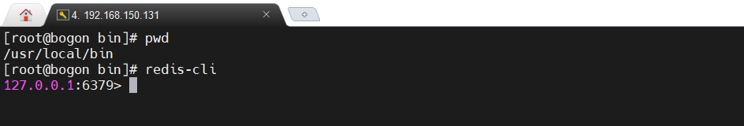


5.测试链接是否正常

```bash
 ping
```

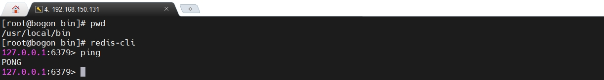


**关闭redis**

```bash
shutdown
```

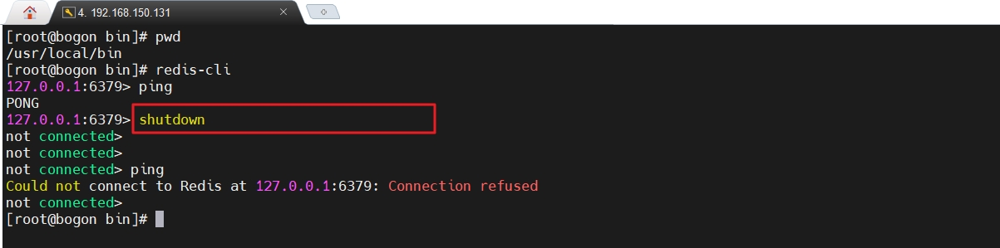


# Redis常用五种数据类型

到目前为止，我们已经完成了Redis的安装。接下来是对Redis的具体学习，而学习数据库，几乎都是从数据类型（不绝对）开始学习的。

Redis作为一个缓存数据库，存储数据的形式是key-value形式，所以，在正式学习数据类型之前，先看看对于key的操作有哪些。


## key的常见操作


**切换数据库**

Redis默认有16个数据库，类似数组下标从0开始，初始默认使用0号库。使用select命令切换数据库

统一密码管理，所有库密码一样

```bash
select dbIndex
```

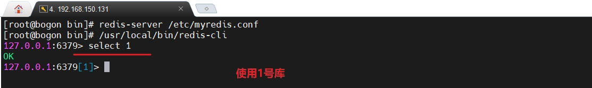


```html
注意 ： Redis没有查看使用库的命令，因为链接的时候，直接就把当前使用库的角标显示出来了。
```


**查看当前库所有key**

```bash
127.0.0.1:6379[1]> keys *
(empty array)
```


**添加键值对数据**

```bash
127.0.0.1:6379[1]> set k1 mingming
OK
127.0.0.1:6379[1]> set k2 yangyang
OK
127.0.0.1:6379[1]> set k3 taitai
OK
127.0.0.1:6379[1]> keys *
1) "k1"
2) "k3"
3) "k2"
127.0.0.1:6379[1]>

```


**判断某个key是否存在**

```bash
127.0.0.1:6379[1]> exists k1
(integer) 1
127.0.0.1:6379[1]> exists k6
(integer) 0
127.0.0.1:6379[1]>
```


**查看指定key的类型**

```bash
127.0.0.1:6379[1]> type k1
string
127.0.0.1:6379[1]> type k6
none
127.0.0.1:6379[1]>
```


**设置key的过期时间**/**查看key多少秒后过期**

数值X表示X秒以后过期， -1表示永不过期，-2表示已过期。

```bash
127.0.0.1:6379[1]> expire k1 23  //k1在23秒后过期
(integer) 1
127.0.0.1:6379[1]> ttl k1		// k1在16秒后过期
(integer) 16
127.0.0.1:6379[1]> ttl k2       // K2永久不过期
(integer) -1
127.0.0.1:6379[1]> ttl k1       // k1已经过期
(integer) -2
127.0.0.1:6379[1]>

```


**查看当前数据库的key的数量**

```bash
127.0.0.1:6379[1]> dbsize
(integer) 2
```


**删除指定的key数据**

```bash
127.0.0.1:6379[1]> del k1
(integer) 0
127.0.0.1:6379[1]> del k2
(integer) 1
127.0.0.1:6379[1]> del k6
(integer) 0
127.0.0.1:6379[1]>
```


**清空当前库**

```bash
127.0.0.1:6379[1]> flushdb
OK
```


**清空全部16个库**

```bash
127.0.0.1:6379[1]> flushall
OK
127.0.0.1:6379[1]>
```


## 字符串类型

String是Redis最基本的类型，你可以理解成与Memcached一模一样的类型，一个key对应一个value。
String类型是二进制安全的。意味着Redis的string可以包含任何数据。比如jpg图片或者序列化的对象。
一个Redis中字符串value最多可以是512M。

在Redis中的String类型，数据结构为简单动态字符串(Simple Dynamic String,缩写SDS)。内部结构实现上类似于Java的ArrayList，是可以修改的字符串，采用预分配冗余空间的方式来减少内存的频繁分配。
在内部，为当前字符串实际分配的空间capacity，一般要高于实际字符串长度len。
当字符串长度小于1M时，扩容都是加倍现有的空间，如果超过1M，扩容时一次只会多扩1M的空间。需要注意的是字符串最大长度为512M。


**常用命令**


**添加键值对**

```bash
set   <key> <value>
```


**查询对应键值**

```bash
get   <key>
```


**将给定的\<value\> 追加到原值的末尾**

```bash
append  <key><value>
```


**获得值的长度**

```bash
strlen  <key>
```


**只有在 key 不存在时    设置 key 的值**

```bash
setnx  <key><value>
```


**将 key 中储存的数字值增1,只能对数字值操作，如果为空，新增值为1**

```bash
incr  <key>
```


**将 key 中储存的数字值减1,只能对数字值操作，如果为空，新增值为-1**

```bash
decr  <key>
```


**将 key 中储存的数字值增减。自定义步长。**

```bash
incrby / decrby  <key><步长>
```


**同时设置一个或多个 key-value对**  

```bash
mset  <key1><value1><key2><value2>  ..... 
```


**同时获取一个或多个 value**  

```bash
mget  <key1><key2><key3> .....
```


**同时设置一个或多个 key-value 对，当且仅当所有给定 key 都不存在才成功**

```bash
msetnx <key1><value1><key2><value2>  ..... 
```

在Redis设置字符串key-value过程中，是具有原子性的，也就是说这个过程不能被打断，这就导致了，设置多个key-value的时候，会同时成功或者同时失败。


**获得值的范围，类似java中的substring，但是Redis中是包头，包尾**

```bash
getrange  <key> <起始位置> <结束位置>
```


**用 \<value\>  覆写\<key\>所储存的字符串值，从<起始位置>开始(索引从0开始)。**

```bash
setrange  <key><起始位置><value>
```


**设置键值的同时，设置过期时间，单位秒**

```bash
setex  <key><过期时间><value>
```


**以新换旧，设置了新值同时获得旧值**

```bash
getset <key><value>
```


## 列表(List)

列表类型是单键多值的形式。
Redis 列表是简单的字符串列表，按照插入顺序排序。你可以添加一个元素到列表的头部（左边）或者尾部（右边）。
它的底层实际是个双向链表，对两端的操作性能很高，通过索引下标的操作中间的节点性能会较差。


List的数据结构为快速链表quickList。
首先在列表元素较少的情况下会使用一块连续的内存存储，这个结构是ziplist，也即是压缩列表。
它将所有的元素紧挨着一起存储，分配的是一块连续的内存。
当数据量比较多的时候才会改成quicklist。
因为普通的链表需要的附加指针空间太大，会比较浪费空间。比如这个列表里存的只是int类型的数据，结构上还需要两个额外的指针prev和next。

Redis将链表和ziplist结合起来组成了quicklist。也就是将多个ziplist使用双向指针串起来使用。这样既满足了快速的插入删除性能，又不会出现太大的空间冗余。


**常用命令**


**从左边插入一个或多个值**

```bash
lpush  <key><value1><value2><value3> .... 
```

列表类型的多个值是按顺序放入的，类似与队列结构，所以第一个放入的元素就会被排列到最后边（右边）


**操作演示**

```bash
127.0.0.1:6379> flushdb
OK
127.0.0.1:6379> lpush mylist aaa bbb ccc
(integer) 3
127.0.0.1:6379> 
```


**从右边插入一个或多个值**

```bash
rpush  <key><value1><value2><value3> .... 
```

列表类型的多个值是按顺序放入的，类似与队列结构，所以第一个放入的元素就会被排列到最前边（左边）


**从左边吐出一个值**(值在键在，值亡键亡)

```bash
lpop  <key>
```


**从右边吐出一个值**(值在键在，值亡键亡)

```bash
rpop  <key>
```


**列表右边吐出一个值，插到\<key2\>列表左边**

```bash
rpoplpush  <key1><key2>从<key1>
```


**按照索引下标获得元素(从左到右)**

```bash
lindex <key> <index>
```


**按照索引下标获得范围内的元素(从左到右)**

```bash
lrange <key> <start> <stop>
```

```bash
lrange mylist 0 -1  //0是左边第一个，-1代表右边第一个，所以0 -1就是获取列表所有的元素
```


**获得列表长度** 

```bash
llen <key>
```


**在\<value\>的后面插入\<newvalue\>插入值**

```bash
linsert <key>  before/after <value><newvalue>
```


**从左边删除n个value(从左到右)**

```bash
lrem <key><n><value>
```


**将列表key下标为index的值替换成value**

```bash
lset<key><index><value>
```


## 集合（Set）


Redis set对外提供的功能与list类似,是一个列表的功能，特殊之处在于set是可以自动排重的，当你需要存储一个列表数据，又不希望出现重复数据时，set是一个很好的选择，并且set提供了判断某个成员是否在一个set集合内的重要接口，这个也是list所不能提供的。
Redis的Set是string类型的无序集合。它底层其实是一个value为null的hash表，所以添加，删除，查找的时间复杂度都是O(1)。


Set数据结构是dict字典，字典是用哈希表实现的。
Java中HashSet的内部实现使用的是HashMap，只不过所有的value都指向同一个对象。Redis的set结构也是一样，它的内部也使用hash结构，所有的value都指向同一个内部值。


**常用命令**


**添加一个/多个值到集合key中，已经存在的元素被忽略**

```bash
sadd  <key> <value1> <value2> ..... 
```


**取出该集合的所有值**

```bash
smembers <key>
```


**判断集合\<key\>是否为含有该\<value\>值，有1，没有0**

```bash
sismember <key> <value>
```


**返回该集合的元素个数**

```bash
scard <key>
```


 **删除集合中的某个元素**

```bash
srem <key><value1><value2> ....
```


**随机从该集合中吐出一个值**

```bash
spop <key>
```


**随机从该集合中取出n个值。不会从集合中删除** 

```bash
srandmember <key> <n>
```


**把集合中一个值从一个集合移动到另一个集合**

```bash
smove <source> <destination> value
```


**返回两个集合的交集元素**

```bash
sinter <key1><key2>
```


**返回两个集合的并集元素**

```bash
sunion <key1> <key2>
```


**返回两个集合的差集元素(key1中的，不包含key2中的**

```bash
sdiff <key1> <key2>
```


## 哈希(hash)


Redis hash 是一个键值对集合。
Redis hash是一个string类型的field和value的映射表，hash特别适合用于存储对象。类似Java里面的Map<String,Object>
Hash类型对应的数据结构是两种：ziplist（压缩列表），hashtable（哈希表）。当field-value长度较短且个数较少时，使用ziplist，否则使用hashtable。


**常用命令**


**给\<key\>集合中的  \<field\>键赋值\<value\>**

```bash
hset <key><field><value>
```


**从\<key1\>集合\<field\>取出 value** 

```bash
hget <key1><field>
```


**演示 ： 放入key-object**

key 是user01

object是 id=1001,name=xiaozuanfeng， age=300

```bash
127.0.0.1:6379> hset user01 id 1001 name xiaozuanfeng age 300
(integer) 3
127.0.0.1:6379> hget user01 name
"xiaozuanfeng"
127.0.0.1:6379>
```


**批量设置hash的值**

```bash
hmset <key1> <field1> <value1> <field2> <value2>... 
```


**查看哈希表 key 中，给定域 field 是否存在。**

```bash
hexists <key1> <field>
```


```bash
127.0.0.1:6379> hmset user02 id 1002 name zongzuanfeng age 300
OK
127.0.0.1:6379> hexists user02 name
(integer) 1
127.0.0.1:6379> hexists user02 gender
(integer) 0
127.0.0.1:6379>

```


**列出该hash集合的所有field**

```bash
hkeys <key>
```

```bash
127.0.0.1:6379> hkeys user01
1) "id"
2) "name"
3) "age"
127.0.0.1:6379> hkeys user02
1) "id"
2) "name"
3) "age"
127.0.0.1:6379>
```


**列出该hash集合的所有value**

```bash
hvals <key>
```


```bash

127.0.0.1:6379> hvals user01
1) "1001"
2) "xiaozuanfeng"
3) "300"
127.0.0.1:6379> hvals user02
1) "1002"
2) "zongzuanfeng"
3) "300"
127.0.0.1:6379>
```


**为哈希表 key 中的域 field 的值加上增量 1 /-1**

```bash
hincrby <key> <field> <increment>
```


```bash
127.0.0.1:6379> hincrby user01 age 1
(integer) 301
127.0.0.1:6379> hget user01 age
"301"
127.0.0.1:6379> hincrby user01 age -2
(integer) 299
127.0.0.1:6379> hget user01 age
"299"
```


**将哈希表 key 中的域 field 的值设置为 value ，当且仅当域 field 不存在** 

```bash
hsetnx <key> <field> <value>
```


```bash
127.0.0.1:6379> hsetnx user01 name aaa //name已经存在，失败
(integer) 0
127.0.0.1:6379> hsetnx user01 gender nan //gender不存在，成功
(integer) 1
127.0.0.1:6379> hvals user01
1) "1001"
2) "xiaozuanfeng"
3) "299"
4) "nan"
```


## 有序集合（Zset）


Redis有序集合zset与普通集合set非常相似，是一个没有重复元素的字符串集合。
不同之处是有序集合的每个成员都关联了一个评分（score）,这个评分（score）被用来按照从最低分到最高分的方式排序集合中的成员。

集合的成员是唯一的，但是评分可以重复 。
因为元素是有序的, 所以你也可以很快的根据评分（score）或者次序（position）来获取一个范围的元素。
访问有序集合的中间元素也是非常快的,因此你能够使用有序集合作为一个没有重复成员的智能列表。

SortedSet(zset)是Redis提供的一个非常特别的数据结构，一方面它等价于Java的数据结构Map<String, Double>，可以给每一个元素value赋予一个权重score，另一方面它又类似于TreeSet，内部的元素会按照权重score进行排序，可以得到每个元素的名次，还可以通过score的范围来获取元素的列表。
Zset底层使用了两个数据结构

1. hash，hash的作用就是关联元素value和权重score，保障元素value的唯一性，可以通过元素value找到相应的score值。
2. 跳跃表，跳跃表的目的在于给元素value排序，根据score的范围获取元素列表。跳跃表比有序链表效率要高


**常用命令**


**将一个或多个 member 元素及其 score 值加入到有序集 key 当中**

```bash
zadd  <key> <score1><value1> <score2><value2>...
```


```bash
127.0.0.1:6379> zadd zongfen 100 xiaoxiao 200 mingming 150 jiajia
(integer) 3
127.0.0.1:6379>
```


**返回有序集 key 中，下标在\<start\>\<stop\>之间的元素,带WITHSCORES，可以让分数一起和值返回到结果集**

```bash
zrange <key><start><stop>  [WITHSCORES]
```


```bash
127.0.0.1:6379> zrange zongfen 0 -1
1) "xiaoxiao"
2) "jiajia"
3) "mingming" //返回结果已经按照score排序
127.0.0.1:6379> zrange zongfen 0 -1 withscores
1) "xiaoxiao"
2) "100"
3) "jiajia"
4) "150"
5) "mingming"
6) "200"	//返回结果，并且返回score 已经按照score排序
127.0.0.1:6379>
```


**返回有序集 key 中，所有 score 值介于 min 和 max 之间(包括等于 min 或 max )的成员。有序集成员按 score 值递增排序** 

```bash
zrangebyscore key minmax [withscores] [limit offset count]
```


```bash
127.0.0.1:6379> zrangebyscore zongfen 130 200
1) "jiajia"
2) "mingming"
127.0.0.1:6379> zrangebyscore zongfen 130 200 withscores
1) "jiajia"
2) "150"
3) "mingming"
4) "200"
127.0.0.1:6379>
```


**同上，改为从大到小排列。**

```bash
zrevrangebyscore key max min [withscores] [limit offset count]
```


```bash
127.0.0.1:6379> zrevrangebyscore zongfen 130 200
(empty array)
127.0.0.1:6379> zrevrangebyscore zongfen 200 130
1) "mingming"
2) "jiajia"
127.0.0.1:6379> zrevrangebyscore zongfen 200 130 withscores
1) "mingming"
2) "200"
3) "jiajia"
4) "150"
127.0.0.1:6379>
```


 **为元素的score加上增量**

```bash
zincrby <key><increment><value>   
```


```bash
127.0.0.1:6379> zincrby zongfen 23 jiajia
"173"
127.0.0.1:6379> zrevrangebyscore zongfen 200 130 withscores
1) "mingming"
2) "200"
3) "jiajia"
4) "173"
127.0.0.1:6379>
```


**删除该集合下，指定值的元素** 

```bash
zrem  <key><value>
```


```bash
127.0.0.1:6379> zrem zongfen jiajia
(integer) 1
127.0.0.1:6379> zrange zongfen 0 -1
1) "xiaoxiao"
2) "mingming"
127.0.0.1:6379>
```


**统计该集合，分数区间内的元素个数** 

```bash
zcount <key><min><max>
```


```bash
127.0.0.1:6379> zcount zongfen 0 -1
(integer) 0
127.0.0.1:6379> zcount zongfen 100 200
(integer) 2
127.0.0.1:6379>
```


**返回该值在集合中的排名，从0开始**

```bash
zrank <key><value>
```


```bash
127.0.0.1:6379> zrank zongfen jiajia
(nil)
127.0.0.1:6379> zrank zongfen ningning
(nil)
127.0.0.1:6379> zrank zongfen mingming
(integer) 1
127.0.0.1:6379> zrank zongfen xiaoxiao
(integer) 0
127.0.0.1:6379>
```


# Redis中的事务操作


我们知道，MySql中的事务是具有原子性的，即不可以被分割，同时成功或者同时失败。而Redis中的事务与MySql中的事务不同。Redis中的事务是单独的隔离操作：事务中的所有命令都会序列化、**按顺序执行**。事务在执行的过程中，不会被其他客户端发送来的命令请求所打断。所以Redis事务的主要作用就是串联多个命令防止别的命令插队。


## 事务的基本操作


**常用命令**


```bash
multi
```

组队命令 ： 将多个命令进行组队，且按照顺序组队，此时，仅仅是将多个命令按顺序组合到一起，并没有执行这些命令。此时， 这多个命令类似于一个队列结构。


**执行命令**

```bash
exec
```

multi命令是将多个命令按照顺序组队，exec则是开始执行那多个命令。


**操作演示**

组队 - 执行命令

```bash
127.0.0.1:6379> multi // 开始组队多个命令
OK
127.0.0.1:6379(TX)> set name xiaozuanfeng
QUEUED				//可以看到提示，命令并没有执行，而是进入队列（按照顺序）
127.0.0.1:6379(TX)> set age 300
QUEUED
127.0.0.1:6379(TX)> set gender nv
QUEUED
127.0.0.1:6379(TX)> exec	//执行命令
1) OK
2) OK
3) OK
127.0.0.1:6379>
```


**取消组队**

```bash
discard
```

如果在组队阶段，发现某个命令写错了，可以使用discard命令来取消组队


**操作演示**

组队 - 命令出错 - 取消组队

```bash
127.0.0.1:6379> multi
OK
127.0.0.1:6379(TX)> set name bishudawang
QUEUED
127.0.0.1:6379(TX)> set age 300
QUEUED
127.0.0.1:6379(TX)> se gender nan //命令出错
(error) ERR unknown command `se`, with args beginning with: `gender`, `nan`,
127.0.0.1:6379(TX)> discard		//取消组队，取消组队成功
OK
127.0.0.1:6379>
```


## 事务的错误处理

事务的错误处理是指代，在事务中出现错误，要如何处理这种情况。Redis提供了两种情况的解决方案

1. 如果在组队阶段，某个命令出现错误，执行的时候，整个队列的命令全部取消。
2. 如果在运行阶段，某个命令出现错误，执行的时候，只有报错的命令不会执行，其它命令依然成功执行


**操作演示**

组队 -某个命令出错- 依然执行命令

```bash
127.0.0.1:6379> flushdb
OK
127.0.0.1:6379> multi
OK
127.0.0.1:6379(TX)> set name zongzuanfeng
QUEUED
127.0.0.1:6379(TX)> set age 230
QUEUED
127.0.0.1:6379(TX)> set gender //命令出错，不理会
(error) ERR wrong number of arguments for 'set' command
127.0.0.1:6379(TX)> set salary 9999  //继续组队
QUEUED
127.0.0.1:6379(TX)> exec  //依然执行命令，可以看到，命令执行失败
(error) EXECABORT Transaction discarded because of previous errors.
127.0.0.1:6379> 

```


组队 -组队阶段命令不出错 -  执行命令 - 执行中某个命令出错 - 其它命令执行成功

```bash
127.0.0.1:6379> flushdb
OK
127.0.0.1:6379> multi
OK
127.0.0.1:6379(TX)> set name xiaoka
QUEUED
127.0.0.1:6379(TX)> set age 23
QUEUED
127.0.0.1:6379(TX)> incr name //给name加1，组队阶段不会出错，执行阶段会出错
QUEUED
127.0.0.1:6379(TX)> set gender nan
QUEUED
127.0.0.1:6379(TX)> exec //执行命令，只有第三条命令失败，其它命令成功
1) OK
2) OK
3) (error) ERR value is not an integer or out of range
4) OK
127.0.0.1:6379>
```


## 事务的冲突(锁机制)


当有多个事务，操作同一个数据的时候，这多个事务之间可能会产生冲突。

例如 ： 

在双一十的时候，小A和小C使用了同一张银行卡进行秒杀结账，假设账号的初始余额是一千元整。

```html
小A 和 小C 同时分别点击了自己的支付按钮，此时账户余额为一千元整，所以它们都获得了余额数字，1000
小A 请求支付600元，当时它获得的余额是1000元，可以进行支付，所以小A支付完成以后，余额减去600，剩下400
小C 请求支付500元，当时它获得的余额也是1000元，可以进行支付，所以小C支付完成以后，余额减去500，剩下500

问题来了，剩下的余额不一致，更重要的是，他俩一共只有一千块钱，却总共花了1100元。

```


为了解决数据库中的事务的冲突的问题，人们提出了“锁”的概念，即将多个事务操作的同一个数据使用一把锁给锁住，保证只能有一个事务来操作数据，以此来解决事务的冲突的问题。这个“锁”有两种，分别是悲观锁和乐观锁。


**悲观锁**

悲观锁(Pessimistic Lock), 顾名思义，就是很悲观，每次去拿数据的时候都认为别人会修改，所以每次在拿数据的时候都会上锁，这样别人想拿这个数据就会阻塞直到它拿到锁。传统的关系型数据库里边就用到了很多这种锁机制，比如行锁，表锁等，读锁，写锁等，都是在做操作之前先上锁。


**乐观锁**

乐观锁(Optimistic Lock), 顾名思义，就是很乐观，每次去拿数据的时候都认为别人不会修改，所以不会上锁，但是在更新的时候会判断一下在此期间别人有没有去更新这个数据，可以使用版本号等机制（Redis自己维护数据的版本号）。乐观锁适用于多读的应用类型，这样可以提高吞吐量。Redis就是利用这种check-and-set机制实现事务的。

Redis默认使用乐观锁，不能直接使用悲观锁。


**事务的冲突演示**

使用watch 命令就可以监视一个(或多个) key ，这些被监视的数据Redis会给它们维护一个版本号，用来实现乐观锁的机制。

unwatch
取消 WATCH 命令对所有 key 的监视。
如果在执行 WATCH 命令之后，EXEC 命令或DISCARD 命令先被执行了的话，那么就不需要再执行UNWATCH 了。


具体操作 ： 

在执行multi之前，先执行watch key1 [key2],可以监视一个(或多个) key ，如果在事务执行之前这个(或这些) key 被其他命令所改动，因为版本号发生了改变,那么事务将被打断。


演示事务的冲突需要两个客户端配合


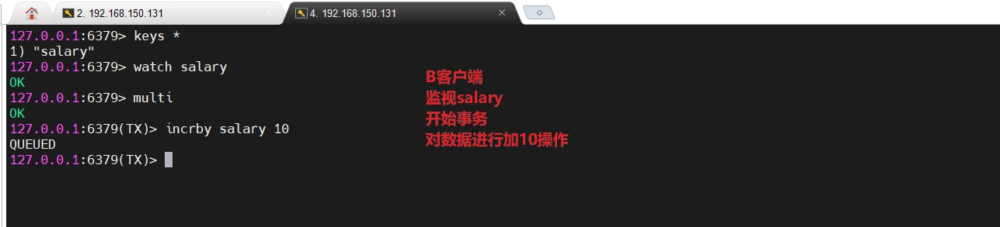


此时，他们都还没有执行命令，接下来，任意客户端先实行命令，另外一个客户端就会执行失败，因为第一个执行命令的客户端执行完成命令以后，数据的版本号不再和原来的一致，导致第二个客户端执行失败，避免冲突的问题产生。


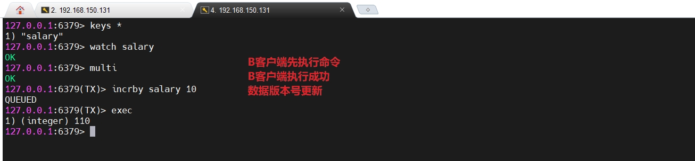


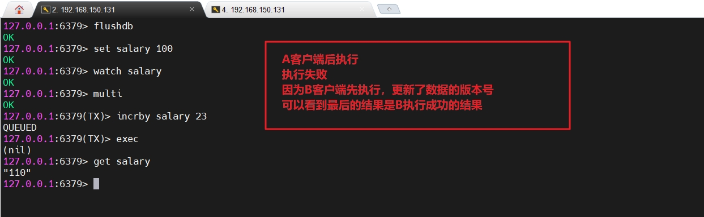


## Redis事务三特性

1. 单独的隔离操作 

   ​	事务中的所有命令都会序列化、按顺序地执行。事务在执行的过程中，不会被其他客户端发送来的命令请求所打断。 

2. 没有隔离级别的概念 

   ​	队列中的命令没有提交之前都不会实际被执行，因为事务提交前任何指令都不会被实际执行

3. 不保证原子性 

   ​	事务中如果有一条命令执行失败，其后的命令仍然会被执行，没有回滚 


# Redis持久化操作


Redis虽然是一个内存数据库，但是也支持持久化操作，它提供了两种持久化方案，分别是

1. RDB
2. AOF


## 持久化之RDB

RDB 是 Redis DataBase 的缩写,即内存快照。它是在指定的时间间隔内将内存中的数据集快照写入磁盘， 专业术语叫做Snapshot快照。等需要恢复数据的时候，就将快照文件直接读到内存里，以此来达到持久化以及恢复数据的目的。


**备份是如何执行的**

Redis会单独创建（fork）一个子进程来进行持久化操作。

过程 ： 先将数据写入到 一个临时文件中，待持久化过程都结束了，再用这个临时文件替换上次持久化好的文件。

整个过程中，主进程是不进行任何IO操作的，这就确保了极高的性能 如果需要进行大规模数据的恢复，且对于数据恢复的完整性不是非常敏感，那RDB方式要比AOF方式更加的高效。

RDB的缺点是最后一次持久化后的数据可能丢失。


**Fork的含义**

Fork的作用是复制一个与当前进程一样的进程。新进程的所有数据（变量、环境变量、程序计数器等） 数值都和原进程一致，但是是一个全新的进程，并作为原进程的子进程

在Linux程序中，fork()会产生一个和父进程完全相同的子进程，但子进程在此后多会exec系统调用，出于效率考虑，Linux中引入了“写时复制技术”

一般情况父进程和子进程会共用同一段物理内存，只有进程空间的各段的内容要发生变化时，才会将父进程的内容复制一份给子进程。


## RDB持久化相关配置


**持久化文件名称**

```html
在redis.conf中配置持久化文件名称，默认为dump.rdb
```

**持久化文件路径**

```html
rdb文件的保存路径，也可以修改。默认为Redis启动时命令行所在的目录下
dir "/myredis/"
```


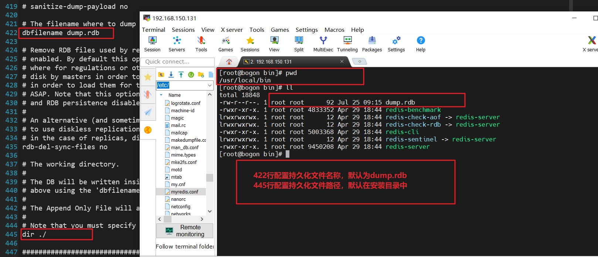


**stop-writes-on-bgsave-error**

当Redis无法写入磁盘的话，直接关掉Redis的写操作。推荐yes.

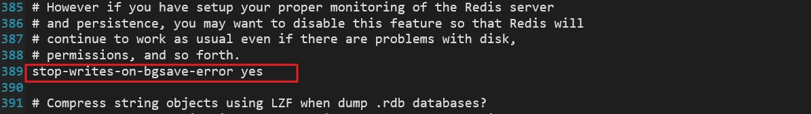


**rdbcompression** 

对于存储到磁盘中的快照，可以设置是否进行压缩存储。如果是的话，redis会采用LZF算法进行压缩。
如果你不想消耗CPU来进行压缩的话，可以设置为关闭此功能。推荐yes.


**rdbchecksum** 

检查完整性的配置。在存储快照后，还可以让redis使用CRC64算法来进行数据校验，但是这样做会增加大约10%的性能消耗，如果希望获取到最大的性能提升，可以关闭此功能，推荐yes。

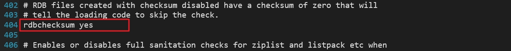


**save**

格式：save  秒数  key被改变的数量

```bash
save 10 23  //在10秒内有23个key被改变，则执行持久化写入操作
save 15 3   //在15秒内有3个key被改变，则执行持久化写入操作
```

RDB是整个内存的压缩过的Snapshot，RDB的数据结构，可以配置复合的快照触发条件，
默认是1分钟内改了1万次，或5分钟内改了10次，或15分钟内改了1次。


## RDB持久化之备份实操

1. 停止Redis服务
2. 删除已经存在的备份文件dump.rdb
3. 修改save配置 ： 在15秒内有三个key被修改就执行持久化操作
4. 开启Redis服务
5. 连接Redis服务，在15秒内添加三个key，那么15秒后就会自动产生dump.rdb持久化文件
6. 以后，凡是在15秒内，有三个key被改变，就会将数据追加到dump.rdb持久化文件中


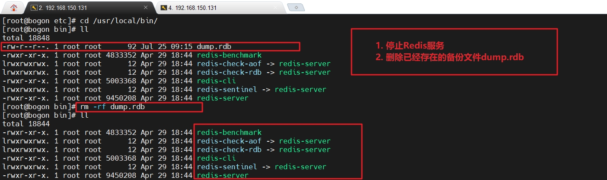


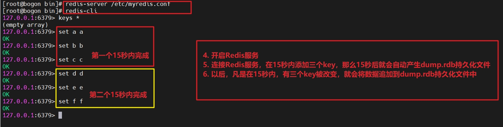


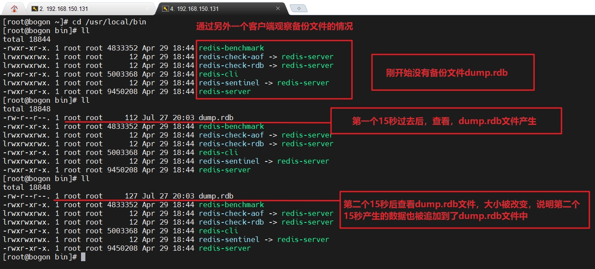


## RDB持久化之恢复实操

Redis在启动的时候，会自动加载备份的rdb文件

例如我们的配置是 dbfilename dump.rdb ，那么就在启动的时候加载dump.rdb文件

如果我们的配置是 dbfilename aaa.rdb ,那么就在启动的时候加载aaa.rdb文件。

而，目前我们的配置是dbfilename dump.rdb ，那么在启动的时候就会加载它。


1. 将dump.rdb文件修改成其它名称，例如aaa.rdb
2. 启动Redis服务，查看内存，没有任何数据
3. 修改配置文件内为 dbfilename aaa.rdb 
4. 再次重新启动，启动Redis服务，查看内存，已经有数据存在，充分证明，Redis启动，默认就读取rdb文件来恢复数据。


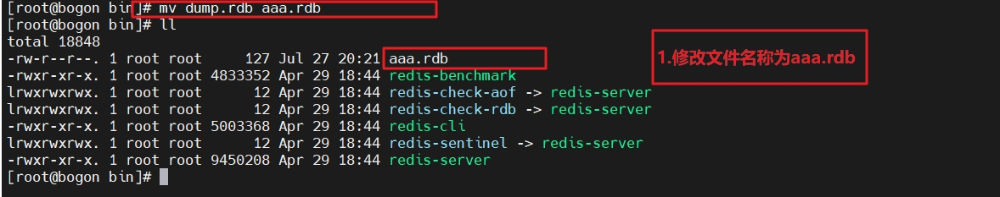


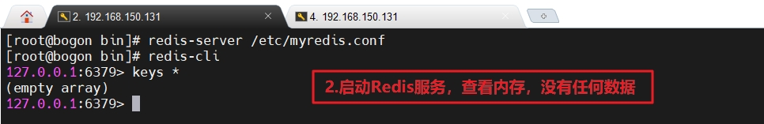


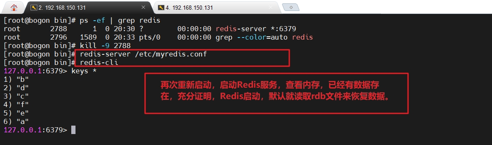


## RDB相关命令

**查看RDB文件的名称和路径的命令**

```bash
config get dir
```


**flushall命令**

```html
执行flushall命令，也会产生dump.rdb文件，但里面是空的，无意义
```


**动态停止**

```bash
redis-cli config set save ""   //save后给空值，表示禁用保存策略
```


## RDB持久化的优缺点


**优点**

1. 适合大规模的数据恢复
2. 对数据完整性和一致性要求不高更适合使用
3. 节省磁盘空间
4. 恢复速度快


**缺点**

1. Fork的时候，内存中的数据被克隆了一份，大致2倍的膨胀性需要考虑
2. 虽然Redis在fork时使用了写时拷贝技术,但是如果数据庞大时还是比较消耗性能
3. 在备份周期在一定间隔时间做一次备份，所以如果Redis意外down掉的话，就会丢失最后一次快照后的所有修改


## 持久化之AOF

AOF（Append Only File），以日志的形式来记录每个写操作（增量保存），将Redis执行过的所有写指令记录下来(读操作不记录)， 只许追加文件但不可以改写文件，redis启动之初会读取该文件重新构建数据，换言之，redis 重启的话就根据日志文件的内容将写指令从前到后执行一次以完成数据的恢复工作。


**AOF持久化流程**

```html
1. 客户端的请求写命令会被append追加到AOF缓冲区内
2. AOF缓冲区根据AOF持久化策略[always,everysec,no]将操作sync同步到磁盘的AOF文件中
3. AOF文件大小超过重写策略或手动重写时，会对AOF文件rewrite重写，压缩AOF文件容量
4. Redis服务重启时，会重新load加载AOF文件中的写操作达到数据恢复的目的
```


**AOF默认不开启**

```html
1. 可以在redis.conf中配置文件名称，默认为 appendonly.aof
2. AOF文件的保存路径，同RDB的路径一致。
```


**AOF启动/修复/恢复**

```html
AOF的备份机制和性能虽然和RDB不同, 但是备份和恢复的操作同RDB一样，都是拷贝备份文件，需要恢复时再拷贝到Redis工作目录下，启动系统即加载。
```

**正常恢复**

```html
1. 修改默认的appendonly no，改为yes
2. 将有数据的aof文件复制一份保存到对应目录(查看目录：config get dir)
3. 恢复：重启redis然后重新加载
```


**操作演示**

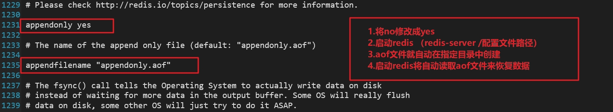


**异常恢复**

```html
1. 修改默认的appendonly no，改为yes
2. 如遇到AOF文件损坏，通过/usr/local/bin/redis-check-aof--fix appendonly.aof进行恢复
3. 备份被写坏的AOF文件
4. 恢复：重启redis，然后重新加载
```


**AOF同步频率设置**

```html
1. appendfsync always

   始终同步，每次Redis的写入都会立刻记入日志；性能较差但数据完整性比较好

2. appendfsync everysec

   每秒同步，每秒记入日志一次，如果宕机，本秒的数据可能丢失。

3. appendfsync no

   redis不主动进行同步，把同步时机交给操作系统。
```


**Rewrite压缩**

```html
AOF采用文件追加方式，文件会越来越大为避免出现此种情况，新增了重写机制, 当AOF文件的大小超过所设定的阈值时，Redis就会启动AOF文件的内容压缩， 只保留可以恢复数据的最小指令集.可以使用命令bgrewriteaof
```


**重写原理，如何实现重写**

```html
AOF文件持续增长而过大时，会fork出一条新进程来将文件重写(也是先写临时文件最后再rename)，redis4.0版本后的重写，是指上就是把rdb 的快照，以二级制的形式附在新的aof头部，作为已有的历史数据，替换掉原来的流水账操作。
```


**no-appendfsync-on-rewrite：**

```html
1. 如果 no-appendfsync-on-rewrite=yes ,不写入aof文件只写入缓存，用户请求不会阻塞，但是在这段时间如果宕机会丢失这段时间的缓存数据。（降低数据安全性，提高性能）
2. 如果 no-appendfsync-on-rewrite=no,  还是会把数据往磁盘里刷，但是遇到重写操作，可能会发生阻塞。（数据安全，但是性能降低）
```

**何时重写**

```html
1. Redis会记录上次重写时的AOF大小，默认配置是当AOF文件大小是上次rewrite后大小的一倍且文件大于64M时触发
2. 重写虽然可以节约大量磁盘空间，减少恢复时间。但是每次重写还是有一定的负担的，因此设定Redis要满足一定条件才会进行重写。 
3. auto-aof-rewrite-percentage：设置重写的基准值，文件达到100%时开始重写（文件是原来重写后文件的2倍时触发）
4. auto-aof-rewrite-min-size：设置重写的基准值，最小文件64MB。达到这个值开始重写。
5. 例如：文件达到70MB开始重写，降到50MB，下次什么时候开始重写？100MB
6. 系统载入时或者上次重写完毕时，Redis会记录此时AOF大小，设为base_size,
7. 如果Redis的AOF当前大小>= base_size +base_size*100% (默认)且当前大小>=64mb(默认)的情况下，Redis会对AOF进行重写。 
```

**重写流程**

```html
1. bgrewriteaof触发重写，判断是否当前有bgsave或bgrewriteaof在运行，如果有，则等待该命令结束后再继续执行。
2. 主进程fork出子进程执行重写操作，保证主进程不会阻塞。
3. 子进程遍历redis内存中数据到临时文件，客户端的写请求同时写入aof_buf缓冲区和aof_rewrite_buf重写缓冲区保证原AOF文件完整以及新AOF文件生成期间的新的数据修改动作不会丢失。
4. 子进程写完新的AOF文件后，向主进程发信号，父进程更新统计信息。2).主进程把aof_rewrite_buf中的数据写入到新的AOF文件。
5. 使用新的AOF文件覆盖旧的AOF文件，完成AOF重写。
```

**优势**

```html
1. 备份机制更稳健，丢失数据概率更低。
2. 可读的日志文本，通过操作AOF稳健，可以处理误操作。
```

**劣势**

```html
1. 比起RDB占用更多的磁盘空间。
2. 恢复备份速度要慢。
3. 每次读写都同步的话，有一定的性能压力。
4. 存在个别Bug，造成恢复不能。
```


**AOF和RDB同时开启，redis听谁的**

```html
AOF和RDB同时开启，系统默认取AOF的数据（数据不会存在丢失）
```


**小总结**

```html
1. 官方推荐两个都启用
2. 如果对数据不敏感，可以选单独用RDB
3. 不建议单独用 AOF，因为可能会出现Bug
4. 如果只是做纯内存缓存，可以都不用
```

**官网建议**

```html
1. RDB持久化方式能够在指定的时间间隔能对你的数据进行快照存储
2. AOF持久化方式记录每次对服务器写的操作,当服务器重启的时候会重新执行这些命令来恢复原始的数据,AOF命令以redis协议追加保存每次写的操作到文件末尾.
3. Redis还能对AOF文件进行后台重写,使得AOF文件的体积不至于过大
4. 只做缓存：如果你只希望你的数据在服务器运行的时候存在,你也可以不使用任何持久化方式
5. 同时开启两种持久化方式
6. 在这种情况下,当redis重启的时候会优先载入AOF文件来恢复原始的数据, 因为在通常情况下AOF文件保存的数据集要比RDB文件保存的数据集要完整
7. RDB的数据不实时，同时使用两者时服务器重启也只会找AOF文件。那要不要只使用AOF呢
8. 建议不要，因为RDB更适合用于备份数据库(AOF在不断变化不好备份)， 快速重启，而且不会有AOF可能潜在的bug，留着作为一个万一的手段。
   性能建议
9. 因为RDB文件只用作后备用途，建议只在Slave上持久化RDB文件，而且只要15分钟备份一次就够了，只保留save 900 1这条规则
10. 如果使用AOF，好处是在最恶劣情况下也只会丢失不超过两秒数据，启动脚本较简单只load自己的AOF文件就可以了。
11. 代价,一是带来了持续的IO，二是AOF rewrite的最后将rewrite过程中产生的新数据写到新文件造成的阻塞几乎是不可避免的。
12. 只要硬盘许可，应该尽量减少AOF rewrite的频率，AOF重写的基础大小默认值64M太小了，可以设到5G以上
13. 默认超过原大小100%大小时重写可以改到适当的数值。
```


# 主从复制


## 主从复制简介

主机数据更新后根据配置和策略， 自动同步到备机的master/slaver机制，就叫做主从复制。这个过程中，Master是主机，以写为主，Slave是从机，以读为主。


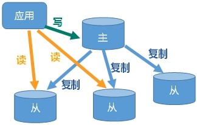

**主从复制的优点**

1. 读写分离，性能扩展
2. 容灾快速恢复


## 搭建主从复制环境

如上图所示，我们需要多个redis,分别扮演主机和从机。本案例总共需要三台Redis服务器，一台充当主机，两台充当从机。

**解决方案 ：** 

1. 创建三台服务器，每一台服务器中安装一个Redis

2. 在一台服务器中启动三个Redis服务，三个Redis分别使用不同的端口号

   显然，在学习阶段使用第2个方案更合理，所以我们使用第二个方案搭建主从复制的环境。


**搭建主从复制**

1. 在/etc/myredisconf/目录中，创建三个redis的配置文件，分别是redis-6379.conf,redis-6380.conf,redis-6381.conf
2. 将原来使用的配置文件/etc/myredis.conf，移动到/etc/myredisconf/目录中
3. 将原来使用的配置文件/etc/myredis.conf，设置开启daemonize yes（之前已经做完）


**redis-6379.conf的内容**

```html
# 加载redis的配置文件，写绝对路径
include /etc/myredisconf/myredis.conf

# Pid 文件名字pidfile
pidfile /var/run/redis_6379.pid

# 指定端口port
port 6379

#Log文件名字

# dump.rdb名字dbfilename
dbfilename dump6379.rdb

#Appendonly 关掉或者换名字

```


**redis-6380.conf的内容**

```html
# 加载redis的配置文件，写绝对路径
include /etc/myredisconf/myredis.conf
pidfile /var/run/redis_6380.pid
port 6380
dbfilename dump6380.rdb

```


**redis-6381.conf的内容**

```html
# 加载redis的配置文件，写绝对路径
include /etc/myredisconf/myredis.conf
pidfile /var/run/redis_6381.pid
port 6381
dbfilename dump6381.rdb

```


**启动三个Redis服务**

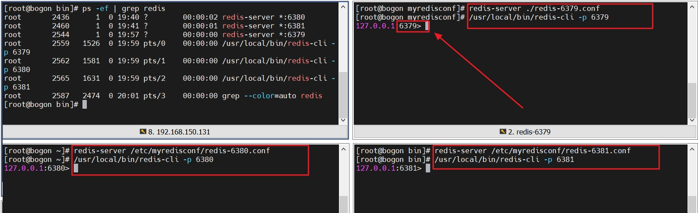


**查看各个redis服务的信息**


**使用info replication命令查看信息**


此时，并没有设置三台Redis谁是主机，谁是从机，仅仅只是让三个Redis使用不同端口，不同RDB,AOF文件进行了启动而已，所以，它们三个都是主机。

从服务器不能执行写操作，但是此时，三台Redis都是主服务器，所以，现在三台Redis都可以执行写操作。


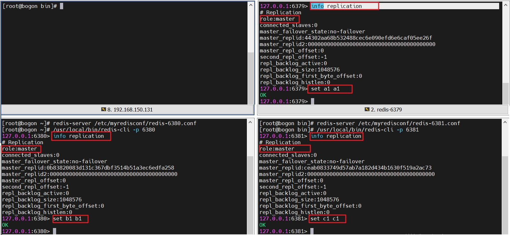


## 常用主从策略


**一主二从**

这种策略顾名思义，就是一台主服务器，搭配两个从服务器。这种策略的特点是 ：

```html
1. 主机可以进行读和写的操作，从机只能进行读操作，不能进行写（添加，更新、删除）操作。
2. 主机挂掉以后，从机依然保持从机角色，不会主动上位变成主机，当主机重新启动以后，各自依然保持原来的角色，即，主机依然是主机，从机依然是从机。
3. 从机挂掉以后，主机进行了若干写的操作，从机启动以后，会从头备份主机数据，保证它自己的数据是完整的，所以不用担心从机宕机，只需要排除从机故障以后，重新启动即可。记得将执行将从机变成从机的命令。
```


**薪火相传**

这种策略是A作为B的主服务器，B作为C的主服务器，依次类推

A →B→ C

```
A服务器作为主服务器
B服务器是A的从服务器
C服务器是B的从服务器

此时
查看A，A本身是主服务器角色，A下边只有B一个从服务器
查看B，B本身是从服务器角色，但是B下边也有一个C是从服务器
查看C，C本身是从服务器角色，但是C的主服务器是B

这种配置，如果B服务器宕机，那么A服务器无法将数据备份给C服务器
```


**反客为主**

```html
在薪火相传配置的基础上，主服务器A宕机，那么，服务器B手动升级成主服务器。
```


**哨兵模式**

```html
反客为主的自动版本。

主服务器宕机，自动选择某个从服务器升级为主服务器

主服务器再次启动，它的角色不再恢复，而是作为新主服务器的从服务器而存在。
```


## 开始配置主从复制效果


### 配置一主二从

主从配置中，主服务器不用管它，只需要将需要作为从服务器的redis执行此命令即可。

```bash
slaveof  <ip> <port>
```


在6380和6381上执行: slaveof 127.0.0.1 6379,然后再次查看三台Redis服务的信息（注意，截图只显示了6380从服务器信息，6381和它是一样的）

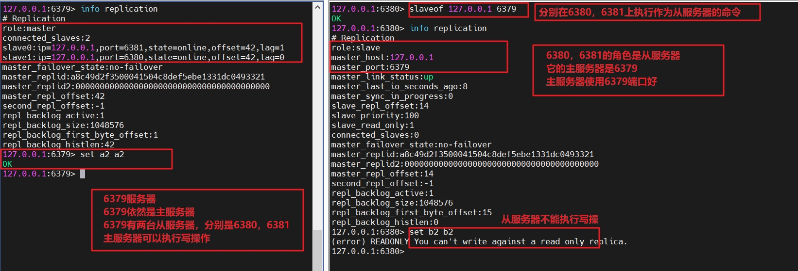


现在，我们再来回顾一下，一主二从的特点

```html
1. 主机可以进行读和写的操作，从机只能进行读操作，不能进行写（添加，更新、删除）操作。
2. 主机挂掉以后，从机依然保持从机角色，不会主动上位变成主机，当主机重新启动以后，各自依然保持原来的角色，即，主机依然是主机，从机依然是从机。
3. 从机挂掉以后，主机进行了若干写的操作，从机启动以后，会从头备份主机数据，保证它自己的数据是完整的，所以不用担心从机宕机，只需要排除从机故障以后，重新启动即可。记得还要再执行变成从机的命令。
```


**第一个特点，我们已经通过上个截图看到了。接下来演示第二个特点**


停止主机器

```bash
127.0.0.1:6379> shutdown
not connected> exit
[root@bogon myredisconf]#
```


查看6380从机的信息，可以看到，它依然作为6379的从机而存在

```bash
127.0.0.1:6380> info replication
# Replication
role:slave
master_host:127.0.0.1
master_port:6379
master_link_status:down
master_last_io_seconds_ago:-1
master_sync_in_progress:0
slave_repl_offset:2110
master_link_down_since_seconds:20
slave_priority:100
slave_read_only:1
connected_slaves:0
master_failover_state:no-failover
master_replid:a8c49d2f3500041504c8def5ebe1331dc0493321
master_replid2:0000000000000000000000000000000000000000
master_repl_offset:2110
second_repl_offset:-1
repl_backlog_active:1
repl_backlog_size:1048576
repl_backlog_first_byte_offset:15
repl_backlog_histlen:2096
127.0.0.1:6380>
```


查看6381从机器的信息，可以看到，它依然作为6379的从机而存在

```html
127.0.0.1:6381> info replication
# Replication
role:slave
master_host:127.0.0.1
master_port:6379
master_link_status:down
master_last_io_seconds_ago:-1
master_sync_in_progress:0
slave_repl_offset:2110
master_link_down_since_seconds:36
slave_priority:100
slave_read_only:1
connected_slaves:0
master_failover_state:no-failover
master_replid:a8c49d2f3500041504c8def5ebe1331dc0493321
master_replid2:0000000000000000000000000000000000000000
master_repl_offset:2110
second_repl_offset:-1
repl_backlog_active:1
repl_backlog_size:1048576
repl_backlog_first_byte_offset:1
repl_backlog_histlen:2110
127.0.0.1:6381>
```


重新启动6379主机,再次查看它的信息，可以看到它依然是主机，依然有6380，6381两个从机

```bash
[root@bogon myredisconf]# redis-server redis-6379.conf
[root@bogon myredisconf]# /usr/local/bin/redis-cli -p 6379
127.0.0.1:6379> info replication
# Replication
role:master
connected_slaves:2
slave0:ip=127.0.0.1,port=6380,state=online,offset=56,lag=0
slave1:ip=127.0.0.1,port=6381,state=online,offset=56,lag=0
master_failover_state:no-failover
master_replid:0e393c8a0abf92db37174d5cc0fcbbe0403c8093
master_replid2:0000000000000000000000000000000000000000
master_repl_offset:56
second_repl_offset:-1
repl_backlog_active:1
repl_backlog_size:1048576
repl_backlog_first_byte_offset:1
repl_backlog_histlen:56
127.0.0.1:6379> set kkk kkk 	//放入一个key,两台从服务器也会有这个key-value
OK
127.0.0.1:6379>
```

查看两台从机的信息(随便查看一台的即可)

```bash
127.0.0.1:6380> info replication
# Replication
role:slave
master_host:127.0.0.1
master_port:6379
master_link_status:up
master_last_io_seconds_ago:8
master_sync_in_progress:0
slave_repl_offset:432
slave_priority:100
slave_read_only:1
connected_slaves:0
master_failover_state:no-failover
master_replid:0e393c8a0abf92db37174d5cc0fcbbe0403c8093
master_replid2:0000000000000000000000000000000000000000
master_repl_offset:432
second_repl_offset:-1
repl_backlog_active:1
repl_backlog_size:1048576
repl_backlog_first_byte_offset:1
repl_backlog_histlen:432
127.0.0.1:6380> get kkk  //通过数据，也可以证明6380确实作为了6379的从服务器
"kkk"
127.0.0.1:6380>
```


**到这里，第二个特点也演示完毕，接下来演示第三个特点**


停止6381从服务器

```bash
127.0.0.1:6381> shutdown
not connected> exit
[root@bogon bin]# 
```


在6379主服务器中进行写操作，并查看此时的信息

```bash
127.0.0.1:6379> set a1 a1
OK
127.0.0.1:6379> set b1 b1
OK
127.0.0.1:6379> info replication
# Replication
role:master
connected_slaves:1
slave0:ip=127.0.0.1,port=6380,state=online,offset=1123,lag=1  //只有6380一台从服务器
master_failover_state:no-failover
master_replid:0e393c8a0abf92db37174d5cc0fcbbe0403c8093
master_replid2:0000000000000000000000000000000000000000
master_repl_offset:1123
second_repl_offset:-1
repl_backlog_active:1
repl_backlog_size:1048576
repl_backlog_first_byte_offset:1
repl_backlog_histlen:1123

```


重新启动6381服务器，此时它主机还是一台主服务器

```bash
[root@bogon bin]# redis-server /etc/myredisconf/redis-6381.conf
[root@bogon bin]# /usr/local/bin/redis-cli -p 6381
127.0.0.1:6381> info replication
# Replication
role:master
connected_slaves:0
master_failover_state:no-failover
master_replid:6a8ed0fe78ad71ff033ebd91557f855f16c4d16b
master_replid2:0000000000000000000000000000000000000000
master_repl_offset:0
second_repl_offset:-1
repl_backlog_active:0
repl_backlog_size:1048576
repl_backlog_first_byte_offset:0
repl_backlog_histlen:0
127.0.0.1:6381> keys *
(empty array)
```


必须重新执行作为从服务器的命令，它才会再次成为从服务器，这样它的数据就会备份主服务器的了

```bash
127.0.0.1:6381> slaveof 127.0.0.1 6379 		//再次执行作为从服务器的命令
OK
127.0.0.1:6381> info replication
# Replication
role:slave								//角色由主服务器变为从服务器
master_host:127.0.0.1
master_port:6379
master_link_status:up
master_last_io_seconds_ago:10
master_sync_in_progress:0
slave_repl_offset:1193
slave_priority:100
slave_read_only:1
connected_slaves:0
master_failover_state:no-failover
master_replid:0e393c8a0abf92db37174d5cc0fcbbe0403c8093
master_replid2:0000000000000000000000000000000000000000
master_repl_offset:1193
second_repl_offset:-1
repl_backlog_active:1
repl_backlog_size:1048576
repl_backlog_first_byte_offset:1180
repl_backlog_histlen:14
127.0.0.1:6381> keys *				//数据完全备份主服务器数据	
1) "a1"
2) "b1"
```


**到这里，第三个特点也演示完毕**


总结

一主二从中，主机和从机都不用担心任意一台服务器宕机

缺点

主机宕机以后，不能再执行写的操作，因为此时没有主服务器存在

从服务器宕机重启以后，还需要手动执行作为从服务器的命令，才可以备份到主服务器的数据


### 配置薪火相传


在开始配置之前，首先回顾一下薪火相传的特点


这种策略是A作为B的主服务器，B作为C的主服务器，依次类推

A →B→ C

```html
A服务器作为主服务器
B服务器是A的从服务器
C服务器是B的从服务器

此时
查看A，A本身是主服务器角色，A下边只有B一个从服务器
查看B，B本身是从服务器角色，但是B下边也有一个C是从服务器
查看C，C本身是从服务器角色，但是C的主服务器是B

这种配置，如果B服务器宕机，那么A服务器无法将数据备份给C服务器
```


按照这种策略，我们配置成这种样式

6379→6380→6381

这样，我们只需要再6380和6381中执行slaveof命令即可。


首先执行将6380作为6379的从服务器的命令

```
127.0.0.1:6380> shutdown
not connected> exit

[root@bogon ~]# redis-server /etc/myredisconf/redis-6380.conf  //重新启动，
[root@bogon ~]# /usr/local/bin/redis-cli -p 6380

127.0.0.1:6380> info replication
# Replication
role:master													//依然是主服务器
connected_slaves:0
master_failover_state:no-failover
master_replid:9b86ab15f8d018e44adc8dcf7958a173b9223040
master_replid2:0000000000000000000000000000000000000000
master_repl_offset:0
second_repl_offset:-1
repl_backlog_active:0
repl_backlog_size:1048576
repl_backlog_first_byte_offset:0
repl_backlog_histlen:0

127.0.0.1:6380> slaveof 127.0.0.1 6379					//将自己作为6379的从服务器
OK
127.0.0.1:6380> info replication
# Replication
role:slave												//6380变成了6379的从服务器
master_host:127.0.0.1
master_port:6379
master_link_status:up
master_last_io_seconds_ago:9
master_sync_in_progress:0
slave_repl_offset:14
slave_priority:100
slave_read_only:1
connected_slaves:0
master_failover_state:no-failover
master_replid:7e316a6e0629be993bb5bcfda2c6d23e21c4d057
master_replid2:0000000000000000000000000000000000000000
master_repl_offset:14
second_repl_offset:-1
repl_backlog_active:1
repl_backlog_size:1048576
repl_backlog_first_byte_offset:1
repl_backlog_histlen:14
127.0.0.1:6380> 
```


查看6379的信息，只有一个从服务器

```bash
127.0.0.1:6379> info replication
# Replication
role:master
connected_slaves:1
slave0:ip=127.0.0.1,port=6380,state=online,offset=420,lag=1		//只有一个6380从服务器
master_failover_state:no-failover
master_replid:7e316a6e0629be993bb5bcfda2c6d23e21c4d057
master_replid2:0000000000000000000000000000000000000000
master_repl_offset:420
second_repl_offset:-1
repl_backlog_active:1
repl_backlog_size:1048576
repl_backlog_first_byte_offset:1
repl_backlog_histlen:420
127.0.0.1:6379>
```


此时，完成了6379→6380的操作，接下来，完成6380→6381的操作

在6381中执行slaveof 命令即可，注意，这次，它要将6380作为主服务器

```bash
127.0.0.1:6381> slaveof 127.0.0.1 6380
OK
127.0.0.1:6381> info replication
# Replication
role:slave
master_host:127.0.0.1
master_port:6380
master_link_status:up
master_last_io_seconds_ago:4
master_sync_in_progress:0
slave_repl_offset:56
slave_priority:100
slave_read_only:1
connected_slaves:0
master_failover_state:no-failover
master_replid:7e316a6e0629be993bb5bcfda2c6d23e21c4d057
master_replid2:0000000000000000000000000000000000000000
master_repl_offset:56
second_repl_offset:-1
repl_backlog_active:1
repl_backlog_size:1048576
repl_backlog_first_byte_offset:57
repl_backlog_histlen:0
127.0.0.1:6381> 
```


这样，再回头查看6380的信息，那么它就不仅仅是作为6379的从服务器，而且还是6381的主服务器

```bash
127.0.0.1:6380> info replication
# Replication
role:slave
master_host:127.0.0.1
master_port:6379
master_link_status:up
master_last_io_seconds_ago:7
master_sync_in_progress:0
slave_repl_offset:448
slave_priority:100
slave_read_only:1
connected_slaves:1
slave0:ip=127.0.0.1,port=6381,state=online,offset=448,lag=0		//自己是从机，然后自己还是6381的主机
master_failover_state:no-failover
master_replid:7e316a6e0629be993bb5bcfda2c6d23e21c4d057
master_replid2:0000000000000000000000000000000000000000
master_repl_offset:448
second_repl_offset:-1
repl_backlog_active:1
repl_backlog_size:1048576
repl_backlog_first_byte_offset:1
repl_backlog_histlen:448
127.0.0.1:6380>
```


此时，就完成了6379→6380→6381，然后，再次查看6379，发现它依然只有一个6380从机

```bash
127.0.0.1:6379> info replication
# Replication
role:master
connected_slaves:1
slave0:ip=127.0.0.1,port=6380,state=online,offset=1582,lag=1
master_failover_state:no-failover
master_replid:7e316a6e0629be993bb5bcfda2c6d23e21c4d057
master_replid2:0000000000000000000000000000000000000000
master_repl_offset:1582
second_repl_offset:-1
repl_backlog_active:1
repl_backlog_size:1048576
repl_backlog_first_byte_offset:1
repl_backlog_histlen:1582
127.0.0.1:6379>
```


在6379主机中加入key-value,6380,6381会依次同步过去数据

```bash
127.0.0.1:6379> set 6379 6379
OK
127.0.0.1:6379> 
```

```bash
127.0.0.1:6380> keys *
1) "6379"
127.0.0.1:6380>
```

```bash
127.0.0.1:6381> keys *
1) "6379"
127.0.0.1:6381>
```


关闭6380中间的这台服务器，6381无法同步6379数据


关闭6380主机

```bash
127.0.0.1:6380> shutdown
not connected> exit
[root@bogon ~]# 
```


6380增加新的key-value,再次查看它的信息

```bash
127.0.0.1:6379> set 6379-2 6379-2
OK
127.0.0.1:6379> keys *
1) "6379-2"
2) "6379"
127.0.0.1:6379> info replication
# Replication
role:master
connected_slaves:0					//6379没有从机了
master_failover_state:no-failover
master_replid:7e316a6e0629be993bb5bcfda2c6d23e21c4d057
master_replid2:0000000000000000000000000000000000000000
master_repl_offset:3089
second_repl_offset:-1
repl_backlog_active:1
repl_backlog_size:1048576
repl_backlog_first_byte_offset:1
repl_backlog_histlen:3089
127.0.0.1:6379>
```

查看6381，没有同步过来6379的数据

```bash

127.0.0.1:6381> keys *
1) "6379"
127.0.0.1:6381> info replication
# Replication
role:slave
master_host:127.0.0.1
master_port:6380
master_link_status:down
master_last_io_seconds_ago:-1
master_sync_in_progress:0
slave_repl_offset:3052
master_link_down_since_seconds:111
slave_priority:100
slave_read_only:1
connected_slaves:0
master_failover_state:no-failover
master_replid:7e316a6e0629be993bb5bcfda2c6d23e21c4d057
master_replid2:0000000000000000000000000000000000000000
master_repl_offset:3052
second_repl_offset:-1
repl_backlog_active:1
repl_backlog_size:1048576
repl_backlog_first_byte_offset:57
repl_backlog_histlen:2996
127.0.0.1:6381>
```


到这里，薪火相传这种策略就演示完毕


### 配置反客为主

反客为主的特点是，在薪火相传配置的基础上，主服务器宕机，那么，服务器B手动升级成主服务器。


此时，只需要重启6380，执行slaveof命令，就能再次恢复成薪火相传。


启动6380，执行slaveof命令，会备份6379主机信息数据，也会传递给6381

```bash
[root@bogon ~]# redis-server /etc/myredisconf/redis-6380.conf
[root@bogon ~]# /usr/local/bin/redis-cli -p 6380
127.0.0.1:6380> clear
127.0.0.1:6380> info replication
# Replication
role:master
connected_slaves:1
slave0:ip=127.0.0.1,port=6381,state=online,offset=0,lag=1
master_failover_state:no-failover
master_replid:8f21c1223d8f4f56b3bf21963ca953c16c7af8f4
master_replid2:0000000000000000000000000000000000000000
master_repl_offset:14
second_repl_offset:-1
repl_backlog_active:1
repl_backlog_size:1048576
repl_backlog_first_byte_offset:1
repl_backlog_histlen:14

127.0.0.1:6380> slaveof 127.0.0.1 6379		//执行变成从机的命令
OK
127.0.0.1:6380> keys *						//数据恢复成主机的
1) "6379-2"
2) "6379"
127.0.0.1:6380> info replication
# Replication
role:slave
master_host:127.0.0.1
master_port:6379
master_link_status:up
master_last_io_seconds_ago:0
master_sync_in_progress:0
slave_repl_offset:3425
slave_priority:100
slave_read_only:1
connected_slaves:1
slave0:ip=127.0.0.1,port=6381,state=online,offset=3411,lag=1
master_failover_state:no-failover
master_replid:7e316a6e0629be993bb5bcfda2c6d23e21c4d057
master_replid2:0000000000000000000000000000000000000000
master_repl_offset:3425
second_repl_offset:-1
repl_backlog_active:1
repl_backlog_size:1048576
repl_backlog_first_byte_offset:3090
repl_backlog_histlen:336
127.0.0.1:6380>
```


查看6381，主机数据传递过来了

```bash
127.0.0.1:6381> keys *
1) "6379"
2) "6379-2"
127.0.0.1:6381>
```


查看6379信息，只有一个6380从机

```bash
127.0.0.1:6379> info replication
# Replication
role:master
connected_slaves:1
slave0:ip=127.0.0.1,port=6380,state=online,offset=3103,lag=1
master_failover_state:no-failover
master_replid:7e316a6e0629be993bb5bcfda2c6d23e21c4d057
master_replid2:0000000000000000000000000000000000000000
master_repl_offset:3103
second_repl_offset:-1
repl_backlog_active:1
repl_backlog_size:1048576
repl_backlog_first_byte_offset:1
repl_backlog_histlen:3103
127.0.0.1:6379>
```


此时的配置是6379→6380→6381


开始配置反客为主，

当一个master宕机后，后面的slave可以立刻升为master，其后面的slave不用做任何修改。

用 slaveof no one  命令将从机变为主机。

所以，只需要将6379主机关闭，在6380中执行slave no noe命令，6380就变成了主机


关闭6379主机

```bash
127.0.0.1:6379> shutdown
not connected> exit
[root@bogon myredisconf]#
```


手动让6380升级成主机

```bash
127.0.0.1:6380> slaveof no one
OK
127.0.0.1:6380> info replication
# Replication
role:master
connected_slaves:1
slave0:ip=127.0.0.1,port=6381,state=online,offset=3887,lag=1
master_failover_state:no-failover
master_replid:a9abc77a692c307468ed98b5f1db7a156a7dd4de
master_replid2:7e316a6e0629be993bb5bcfda2c6d23e21c4d057
master_repl_offset:3887
second_repl_offset:3860
repl_backlog_active:1
repl_backlog_size:1048576
repl_backlog_first_byte_offset:3090
repl_backlog_histlen:798
127.0.0.1:6380> set 6380 6380
OK
127.0.0.1:6380>
```


查看6381，依然是6380从机，同步了6380的新数据

```bash
127.0.0.1:6381> info replication
# Replication
role:slave
master_host:127.0.0.1
master_port:6380
master_link_status:up
master_last_io_seconds_ago:2
master_sync_in_progress:0
slave_repl_offset:4125
slave_priority:100
slave_read_only:1
connected_slaves:0
master_failover_state:no-failover
master_replid:a9abc77a692c307468ed98b5f1db7a156a7dd4de
master_replid2:7e316a6e0629be993bb5bcfda2c6d23e21c4d057
master_repl_offset:4125
second_repl_offset:3860
repl_backlog_active:1
repl_backlog_size:1048576
repl_backlog_first_byte_offset:3104
repl_backlog_histlen:1022
127.0.0.1:6381> keys *
1) "6379"
2) "6379-2"
3) "6380"
127.0.0.1:6381>
```


到这里，反客为主演示完成


优点 ： 主机宕机，可以让从机升级为主机，依然能够执行写的操作

缺点 ： 需要手动将从机升级为主机

使用接下来要学习的哨兵模式，就可以解决这个手动升级主机的问题，使得在整个主从复制环境中，始终有主机存在，始终有从机存在，始终保证了读写分离，保证了高效率的运转。


## 哨兵模式

**反客为主的自动版**，能够后台监控主机是否故障，如果故障了根据投票数自动将从库转换为主库

当然，反客为主是基于薪火相传的策略，这有一个很大的缺点，就是一旦中间的服务器宕机，那么将导致整个主从链条断掉，这是一个致命的缺点。

所以，我们使用一主二从和反客为主相结合的策略，保证没有中间链条服务器，还保证主机宕机以后，能够从两台从服务器中自动选举出来一个，自动升级成主服务器。


首先配置成为一主二从的策略结构 ： 6379带着6380和6381

```bash
127.0.0.1:6379> info replication
# Replication
role:master
connected_slaves:2
slave0:ip=127.0.0.1,port=6380,state=online,offset=28,lag=0
slave1:ip=127.0.0.1,port=6381,state=online,offset=28,lag=0
master_failover_state:no-failover
master_replid:6cc29d490e35540b9b6e3da1474d7dbd16c17a53
master_replid2:0000000000000000000000000000000000000000
master_repl_offset:28
second_repl_offset:-1
repl_backlog_active:1
repl_backlog_size:1048576
repl_backlog_first_byte_offset:1
repl_backlog_histlen:28
```


**书写配置文件**

在自定义/etc/myredisconf、目录下新建sentinel.conf文件，名字绝不能错

sentinel.conf

```html
sentinel monitor mymaster 127.0.0.1 6379 1
```

- 其中mymaster为监控对象起的服务器名称
- 1 为至少有1（多少）个哨兵（从服务器）同意,就进行角色切换
- 2为至少有2（多少）个哨兵（从服务器）同意,就进行角色切换
- x为至少有x（多少）个哨兵（从服务器）同意,就进行角色切换


执行redis-sentinel命令

```bash
[root@bogon bin]# cd /etc/myredisconf/
[root@bogon myredisconf]# ll
total 116
-rw-r--r--. 1 root root   343 Jul 28 22:11 appendonly-6379.aof
-rw-r--r--. 1 root root   202 Jul 29 11:37 dump6379.rdb
-rw-r--r--. 1 root root 92215 Jul 28 19:14 myredis.conf
-rw-r--r--. 1 root root   192 Jul 28 19:38 redis-6379.conf
-rw-r--r--. 1 root root   192 Jul 28 19:38 redis-6380.conf
-rw-r--r--. 1 root root   192 Jul 28 19:38 redis-6381.conf
-rw-r--r--. 1 root root    42 Jul 29 11:49 sentinel.conf

[root@bogon myredisconf]# redis-sentinel /etc/myredisconf/sentinel.conf		//执行命令，这样等主机宕机，从机就会自动升级成主机

3839:X 29 Jul 2022 11:50:37.479 # oO0OoO0OoO0Oo Redis is starting oO0OoO0O                                                                  oO0Oo
3839:X 29 Jul 2022 11:50:37.479 # Redis version=6.2.1, bits=64, commit=000                                                                  00000, modified=0, pid=3839, just started
3839:X 29 Jul 2022 11:50:37.479 # Configuration loaded
3839:X 29 Jul 2022 11:50:37.480 * Increased maximum number of open files t                                                                  o 10032 (it was originally set to 1024).
3839:X 29 Jul 2022 11:50:37.480 * monotonic clock: POSIX clock_gettime
                _._
           _.-``__ ''-._
      _.-``    `.  `_.  ''-._           Redis 6.2.1 (00000000/0) 64 bit
  .-`` .-```.  ```\/    _.,_ ''-._
 (    '      ,       .-`  | `,    )     Running in sentinel mode
 |`-._`-...-` __...-.``-._|'` _.-'|     Port: 26379
 |    `-._   `._    /     _.-'    |     PID: 3839
  `-._    `-._  `-./  _.-'    _.-'
 |`-._`-._    `-.__.-'    _.-'_.-'|
 |    `-._`-._        _.-'_.-'    |           http://redis.io
  `-._    `-._`-.__.-'_.-'    _.-'
 |`-._`-._    `-.__.-'    _.-'_.-'|
 |    `-._`-._        _.-'_.-'    |
  `-._    `-._`-.__.-'_.-'    _.-'
      `-._    `-.__.-'    _.-'
          `-._        _.-'
              `-.__.-'

3839:X 29 Jul 2022 11:50:37.481 # WARNING: The TCP backlog setting of 511                                                                   cannot be enforced because /proc/sys/net/core/somaxconn is set to the lowe                                                                  r value of 128.
3839:X 29 Jul 2022 11:50:37.483 # Sentinel ID is af438ed97774890022657d836                                                                  dd065a0cfa495ca
3839:X 29 Jul 2022 11:50:37.483 # +monitor master mymaster 127.0.0.1 6379                                                                   quorum 1
3839:X 29 Jul 2022 11:50:37.485 * +slave slave 127.0.0.1:6380 127.0.0.1 63                                                                  80 @ mymaster 127.0.0.1 6379
3839:X 29 Jul 2022 11:50:37.486 * +slave slave 127.0.0.1:6381 127.0.0.1 63                                                                  81 @ mymaster 127.0.0.1 6379

```


关闭主机，大约十秒以后就会在两台从机中选举出来一台升级为主机

关闭主机

```bash
127.0.0.1:6379> shutdown
not connected> exit
```


查看日志，有从机升级为主机了

```bash
3839:X 29 Jul 2022 11:51:29.837 # +sdown master mymaster 127.0.0.1 6379
3839:X 29 Jul 2022 11:51:29.837 # +odown master mymaster 127.0.0.1 6379 #quorum 1/1
3839:X 29 Jul 2022 11:51:29.837 # +new-epoch 1
3839:X 29 Jul 2022 11:51:29.837 # +try-failover master mymaster 127.0.0.1 6379
3839:X 29 Jul 2022 11:51:29.848 # +vote-for-leader af438ed97774890022657d836dd065a0cfa495ca 1
3839:X 29 Jul 2022 11:51:29.848 # +elected-leader master mymaster 127.0.0.1 6379
3839:X 29 Jul 2022 11:51:29.848 # +failover-state-select-slave master mymaster 127.0.0.1 6379
3839:X 29 Jul 2022 11:51:29.901 # +selected-slave slave 127.0.0.1:6381 127.0.0.1 6381 @ mymaster 127.0.0.1 6379
3839:X 29 Jul 2022 11:51:29.901 * +failover-state-send-slaveof-noone slave 127.0.0.1:6381 127.0.0.1 6381 @ mymaster 127.0.0.1 6379
3839:X 29 Jul 2022 11:51:29.980 * +failover-state-wait-promotion slave 127.0.0.1:6381 127.0.0.1 6381 @ mymaster 127.0.0.1 6379
3839:X 29 Jul 2022 11:51:30.646 # +promoted-slave slave 127.0.0.1:6381 127.0.0.1 6381 @ mymaster 127.0.0.1 6379
3839:X 29 Jul 2022 11:51:30.646 # +failover-state-reconf-slaves master mymaster 127.0.0.1 6379
3839:X 29 Jul 2022 11:51:30.734 * +slave-reconf-sent slave 127.0.0.1:6380 127.0.0.1 6380 @ mymaster 127.0.0.1 6379
3839:X 29 Jul 2022 11:51:31.647 * +slave-reconf-inprog slave 127.0.0.1:6380 127.0.0.1 6380 @ mymaster 127.0.0.1 6379
3839:X 29 Jul 2022 11:51:31.647 * +slave-reconf-done slave 127.0.0.1:6380 127.0.0.1 6380 @ mymaster 127.0.0.1 6379
3839:X 29 Jul 2022 11:51:31.729 # +failover-end master mymaster 127.0.0.1 6379
3839:X 29 Jul 2022 11:51:31.729 # +switch-master mymaster 127.0.0.1 6379 127.0.0.1 6381
3839:X 29 Jul 2022 11:51:31.729 * +slave slave 127.0.0.1:6380 127.0.0.1 6380 @ mymaster 127.0.0.1 6381
3839:X 29 Jul 2022 11:51:31.729 * +slave slave 127.0.0.1:6379 127.0.0.1 6379 @ mymaster 127.0.0.1 6381
3839:X 29 Jul 2022 11:52:01.744 # +sdown slave 127.0.0.1:6379 127.0.0.1 6379 @ mymaster 127.0.0.1 6381

```


6381升级成了主机

```bash

127.0.0.1:6381> info replication
# Replication
role:master
connected_slaves:1
slave0:ip=127.0.0.1,port=6380,state=online,offset=684793,lag=1
master_failover_state:no-failover
master_replid:192f6fed9e4f123103464960a7a9951414e765b4
master_replid2:6cc29d490e35540b9b6e3da1474d7dbd16c17a53
master_repl_offset:684793
second_repl_offset:2460
repl_backlog_active:1
repl_backlog_size:1048576
repl_backlog_first_byte_offset:15
repl_backlog_histlen:684779
127.0.0.1:6381>

```


重启6379，它也只能作为6381的从机，不能再次升级为主机

```bash
127.0.0.1:6379> info replication
# Replication
role:slave
master_host:127.0.0.1
master_port:6381
master_link_status:up
master_last_io_seconds_ago:1
master_sync_in_progress:0
slave_repl_offset:693097
slave_priority:100
slave_read_only:1
connected_slaves:0
master_failover_state:no-failover
master_replid:192f6fed9e4f123103464960a7a9951414e765b4
master_replid2:0000000000000000000000000000000000000000
master_repl_offset:693097
second_repl_offset:-1
repl_backlog_active:1
repl_backlog_size:1048576
repl_backlog_first_byte_offset:689813
repl_backlog_histlen:3285
```


到这里，哨兵模式搞定！


**选举机制**

在哨兵模式中，主机宕机，根据下列三个机制，选举出来一台从机升级为主机

```bash
1. 优先级

   优先级在redis.conf中配置，默认：slave-priority 100，值越小优先级越高

2. 偏移量

   偏移量是指首先选择和主机数据一致的从机，其次选择和主机数据一致性最高的从机，依次类推

3. runid

   每个redis实例启动后都会随机生成一个40位的runid，选择runid值最小的


```


## 主从复制原理


1. 当从连接上主服务器之后，从服务器向主服务发送进行数据同步消息
2. 主服务器接到从服务器发送过来同步消息，把主服务器数据进行持久化，rdb文件，把rdb文件发送从服务器，从服务器拿到rdb进行读取
3. 由于所有的写操作都是先在Master上操作，然后同步更新到Slave上，所以从Master同步到Slave机器有一定的延迟，当系统很繁忙的时候，延迟问题会更加严重，Slave机器数量的增加也会使这个问题更加严重。


# 集群

集群技术，通俗地说就是将多台计算机进行统一管理的技术。

例如，一台计算机只有100G空间，那么两台计算机就能提供200G空间，6台计算机就能提供600G空间。

所以，集群技术可以让系统提高性能，提高扩展性，增强可靠性等。


在Redis中，也可以配置集群技术，即配置多个Redis共同提供服务，这样做的优点如下

- 多个Redis共同分摊读取和写入的压力
- 提高可靠性，因为有多个Reids提供服务，所以不至于一个Redis宕机以后导致整个应用无法使用


现在，我们假设有六台Redis的服务器共同提供服务，那么就有六个ip地址，如果某一台Redis服务宕机，我们的应用程序就不得不修改对应主机的ip,端口等信息，非常的不方便。所以，虽然使用了多台计算机提供服务，但是在外界的感知中，只有一台服务器的存在，即集群技术虽然是多台服务器共同提供服务，但是要作为一台来使用，这就是集群技术的要点。


为了实现集群的统一管理，有如下解决方案

1. 使用代理主机
2. 无中心化集群配置


**代理主机**

顾名思义，让应用访问代理主机这一个ip地址，真正要访问的ip由代理主机进行转发。


**无中心化集群配置**

多台服务器可以相互连通，由这些集群中的服务器进行最终目标的转发，例如用户要访问A服务器，那么用户可以直接访问到集群中的任意一台主机，由被访问到的主机进行最终目标的准发。

Redis使用的就是无中心化集群配置。


**Redis集群简介**

Redis 集群实现了对Redis的水平扩容，即启动N个redis节点，将整个数据库分布存储在这N个节点中，每个节点存储总数据的1/N。
Redis 集群通过分区（partition）来提供一定程度的可用性（availability）： 即使集群中有一部分节点失效或者无法进行通讯， 集群也可以继续处理命令请求。


## 配置Redis集群


实际上，为了应用方便，集群技术并没有多么的复杂，只需要进行最基本的配置即可，最终完成集群效果，大概一共需要这四步：


1. 删除所有的RDB,AOF文件

2. 创建六个redis的配置文件，作为六个redis的配置文件

   Redis的集群中最少需要三个主节点，每个主节点再配置一个从节点，所以至少需要六个Redis服务来组成Redis集群

   分配原则是尽量保证每个主数据库运行在不同的IP地址，每个从库和主库不在一个IP地址上。

3. 使用六个配置文件，启动六个Redis服务

4. 使用集群命令登陆


**1.删除所有的RDB,AOF文件**

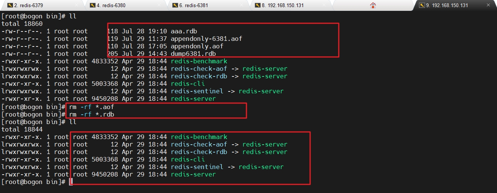


**2.在/etc/myredisclusterconf/下创建六个redis的配置文件**

```html
redis-6319.conf
redis-6329.conf

redis-6339.conf
redis-6349.conf

redis-6359.conf
redis-6369.conf
```


redis-6319.conf

```html
include /etc/myredisconf/myredis.conf
port 6319
pidfile "/var/run/redis_6319.pid"
dbfilename "dump6319.rdb"
#dir "/etc/myredisconf/redis_cluster"
#logfile "/etc/myredisconf/redis_cluster/redis_err_6319.log"
# 打开集群模式
cluster-enabled yes
# 设定节点配置文件名(打开集群模式，启动以后，自动生成)
cluster-config-file nodes-6319.conf
# 设定节点失联时间，超过该时间（毫秒），集群自动进行主从切换。
cluster-node-timeout 15000
```


redis-6329.conf

```html
include /etc/myredisconf/myredis.conf
port 6329
pidfile "/var/run/redis_6329.pid"
dbfilename "dump6329.rdb"
#dir "/etc/myredisconf/redis_cluster"
#logfile "/etc/myredisconf/redis_cluster/redis_err_6329.log"
cluster-enabled yes
cluster-config-file nodes-6329.conf
cluster-node-timeout 15000
```


redis-6339.conf

```html
include /etc/myredisconf/myredis.conf
port 6339
pidfile "/var/run/redis_6339.pid"
dbfilename "dump6339.rdb"
#dir "/etc/myredisconf/redis_cluster"
#logfile "/etc/myredisconf/redis_cluster/redis_err_6339.log"
cluster-enabled yes
cluster-config-file nodes-6339.conf
cluster-node-timeout 15000
```


redis-6349.conf

```html
include /etc/myredisconf/myredis.conf
port 6349
pidfile "/var/run/redis_6349.pid"
dbfilename "dump6349.rdb"
#dir "/etc/myredisconf/redis_cluster"
#logfile "/etc/myredisconf/redis_cluster/redis_err_6349.log"
cluster-enabled yes
cluster-config-file nodes-6349.conf
cluster-node-timeout 15000
```


redis-6359.conf

```html
include /etc/myredisconf/myredis.conf
port 6359
pidfile "/var/run/redis_6359.pid"
dbfilename "dump6359.rdb"
#dir "/etc/myredisconf/redis_cluster"
#logfile "/etc/myredisconf/redis_cluster/redis_err_6359.log"
cluster-enabled yes
cluster-config-file nodes-6359.conf
cluster-node-timeout 15000
```


redis-6369.conf

```html
include /etc/myredisconf/myredis.conf
port 6369
pidfile "/var/run/redis_6369.pid"
dbfilename "dump6369.rdb"
#dir "/etc/myredisconf/redis_cluster"
#logfile "/etc/myredisconf/redis_cluster/redis_err_6369.log"
cluster-enabled yes
cluster-config-file nodes-6369.conf
cluster-node-timeout 15000
```


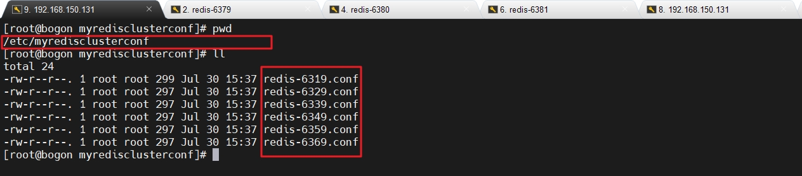


**3.使用六个配置文件，启动六个Redis服务**

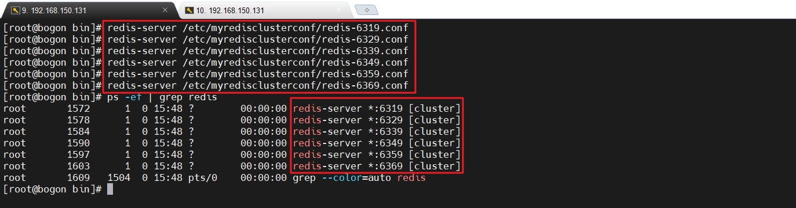


启动六个Redis服务后，一定要确定六个对应的节点文件生成 ： nodes-xxxx.conf文件都生成正常。

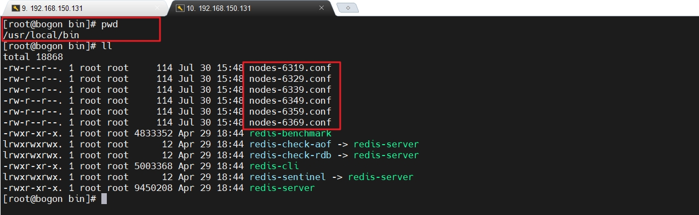


**4.使用集群命令登陆**

一定要进入Redis的源文件目录（/opt/redis-6.2.1/src/）执行集群合体登陆的命令,这样才能实现六合一，才能虽然存在六个Redis服务，但是在外界的感知中是一台的效果。

```bash
redis-cli --cluster create --cluster-replicas 1 192.168.150.131:6319 192.168.150.131:6329 192.168.150.131:6339 192.168.150.131:6349 192.168.150.131:6359 192.168.150.131:6369
```

注意，集群中的登陆命令必须写ip地址，即使在本地，也要写ip地址，千万不能写127.0.0.1


**查看运行效果**

```html
[root@bogon src]# cd /opt/redis-6.2.1/src/  //进入Redis的源文件目录
[root@bogon src]# pwd
/opt/redis-6.2.1/src

[root@bogon src]# redis-cli --cluster create --cluster-replicas 1 192.168.150.131:6319 192.168.150.131:6329 192.168.150.131:6339 192.168.150.131:6349 192.168.150.131:6359 192.168.150.131:6369 	//集群六合一登陆命令

>>> Performing hash slots allocation on 6 nodes...
Master[0] -> Slots 0 - 5460
Master[1] -> Slots 5461 - 10922
Master[2] -> Slots 10923 - 16383
Adding replica 192.168.150.131:6359 to 192.168.150.131:6319
Adding replica 192.168.150.131:6369 to 192.168.150.131:6329
Adding replica 192.168.150.131:6349 to 192.168.150.131:6339
>>> Trying to optimize slaves allocation for anti-affinity
[WARNING] Some slaves are in the same host as their master
M: d212681eef2d040afca43e740d9dccac02a044fc 192.168.150.131:6319
   slots:[0-5460] (5461 slots) master
M: f72e9fdece8b93407d24955025fe2420b185f8e7 192.168.150.131:6329
   slots:[5461-10922] (5462 slots) master
M: 5713a771706102aad2f314c990173a58f3f3f4e0 192.168.150.131:6339
   slots:[10923-16383] (5461 slots) master
S: 4313b8886140a12dd403c981258aa432c917a354 192.168.150.131:6349
   replicates f72e9fdece8b93407d24955025fe2420b185f8e7
S: 64e7240f1f75a377e5922ac0134bb0e0a0413aa2 192.168.150.131:6359
   replicates 5713a771706102aad2f314c990173a58f3f3f4e0
S: 72fcc65188a4545116de360e464dce311b26490d 192.168.150.131:6369
   replicates d212681eef2d040afca43e740d9dccac02a044fc
Can I set the above configuration? (type 'yes' to accept): yes			//输入yes
>>> Nodes configuration updated
>>> Assign a different config epoch to each node
>>> Sending CLUSTER MEET messages to join the cluster
Waiting for the cluster to join
.
//六合一成功，三台主机，三台从机

>>> Performing Cluster Check (using node 192.168.150.131:6319)
M: d212681eef2d040afca43e740d9dccac02a044fc 192.168.150.131:6319
   slots:[0-5460] (5461 slots) master	//主机
   1 additional replica(s)
M: f72e9fdece8b93407d24955025fe2420b185f8e7 192.168.150.131:6329
   slots:[5461-10922] (5462 slots) master	//主机
   1 additional replica(s)
S: 4313b8886140a12dd403c981258aa432c917a354 192.168.150.131:6349
   slots: (0 slots) slave	//从机
   replicates f72e9fdece8b93407d24955025fe2420b185f8e7
M: 5713a771706102aad2f314c990173a58f3f3f4e0 192.168.150.131:6339
   slots:[10923-16383] (5461 slots) master	//主机
   1 additional replica(s)
S: 72fcc65188a4545116de360e464dce311b26490d 192.168.150.131:6369
   slots: (0 slots) slave	//从机
   replicates d212681eef2d040afca43e740d9dccac02a044fc
S: 64e7240f1f75a377e5922ac0134bb0e0a0413aa2 192.168.150.131:6359
   slots: (0 slots) slave	//从机
   replicates 5713a771706102aad2f314c990173a58f3f3f4e0
[OK] All nodes agree about slots configuration.
>>> Check for open slots...
>>> Check slots coverage...
[OK] All 16384 slots covered.
[root@bogon src]#

```


**登陆集群**

在集群环境中，使用任意一台主机登陆即可。采用集群策略连接，写入数据会自动切换到相应的写主机。

```bash
[root@bogon bin]# redis-cli -c -p 6319
-c参数就是说使用集群方式连接，没有-c就是普通连接
```


**查看集群信息**

```html
[root@bogon bin]# redis-cli -c -p 6319	//采用集群方式登陆
127.0.0.1:6319> cluster nodes			//查看集群信息
f72e9fdece8b93407d24955025fe2420b185f8e7 192.168.150.131:6329@16329 master - 0 1659168653000 2 connected 5461-10922
4313b8886140a12dd403c981258aa432c917a354 192.168.150.131:6349@16349 slave f72e9fdece8b93407d24955025fe2420b185f8e7 0 1659168654000 2 connected
5713a771706102aad2f314c990173a58f3f3f4e0 192.168.150.131:6339@16339 master - 0 1659168655760 3 connected 10923-16383
d212681eef2d040afca43e740d9dccac02a044fc 192.168.150.131:6319@16319 myself,master - 0 1659168652000 1 connected 0-5460
72fcc65188a4545116de360e464dce311b26490d 192.168.150.131:6369@16369 slave d212681eef2d040afca43e740d9dccac02a044fc 0 1659168655000 1 connected
64e7240f1f75a377e5922ac0134bb0e0a0413aa2 192.168.150.131:6359@16359 slave 5713a771706102aad2f314c990173a58f3f3f4e0 0 1659168654741 3 connected
127.0.0.1:6319>

master机器后边没有其它信息
slave从机后边描述的是自己的主机，例如最后一行的
64e7240f1f75a377e5922ac0134bb0e0a0413aa2 192.168.150.131:6359@16359 slave 5713a771706102aad2f314c990173a58f3f3f4e0 0 1659168654741 3 connected


64e7240f1f75a377e5922ac0134bb0e0a0413aa2 ： 自己的运行id
192.168.150.131:6359@16359				 :	自己的ip和端口
slave									 ： 自己的角色是从机
5713a771706102aad2f314c990173a58f3f3f4e0	就是主机的运行id
所以
3aa2从机的主机是f4e0
```


**到这里，Redis集群搭建完毕！！！**


## 集群操作-添加/查询数据


**插槽的概念**


在使用集群命令登陆的启动日志中，有如下三行信息

```
>>> Performing hash slots allocation on 6 nodes...
Master[0] -> Slots 0 - 5460
Master[1] -> Slots 5461 - 10922
Master[2] -> Slots 10923 - 16383
```


Slots，翻译过来就是插槽的意思，在启动日志中明确说了，Master[0]号主机有5461个插槽，Master[1]号主机有10922-5464个插槽，Master[2]号主机中有16383-10923个插槽，这些范围内的数字，就是插槽的标号（角标），所以，一个Redis集群中有16384 个插槽（hash slot）， **数据库中的每个键都属于这 16384 个插槽的其中一个。**

集群使用公式 CRC16(key) % 16384 来计算键 key 属于哪个槽， 其中 CRC16(key) 语句用于计算键 key 的 CRC16 校验和 。
集群中的每个节点负责处理一部分插槽。就像启动日志中描述的那样， 其中：
Master[0]负责处理 0 号至 5460 号插槽。
Master[0]负责处理 5461 号至 10922 号插槽。
Master[0]负责处理 10923 号至 16383 号插槽。


**在集群中录入单个值**

```bash
127.0.0.1:6319> set ck1 cvalue1
-> Redirected to slot [13209] located at 192.168.150.131:6339
OK
192.168.150.131:6339>
```

我们使用6319端口登陆的集群，在添加ck1数据的时候，Redis计算这个key应该放入在13209号插槽中，所以，自动切换到了负责维护13209号插槽的主机6339中，然后再将数据添加到6339端口主机中，这就保证了数据被平均分布在几台主机中，同时也完成了自动的切换，达到了集群的合体效果。


**在集群中录入多个值**

```ba
192.168.150.131:6339> mset name xiaoka age 33 slary 99999
(error) CROSSSLOT Keys in request don't hash to the same slot
192.168.150.131:6339>
```

一次录入多个键值对，Redis无法决定使用哪个键进行计算，也就无法决定将这多个key-value放入到哪个插槽中，所以，不能直接一次添加多个key-value。

同样，不在一个插槽中的数据，也不能一次获取，即mget也不行。


**组的概念**

在Redis集群中，无法一次录入多个键值对，原因是无法决定使用哪个key来计算要放入的插槽。但是，如果我们将这多个key放入同一组中，使用组来计算，这个问题就可以迎刃而解。

```bash
192.168.150.131:6339> mset name{user} xiaoka age{user} 33 slary{user} 99999
-> Redirected to slot [5474] located at 192.168.150.131:6329
OK
192.168.150.131:6329>
```

不使用name计算，也不使用age计算，而是使用组user来计算，这样就可以计算出来将这三个key放入到5474号插槽中。注意，此时又切换到了6329端口主机中。


**查询集群中的值**

注意，虽然集群是理论上的一个整体，但是这仅仅是针对写入数据时集群中的主机可以自动切换，但是获取数据的时候，没有自动切换主机这个功能，这就导致，在A主机中的数据，只能登陆到A主机获取，在B主机中的数据，只能在B主机中查看。


**查看键所在的插槽的标号**

```bash
192.168.150.131:6329> cluster keyslot ck1
(integer) 13209
192.168.150.131:6329>
```

键ck1放在了13209号插槽中。


**查看插槽中键的数量**

```bash
192.168.150.131:6329> cluster countkeysinslot 5474
(integer) 3
192.168.150.131:6329> cluster countkeysinslot 13209
(integer) 0
```

注意，我们的第一个key就是放在了13209号插槽中，但是查看集群中的值只能在当前插槽所在的主机中查看，所以这里看到的13209号插槽中的键数量结果是零。


**获取插槽中的键的值**

```bash
192.168.150.131:6329> cluster getkeysinslot 5474 2
1) "age{user}"
2) "name{user}"
192.168.150.131:6329> cluster getkeysinslot 5474 3
1) "age{user}"
2) "name{user}"
3) "slary{user}"
192.168.150.131:6329> cluster getkeysinslot 13209 1
(empty array)
```

返回5474号插槽中的前2个key

返回5474号插槽中的前3个key

返回13209号插槽中的前1个key


## 集群操作-故障恢复

我们之所以使用集群，就是为了保证随时有主机提供服务，所以，演示这个故障恢复，其实就是演示主机宕机，从机自动升级为主机

注意 ： 主机宕机，从机自动升级主机会有大概十五秒的延迟，同样，重新启动主机以后，主机成为从机，也会有大概十五秒的延迟。


**主机宕机，从机自动升级成从机**

```bash
192.168.150.131:6329> shutdown			//让6329宕机
not connected> exit
[root@bogon bin]# redis-cli -c -p 6319	//从6319端口登陆
127.0.0.1:6319> cluster nodes			//查看集群信息
f72e9fdece8b93407d24955025fe2420b185f8e7 192.168.150.131:6329@16329 master,fail - 1659254262325 1659254258283 2 disconnected
4313b8886140a12dd403c981258aa432c917a354 192.168.150.131:6349@16349 master - 0 1659254292000 7 connected 5461-10922
5713a771706102aad2f314c990173a58f3f3f4e0 192.168.150.131:6339@16339 master - 0 1659254293864 3 connected 10923-16383
d212681eef2d040afca43e740d9dccac02a044fc 192.168.150.131:6319@16319 myself,master - 0 1659254293000 1 connected 0-5460
72fcc65188a4545116de360e464dce311b26490d 192.168.150.131:6369@16369 slave d212681eef2d040afca43e740d9dccac02a044fc 0 1659254292847 1 connected
64e7240f1f75a377e5922ac0134bb0e0a0413aa2 192.168.150.131:6359@16359 slave 5713a771706102aad2f314c990173a58f3f3f4e0 0 1659254292000 3 connected
127.0.0.1:6319>
```

可以看到，6329端口服务器无法连接

现在的主机变成了6319，6339，6349，说明6329号的从机自动升级成了主机。


**原主节点恢复后，主节点回来变成从机**

再次启动6329端口号Redis

```bash
[root@bogon src]# redis-server /etc/myredisclusterconf/redis-6329.conf
[root@bogon src]#
```

再次查看节点信息，6329端口主机变成了从机

```bash
192.168.150.131:6359> cluster nodes
f16157a988c2f55d2b8583061167cd2b7c028da2 192.168.150.131:6359@16359 myself,master - 0 1659256578000 8 connected 5461-10922
5e93ead1989bbd71b020c70ef4190598449ec386 192.168.150.131:6369@16369 slave 790ef0d98d9cc0f499fa6e02f2332861836bd30e 0 1659256579000 3 connected
25cab0212f077122b924ae25ae85197f77321919 192.168.150.131:6329@16329 slave f16157a988c2f55d2b8583061167cd2b7c028da2 0 1659256579000 8 connected
719b6c716a9474b8fb29b5734b2b423e5dd7c3b2 192.168.150.131:6349@16349 master - 0 1659256580985 7 connected 0-5460
8778520e22816670e11e06ae61f1146a772b2679 192.168.150.131:6319@16319 slave 719b6c716a9474b8fb29b5734b2b423e5dd7c3b2 0 1659256579963 7 connected
790ef0d98d9cc0f499fa6e02f2332861836bd30e 192.168.150.131:6339@16339 master - 0 1659256580000 3 connected 10923-16383
```


**其它问题**

如果所有某一段插槽的主从节点都宕掉，redis服务是否还能继续?答案是根据redis.conf中的参数  cluster-require-full-coverage来决定的。
如果某一段插槽的主从都挂掉，而cluster-require-full-coverage 为yes ，那么 ，整个集群都挂掉
如果某一段插槽的主从都挂掉，而cluster-require-full-coverage 为no ，那么，该插槽数据全都不能使用，也无法存储。


**小结**

```html
Redis 集群提供了以下好处
	实现扩容
	分摊压力
	无中心配置相对简单

Redis 集群的不足
	多键操作是不被支持的 
	多键的Redis事务是不被支持的。lua脚本不被支持
	由于集群方案出现较晚，很多公司已经采用了其他的集群方案，而代理或者客户端分片的方案想要迁移至redis cluster，需要整体迁移而不是逐步过渡，复杂度较大。
```


# Redis应用中的问题


## 缓存穿透

key对应的数据在数据源并不存在，每次针对此key的请求从缓存获取不到，请求都会压到数据源，从而可能压垮数据源。

比如用一个不存在的用户id获取用户信息，不论缓存还是数据库都没有，若黑客利用此漏洞进行攻击可能压垮数据库。


**解决方案**

一个一定不存在缓存及查询不到的数据，由于缓存是不命中时被动写的，并且出于容错考虑，如果从存储层查不到数据则不写入缓存，这将导致这个不存在的数据每次请求都要到存储层去查询，失去了缓存的意义。

1. 对空值缓存：如果一个查询返回的数据为空（不管是数据是否不存在），我们仍然把这个空结果（null）进行缓存，设置空结果的过期时间会很短，最长不超过五分钟

2. 设置可访问的名单（白名单）：

   ​	使用bitmaps类型定义一个可以访问的名单，名单id作为bitmaps的偏移量，每次访问和bitmap里面的id进行比较，如果访问id不在bitmaps里面，进行拦截，不允许访问。

3. 采用布隆过滤器：(布隆过滤器（Bloom Filter）是1970年由布隆提出的。它实际上是一个很长的二进制向量(位图)和一系列随机映射函数（哈希函数）。

   ​	布隆过滤器可以用于检索一个元素是否在一个集合中。它的优点是空间效率和查询时间都远远超过一般的算法，缺点是有一定的误识别率和删除困难。)
   将所有可能存在的数据哈希到一个足够大的bitmaps中，一个一定不存在的数据会被 这个bitmaps拦截掉，从而避免了对底层存储系统的查询压力。

4. 进行实时监控：当发现Redis的命中率开始急速降低，需要排查访问对象和访问的数据，和运维人员配合，可以设置黑名单限制服务


## 缓存击穿

key对应的数据存在，但在redis中过期，此时若有大量并发请求过来，这些请求发现缓存过期一般都会从后端DB加载数据并回设到缓存，这个时候大并发的请求可能会瞬间把后端DB压垮。


**解决方案**

key可能会在某些时间点被超高并发地访问，是一种非常“热点”的数据。这个时候，需要考虑一个问题：缓存被“击穿”的问题。

1. 预先设置热门数据：在redis高峰访问之前，把一些热门数据提前存入到redis里面，加大这些热门数据key的时长
2. 实时调整：现场监控哪些数据热门，实时调整key的过期时长
3. 使用锁：
   1. 就是在缓存失效的时候（判断拿出来的值为空），不是立即去load db。
   2. 先使用缓存工具的某些带成功操作返回值的操作（比如Redis的SETNX）去set一个mutex key
   3. 当操作返回成功时，再进行load db的操作，并回设缓存,最后删除mutex key；
   4. 当操作返回失败，证明有线程在load db，当前线程睡眠一段时间再重试整个get缓存的方法。


## 缓存雪崩

key对应的数据存在，但在redis中过期，此时若有大量并发请求过来，这些请求发现缓存过期一般都会从后端DB加载数据并回设到缓存，这个时候大并发的请求可能会瞬间把后端DB压垮。
缓存雪崩与缓存击穿的区别在于这里针对很多key缓存，前者则是某一个key


**解决方案**


缓存失效时的雪崩效应对底层系统的冲击非常可怕！

1. 构建多级缓存架构：nginx缓存 + redis缓存 +其他缓存（ehcache等）

2. 使用锁或队列：

   ​	用加锁或者队列的方式保证来保证不会有大量的线程对数据库一次性进行读写，从而避免失效时大量的并发请求落到底层存储系统上。不适用高	并发情况

3. 设置过期标志更新缓存：

   记录缓存数据是否过期（设置提前量），如果过期会触发通知另外的线程在后台去更新实际key的缓存。

4. 将缓存失效时间分散开：

   比如我们可以在原有的失效时间基础上增加一个随机值，比如1-5分钟随机，这样每一个缓存的过期时间的重复率就会降低，就很难引发集体失效的事件。


# 分布式锁

随着业务发展的需要，原单体单机部署的系统被演化成分布式集群系统后，由于分布式系统多线程、多进程并且分布在不同机器上，这将使原单机部署情况下的并发控制锁策略失效，单纯的Java API并不能提供分布式锁的能力。为了解决这个问题就需要一种跨JVM的互斥机制来控制共享资源的访问，这就是分布式锁要解决的问题！

分布式锁主流的实现方案：

1. 基于数据库实现分布式锁
2. 基于缓存（Redis等）
3. 基于Zookeeper

每一种分布式锁解决方案都有各自的优缺点：

1. 性能：redis最高

2. 可靠性：zookeeper最高

  

  这里，我们就基于redis实现分布式锁。


**常用命令**


**添加key-value，并且给当前key添加上锁,永远不释放**

```bash
setnx key value 
```


```bash
192.168.150.131:6359> setnx k1 v1
-> Redirected to slot [12706] located at 192.168.150.131:6339
(integer) 1
192.168.150.131:6339> setnx k1 v1
(integer) 0
192.168.150.131:6339> setnx k1 v2
(integer) 0
```

第一次添加k1，并且加上了分布式锁，而且永不释放锁，所以再次执行返回0，表示执行失败


**释放锁**

```bash
del key
```


```bash

192.168.150.131:6339> del k1
(integer) 1
192.168.150.131:6339> setnx k1 v2
(integer) 1
192.168.150.131:6339>

```

将那个key给删除，自然那个锁也就被释放了


**设置锁过期时间**

```bash
expire key seconds
```


```bash
192.168.150.131:6339> setnx k1 v3
(integer) 1
192.168.150.131:6339> expire k1 6 // 设置k1在6秒后过期
(integer) 1
192.168.150.131:6339> ttl k1	//还剩下3秒过期
(integer) 3
192.168.150.131:6339> ttl k1	//过期，锁被释放
(integer) -2		
192.168.150.131:6339> setnx k1 v4	//没有锁了，设置值成功
(integer) 1
192.168.150.131:6339>
```


**同时添加锁和过期时间**

```bash
set key value nx ex seconds
```


```bash
192.168.150.131:6339> set k1 v5 nx ex 60
OK
192.168.150.131:6339> ttl k1
(integer) 55
192.168.150.131:6339>
```

这样就能保证所有添加的数据锁一定会被释放。


# Redis中的发布和订阅

Redis 发布订阅 (pub/sub) 是一种消息通信模式：发送者 (pub) 发送消息，订阅者 (sub) 接收消息。就像是消费者可以在邮局订任意种报纸一个道理，Redis 客户端可以订阅任意数量的频道。


**常用命令**

实现发布-订阅需要两个客户端配合来演示，一个客户端扮演出版社，发布报纸，另外一个客户端扮演消费者，订阅报纸。

凡是订阅了报纸的消费者都能收到出版社发布的报纸，那么，同样，订阅消息的客户端一定会收到发布消息的客户端发布的消息。


**订阅**

```bash
subscribe
```


**发布**

```bash
publish
```


**操作演示**


**订阅者客户端**


**发布者客户端**

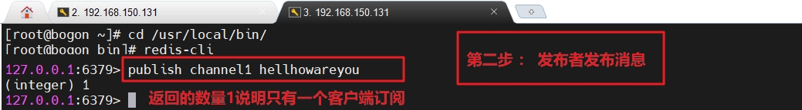


注：发布的消息没有持久化，在订阅的客户端，只能收到订阅后发布的消息。


# Redis的新数据类型


Redis提供了几个新的数据类型，它们是

- bitmaps
- HyperLogLog
- Geospatial


## Bitmaps

Bitmaps是一个String类型的数组，数组中只能存储0和1，更重要的是，bitmaps中的0和1都只占用一个bit位，所以，使用bitmaps存储数据，可以大大节省存储空间。

注意，数组的角标在Bitmaps中叫做偏移量。所以，我们说bitmap偏移量为3的地方存储的是1，其实就是指代角标为3的位置存储的1，属于第四个元素。


**基本命令**


**设置Bitmaps中某个偏移量的值（0或1）**

```bash
setbit	<key> <offset> <value>	
```


```bash
127.0.0.1:6381> setbit users 3 1
(integer) 0
127.0.0.1:6381> setbit users 23 1
(integer) 0
127.0.0.1:6381> setbit users 16 1
(integer) 0
```


**获取Bitmaps中某个偏移量的值(从0开始)**

```bash
getbit <key> <offset>
```


```bash
127.0.0.1:6381> getbit users 0
(integer) 0
127.0.0.1:6381> getbit users 1
(integer) 0
127.0.0.1:6381> getbit users 3	//只有角标为3的位置存储了1，所以获取到了1，其它角标没设置数值，所以获取到了0
(integer) 1
127.0.0.1:6381> getbit users 30
(integer) 0
127.0.0.1:6381> getbit users 27
(integer) 0
127.0.0.1:6381>
```


**统计字符串被设置为1的bit数**

```bash
bitcount key
```

一般情况下，给定的整个字符串都会被进行计数，通过指定额外的 start 或 end 参数，可以让计数只在特定的位上进行。

start 和 end 参数的设置，都可以使用负数值：比如 -1 表示最后一个位，而 -2 表示倒数第二个位

start、end 是指bit组的字节的偏移量（角标）。


```bash
127.0.0.1:6381> bitcount users
(integer) 3
127.0.0.1:6381>
```


**bitmaps应用**

现在有9个用户，他们的id分别是 ： 1001，2001，3001，4001，5001，6001，7001，8001，9001

这9个用户中，只有3001和9001两个用户访问过网站，

我们则可以使用bitmap这个String数组来存储访问过网站的用户id : 将用户id作为bitmaps的角标，将该角标位置设置为1，表示访问过。

```bash

127.0.0.1:6381> setbit users_id 3001 1
(integer) 0
127.0.0.1:6381> setbit users_id 9001 1
(integer) 0
127.0.0.1:6381>

```

此时，users_id的内存情况是


user_id这个bitmaps数组的长度是9002，也就是一共9002个bit位。

在这9002个bit位中

角标3001存储1，代表id=3001的用户访问过网站

角标9001存储1，代表id=9001的用户访问过网站

此时，它一共占用内存 9002bit / 8 =  1126个字节 / 1024 =  1.1kb =  0.001MB。


当然，我们也可以使用一个集合来存储访问过网站用户的id

```bash
127.0.0.1:6381> sadd user_id_set 3001,9001
(integer) 1
127.0.0.1:6381>
```

使用set集合存储这两个访问过网站用户的id,内存大小是64bit * 2 = 128个bit位 / 8 = 16个字节


现在，同样是存储两个用户的数据，bitmap使用了1126个字节，但是set集合仅仅使用了16个字节。

所以，虽然bitmap的目的是节省存储空间，但是，在某些情况下，它会造成空间的浪费，这种情况是由于9001，3001这两个超大id造成的。

它导致了user_id这个bitmaps里边的绝大多数空间都被浪费了（都是默认的0）。

为了避免bitmaps浪费空间，我们可以将用户的id进行一下处理，例如都减去某个数字，让id值变小，这样就可以节省空间了。


当然，bitmaps的目的是节省空间，在通常的情况下，它能够节省的空间还是非常大的。

例如

网站有1亿用户， 每天独立访问的用户有5千万， 如果每天用集合类型和Bitmaps分别存储活跃用户可以得到表

| 数据类型 | 每个用户id占用空间 | 需要存储的用户量 | 全部占用内存     |
| -------- | ------------------ | ---------------- | ---------------- |
| 集合类型 | 64位               | 5千万            | 64位*5千万=382MB |
| bitmaps  | 1位                | 1亿              | 1位*1亿 = 12MB   |


通过上表，可以看到，bitmaps是可以节省非常大的空间的。


**其它命令**


```html
bitop operation destkey key [key...]
```

bitop是一个复合操作， 它可以做多个Bitmaps的and（交集） 、 or（并集） 、 not（非） 、 xor（异或） 操作并将结果保存在deskey中。


**求两个key的交集**

```bash
bitop and destkey key [key...]
```


求交集，顾名思义，多个key，角标相同，都是1，才会被取出来，这个交集结果会被放入destkey中，我们先来设置两个bitmaps，放入一些数据

```bash

127.0.0.1:6381> setbit users0701 1 1
(integer) 0
127.0.0.1:6381> setbit users0701 3 1
(integer) 0
127.0.0.1:6381> setbit users0701 5 1
(integer) 0
127.0.0.1:6381> setbit users0701 7 1
(integer) 0
127.0.0.1:6381> setbit users0702 1 1
(integer) 0
127.0.0.1:6381> setbit users0702 3 1
(integer) 0
127.0.0.1:6381> setbit users0702 5 1
(integer) 0
127.0.0.1:6381> setbit users0702 6 1
(integer) 0
127.0.0.1:6381> setbit users0702 8 1
(integer) 0
```


显然，users0701和users0702这两个key的交集是1，3，5，那么目标key中就会有3个1

```bash
127.0.0.1:6381> bitop and users0102 users0701 users0702
(integer) 2
127.0.0.1:6381> bitcount users0102 //destkey中有3个1
(integer) 3
127.0.0.1:6381> getbit users0102 2
(integer) 0
127.0.0.1:6381> getbit users0102 1
(integer) 1
127.0.0.1:6381>
```


## HyperLogLog


Redis HyperLogLog 是用来做基数统计的算法。

HyperLogLog 的优点是 ： 在输入元素的数量或者体积非常非常大时，计算基数所需的空间总是固定的、并且是很小的。

在 Redis 里面，每个 HyperLogLog 键只需要花费 12 KB 内存，就可以计算接近 2^64 个不同元素的基数。这和计算基数时，元素越多耗费内存就越多的集合形成鲜明对比。

但是，因为 HyperLogLog 只会根据输入元素来计算基数，而不会储存输入元素本身，所以 HyperLogLog 不能像集合那样，返回输入的各个元素。

什么是基数

比如数据集 {1，3，5，7，9，9，3，6}， 那么这个数据集的基数集为 {1, 3, 5 ,7, 9, 6}, 基数为6(不重复元素)。 

基数估计就是在误差可接受的范围内，叫做近似基数。用大白话就是统计不重复元素的个数，允许有一定范围的差错。


**基本命令**

 **添加指定元素到 HyperLogLog 中**

```bash
pfadd key element [element,element...]
```

如果执行命令后key估计的近似基数发生变化，则返回1，否则返回0。


**计算key的近似基数**

```bash
pfcount <key> [key ...] 
```

可以计算多个key，比如用key存储每天的访问ip，计算一周的ip可以使用7天的ip合并计算即可


**合并操作**

```bash
pfmerge <destkey> <sourcekey> [sourcekey ...] 
```

 将一个或多个key合并后的结果存储在另一个key中，比如每月活跃用户可以使用每天的活跃用户来合并计算可得


```bash
127.0.0.1:6381> pfadd usersid 1001 1002 1003 1005 1002 1003
(integer) 1
127.0.0.1:6381> pfcount usersid
(integer) 4
127.0.0.1:6381> pfadd users2id 1002 1003 1007
(integer) 1
127.0.0.1:6381> pfmerge userstotal usersid users2id
OK
127.0.0.1:6381> pfcount userstotal
(integer) 5
127.0.0.1:6381>
```


## Geospatial

Redis 3.2 中增加了对GEO类型的支持。GEO，Geographic，地理信息的缩写。该类型，就是元素的2维坐标，在地图上就是经纬度。

redis基于该类型，提供了经纬度设置，查询，范围查询，距离查询，经纬度Hash等常见操作。


**常用命令**

**添加地理位置（经度，纬度，名称）**

```bash
geoadd <key> <longitude> <latitude> <member> [longitude latitude member...] 
```


```bash

127.0.0.1:6381> geoadd chinacitys 115.25 39.26 beijing 120.52 30.40 shanghai 114.03 22.32 shenzhen
(integer) 3
127.0.0.1:6381> geoadd chinacitys 102.54 30.05 chengdu
(integer) 1
127.0.0.1:6381>

```


两极无法直接添加，一般会下载城市数据，直接通过 Java 程序一次性导入。
有效的经度从 -180 度到 180 度。有效的纬度从 -85.05112878 度到 85.05112878 度。
当坐标位置超出指定范围时，该命令将会返回一个错误。
已经添加的数据，是无法再次往里面添加的。

**获取两个位置之间的直线距离**

```bash
geodist <key> <member1> <member2>  [m|km|ft|mi ] 
```

最后的参数是长度单位，分别是

m : 米

km : 千米

ft : 英里

mi : 英尺


```bash

127.0.0.1:6381> geodist chinacitys beijing shanghai km
"1096.1123"
127.0.0.1:6381>

```


**以给定的经纬度为中心，找出某一半径内的元素**

```bash
georadius <key> <longitude> <latitude> radius  m|km|ft|mi 
```


找出北京方圆2000公里半径内的地方

```bash
georadius chinacitys 115 39 2000 km
1) "chengdu"
2) "shenzhen"
3) "shanghai"
4) "beijing"
127.0.0.1:6381>
```


# Redis配置文件详解


## Units单位

配置大小单位,开头定义了一些基本的度量单位，只支持bytes，不支持bit

大小写不敏感

```html
# Redis configuration file example.
#
# Note that in order to read the configuration file, Redis must be
# started with the file path as first argument:
#
# ./redis-server /path/to/redis.conf

# Note on units: when memory size is needed, it is possible to specify
# it in the usual form of 1k 5GB 4M and so forth:
#
# 1k => 1000 bytes
# 1kb => 1024 bytes
# 1m => 1000000 bytes
# 1mb => 1024*1024 bytes
# 1g => 1000000000 bytes
# 1gb => 1024*1024*1024 bytes
#
# units are case insensitive so 1GB 1Gb 1gB are all the same.
```


## INCLUDES包含

类似jsp中的include，多实例的情况可以把公用的配置文件提取出来

```html
################################## INCLUDES ###################################

# Include one or more other config files here.  This is useful if you
# have a standard template that goes to all Redis servers but also need
# to customize a few per-server settings.  Include files can include
# other files, so use this wisely.
#
# Note that option "include" won't be rewritten by command "CONFIG REWRITE"
# from admin or Redis Sentinel. Since Redis always uses the last processed
# line as value of a configuration directive, you'd better put includes
# at the beginning of this file to avoid overwriting config change at runtime.
#
# If instead you are interested in using includes to override configuration
# options, it is better to use include as the last line.
#
# include /path/to/local.conf
# include /path/to/other.conf
```


## 网络相关配置


**bind**

默认情况bind=127.0.0.1只能接受本机的访问请求
不写的情况下，无限制接受任何ip地址的访问
生产环境肯定要写你应用服务器的地址；服务器是需要远程访问的，所以需要将其注释掉
如果开启了protected-mode，那么在没有设定bind ip且没有设密码的情况下，Redis只允许接受本机的响应

```html
################################## NETWORK #####################################

# By default, if no "bind" configuration directive is specified, Redis listens
# for connections from all available network interfaces on the host machine.
# It is possible to listen to just one or multiple selected interfaces using
# the "bind" configuration directive, followed by one or more IP addresses.
# Each address can be prefixed by "-", which means that redis will not fail to
# start if the address is not available. Being not available only refers to
# addresses that does not correspond to any network interfece. Addresses that
# are already in use will always fail, and unsupported protocols will always BE
# silently skipped.
#
# Examples:
#
# bind 192.168.1.100 10.0.0.1     # listens on two specific IPv4 addresses
# bind 127.0.0.1 ::1              # listens on loopback IPv4 and IPv6
# bind * -::*                     # like the default, all available interfaces
#
# ~~~ WARNING ~~~ If the computer running Redis is directly exposed to the
# internet, binding to all the interfaces is dangerous and will expose the
# instance to everybody on the internet. So by default we uncomment the
# following bind directive, that will force Redis to listen only on the
# IPv4 and IPv6 (if available) loopback interface addresses (this means Redis
# will only be able to accept client connections from the same host that it is
# running on).
#
# IF YOU ARE SURE YOU WANT YOUR INSTANCE TO LISTEN TO ALL THE INTERFACES
# JUST COMMENT OUT THE FOLLOWING LINE.
# ~~~~~~~~~~~~~~~~~~~~~~~~~~~~~~~~~~~~~~~~~~~~~~~~~~~~~~~~~~~~~~~~~~~~~~~~
#bind 127.0.0.1 -::1
```


**protected-mode**

将本机访问保护模式设置no

```html
# Protected mode is a layer of security protection, in order to avoid that
# Redis instances left open on the internet are accessed and exploited.
#
# When protected mode is on and if:
#
# 1) The server is not binding explicitly to a set of addresses using the
#    "bind" directive.
# 2) No password is configured.
#
# The server only accepts connections from clients connecting from the
# IPv4 and IPv6 loopback addresses 127.0.0.1 and ::1, and from Unix domain
# sockets.
#
# By default protected mode is enabled. You should disable it only if
# you are sure you want clients from other hosts to connect to Redis
# even if no authentication is configured, nor a specific set of interfaces
# are explicitly listed using the "bind" directive.
protected-mode no
```


**Port**

端口号，默认 6379

```html
# Accept connections on the specified port, default is 6379 (IANA #815344).
# If port 0 is specified Redis will not listen on a TCP socket.
port 6379
```


**tcp-backlog**

设置tcp的backlog，backlog其实是一个连接队列，backlog队列总和=未完成三次握手队列 + 已经完成三次握手队列。
在高并发环境下你需要一个高backlog值来避免慢客户端连接问题。
注意Linux内核会将这个值减小到/proc/sys/net/core/somaxconn的值（128），所以需要确认增大/proc/sys/net/core/somaxconn和/proc/sys/net/ipv4/tcp_max_syn_backlog（128）两个值来达到想要的效果

```html
# TCP listen() backlog.
#
# In high requests-per-second environments you need a high backlog in order
# to avoid slow clients connection issues. Note that the Linux kernel
# will silently truncate it to the value of /proc/sys/net/core/somaxconn so
# make sure to raise both the value of somaxconn and tcp_max_syn_backlog
# in order to get the desired effect.
tcp-backlog 511
```


**timeout**

一个空闲的客户端维持多少秒会关闭，0表示关闭该功能。即永不关闭。

```html
# Close the connection after a client is idle for N seconds (0 to disable)
timeout 0
```


**tcp-keepalive**

对访问客户端的一种心跳检测，每个n秒检测一次。
单位为秒，如果设置为0，则不会进行Keepalive检测，建议设置成60 

```html
# TCP keepalive.
#
# If non-zero, use SO_KEEPALIVE to send TCP ACKs to clients in absence
# of communication. This is useful for two reasons:
#
# 1) Detect dead peers.
# 2) Force network equipment in the middle to consider the connection to be
#    alive.
#
# On Linux, the specified value (in seconds) is the period used to send ACKs.
# Note that to close the connection the double of the time is needed.
# On other kernels the period depends on the kernel configuration.
#
# A reasonable value for this option is 300 seconds, which is the new
# Redis default starting with Redis 3.2.1.
tcp-keepalive 300
```


## GENERAL

通用设置


### daemonize

是否为后台进程，设置为yes
守护进程，后台启动

```html
# By default Redis does not run as a daemon. Use 'yes' if you need it.
# Note that Redis will write a pid file in /var/run/redis.pid when daemonized.
# When Redis is supervised by upstart or systemd, this parameter has no impact.
daemonize yes
```


### pidfile

存放pid文件的位置，每个实例会产生一个不同的pid文件

```html
# If a pid file is specified, Redis writes it where specified at startup
# and removes it at exit.
#
# When the server runs non daemonized, no pid file is created if none is
# specified in the configuration. When the server is daemonized, the pid file
# is used even if not specified, defaulting to "/var/run/redis.pid".
#
# Creating a pid file is best effort: if Redis is not able to create it
# nothing bad happens, the server will start and run normally.
#
# Note that on modern Linux systems "/run/redis.pid" is more conforming
# and should be used instead.
pidfile /var/run/redis_6379.pid
```


### **loglevel** 

指定日志记录级别，Redis总共支持四个级别：debug、verbose、notice、warning，默认为notice
四个级别根据使用阶段来选择，生产环境选择notice 或者warning

```html
# Specify the server verbosity level.
# This can be one of:
# debug (a lot of information, useful for development/testing)
# verbose (many rarely useful info, but not a mess like the debug level)
# notice (moderately verbose, what you want in production probably)
# warning (only very important / critical messages are logged)
loglevel notice
```


### **logfile** 

日志文件名称

```html
# Specify the log file name. Also the empty string can be used to force
# Redis to log on the standard output. Note that if you use standard
# output for logging but daemonize, logs will be sent to /dev/null
logfile ""
```


### **databases 16** 

设定库的数量 默认16，默认数据库为0，可以使用SELECT <dbid>命令在连接上指定数据库id

```html
# Set the number of databases. The default database is DB 0, you can select
# a different one on a per-connection basis using SELECT <dbid> where
# dbid is a number between 0 and 'databases'-1
databases 16
```


## **SECURITY**

设置密码

```html
# Warning: since Redis is pretty fast, an outside user can try up to
# 1 million passwords per second against a modern box. This means that you
# should use very strong passwords, otherwise they will be very easy to break.
# Note that because the password is really a shared secret between the client
# and the server, and should not be memorized by any human, the password
# can be easily a long string from /dev/urandom or whatever, so by using a
# long and unguessable password no brute force attack will be possible.
```


## CLIENTS

### maxclients

设置redis同时可以与多少个客户端进行连接。
	默认情况下为10000个客户端。
	如果达到了此限制，redis则会拒绝新的连接请求，并且向这些连接请求方发出“max number of clients reached”以作回应。

```html
# Set the max number of connected clients at the same time. By default
# this limit is set to 10000 clients, however if the Redis server is not
# able to configure the process file limit to allow for the specified limit
# the max number of allowed clients is set to the current file limit
# minus 32 (as Redis reserves a few file descriptors for internal uses).
#
# Once the limit is reached Redis will close all the new connections sending
# an error 'max number of clients reached'.
#
# IMPORTANT: When Redis Cluster is used, the max number of connections is also
# shared with the cluster bus: every node in the cluster will use two
# connections, one incoming and another outgoing. It is important to size the
# limit accordingly in case of very large clusters.
#
# maxclients 10000
```


## MEMORY MANAGEMENT 

### maxmemory

建议必须设置，否则，将内存占满，造成服务器宕机
	设置redis可以使用的内存量。一旦到达内存使用上限，redis将会试图移除内部数据，移除规则可以通过maxmemory-policy来指定。
	如果redis无法根据移除规则来移除内存中的数据，或者设置了“不允许移除”，那么redis则会针对那些需要申请内存的指令返回错误信息，比如SET、LPUSH等。
	但是对于无内存申请的指令，仍然会正常响应，比如GET等。如果你的redis是主redis（说明你的redis有从redis），那么在设置内存使用上限时，需要在系统中留出一些内存空间给同步队列缓存，只有在你设置的是“不移除”的情况下，才不用考虑这个因素。

```html
# This option is usually useful when using Redis as an LRU or LFU cache, or to
# set a hard memory limit for an instance (using the 'noeviction' policy).
#
# WARNING: If you have replicas attached to an instance with maxmemory on,
# the size of the output buffers needed to feed the replicas are subtracted
# from the used memory count, so that network problems / resyncs will
# not trigger a loop where keys are evicted, and in turn the output
# buffer of replicas is full with DELs of keys evicted triggering the deletion
# of more keys, and so forth until the database is completely emptied.
#
# In short... if you have replicas attached it is suggested that you set a lower
# limit for maxmemory so that there is some free RAM on the system for replica
# output buffers (but this is not needed if the policy is 'noeviction').
#
# maxmemory <bytes>
```


### maxmemory-policy

	volatile-lru：使用LRU算法移除key，只对设置了过期时间的键；（最近最少使用）
	allkeys-lru：在所有集合key中，使用LRU算法移除key
	volatile-random：在过期集合中移除随机的key，只对设置了过期时间的键
	allkeys-random：在所有集合key中，移除随机的key
	volatile-ttl：移除那些TTL值最小的key，即那些最近要过期的key
	noeviction：不进行移除。针对写操作，只是返回错误信息

```html
# MAXMEMORY POLICY: how Redis will select what to remove when maxmemory
# is reached. You can select one from the following behaviors:
#
# volatile-lru -> Evict using approximated LRU, only keys with an expire set.
# allkeys-lru -> Evict any key using approximated LRU.
# volatile-lfu -> Evict using approximated LFU, only keys with an expire set.
# allkeys-lfu -> Evict any key using approximated LFU.
# volatile-random -> Remove a random key having an expire set.
# allkeys-random -> Remove a random key, any key.
# volatile-ttl -> Remove the key with the nearest expire time (minor TTL)
# noeviction -> Don't evict anything, just return an error on write operations.
#
# LRU means Least Recently Used
# LFU means Least Frequently Used
#
# Both LRU, LFU and volatile-ttl are implemented using approximated
# randomized algorithms.
#
# Note: with any of the above policies, when there are no suitable keys for
# eviction, Redis will return an error on write operations that require
# more memory. These are usually commands that create new keys, add data or
# modify existing keys. A few examples are: SET, INCR, HSET, LPUSH, SUNIONSTORE,
# SORT (due to the STORE argument), and EXEC (if the transaction includes any
# command that requires memory).
#
# The default is:
#
# maxmemory-policy noeviction
```


### maxmemory-samples

	设置样本数量，LRU算法和最小TTL算法都并非是精确的算法，而是估算值，所以你可以设置样本的大小，redis默认会检查这么多个key并选择其中LRU的那个。
	一般设置3到7的数字，数值越小样本越不准确，但性能消耗越小

```html
# LRU, LFU and minimal TTL algorithms are not precise algorithms but approximated
# algorithms (in order to save memory), so you can tune it for speed or
# accuracy. By default Redis will check five keys and pick the one that was
# used least recently, you can change the sample size using the following
# configuration directive.
#
# The default of 5 produces good enough results. 10 Approximates very closely
# true LRU but costs more CPU. 3 is faster but not very accurate.
#
# maxmemory-samples 5
```


# Java连接Redis


禁用Linux的防火墙：systemctl stop/disable firewalld.service   

redis.conf中注释掉bind 127.0.0.1 ,然后 protected-mode 修改成no

jar包 ： 

```html
使用maven
<dependency>
	<groupId>redis.clients</groupId>
	<artifactId>jedis</artifactId>
	<version>xxxx</version>
</dependency>

单独导入jar包
jedis-4.2.3.jar
gson-2.2.1.jar
```


**示例代码 : 连接测试**

```java
	@Test
	public void testConnection() {

		Jedis jedis = new Jedis("192.168.150.131", 6379);
		String ping = jedis.ping();
		System.out.println(ping);
		if ("PONG".equals(ping)) {
			System.out.println("连接成功");
		} else {
			System.out.println("连接失败");
		}
	}
```


**示例代码 ： 操作key**

```java
@Test
	public void testKeys() {
		Jedis jedis = new Jedis("192.168.150.131", 6379);
		jedis.set("k1", "v1");
		jedis.set("k2", "v2");
		jedis.set("k3", "v3");
		Set<String> keys = jedis.keys("*");
		System.out.println(keys.size());
		for (String key : keys) {
			System.out.println(key);
		}
		System.out.println(jedis.exists("k1"));
		System.out.println(jedis.ttl("k1"));
		System.out.println(jedis.get("k1"));

		jedis.close();
	}

```


**示例代码 ： 操作string**

```java
	@Test
	public void testStrings() {
		Jedis jedis = new Jedis("192.168.150.131", 6379);
		jedis.mset("str1","v1","str2","v2","str3","v3");
		System.out.println(jedis.mget("str1","str2","str3"));
		jedis.close();
	}
```


**示例代码 ： 操作List**

```bash
127.0.0.1:6379> flushdb
OK
127.0.0.1:6379> lpush mylist aaa bbb ccc
(integer) 3
127.0.0.1:6379> lrange mylist 0 -1
1) "ccc"
2) "bbb"
3) "aaa"
127.0.0.1:6379>

```


```java
	@Test
	public void testList() {
		Jedis jedis = new Jedis("192.168.150.131", 6379);
		List<String> list = jedis.lrange("mylist", 0, -1);
		for (String element : list) {
			System.out.println(element);
		}
		jedis.close();
	}
```


**示例代码 ： 操作Set**

```java
	@Test
	public void testSet() {
		Jedis jedis = new Jedis("192.168.150.131", 6379);
		jedis.sadd("orders", "order01");
		jedis.sadd("orders", "order02");
		jedis.sadd("orders", "order03");
		jedis.sadd("orders", "order04");
		Set<String> smembers = jedis.smembers("orders");
		for (String order : smembers) {
			System.out.println(order);
		}
		jedis.srem("orders", "order02");
	}
```


**示例代码 ： 操作hash**

```java
	@Test
	public void testHash() {
		Jedis jedis = new Jedis("192.168.150.131", 6379);
		jedis.hset("hash1", "userName", "lisi");
		System.out.println(jedis.hget("hash1", "userName"));
		Map<String, String> map = new HashMap<String, String>();
		map.put("telphone", "13810169999");
		map.put("address", "china");
		map.put("email", "abc@163.com");
		jedis.hmset("hash2", map);
		List<String> result = jedis.hmget("hash2", "telphone", "email");
		for (String element : result) {
			System.out.println(element);
		}
	}
```


**示例代码 ： 操作zset**

```java
	@Test
	public void testZset() {
		Jedis jedis = new Jedis("192.168.150.131", 6379);
		jedis.zadd("zset01", 100d, "z3");
		jedis.zadd("zset01", 90d, "l4");
		jedis.zadd("zset01", 80d, "w5");
		jedis.zadd("zset01", 80d, "w5");
		jedis.zadd("zset01", 70d, "z6");

		List<String> list = jedis.zrange("zset01", 0,-1);
		for (String string : list) {
			System.out.println(string);
		}
	}
```


# 使用Java代码实现主从复制

```java


	public Jedis test() throws Exception{
		JedisSentinelPool jedisSentinelPool = null;

		if (jedisSentinelPool == null) {
			Set<String> sentinelSet = new HashSet<>();
			sentinelSet.add("ip:端口号");

			JedisPoolConfig jedisPoolConfig = new JedisPoolConfig();
			jedisPoolConfig.setMaxTotal(10); // 最大可用连接数
			jedisPoolConfig.setMaxIdle(5); // 最大闲置连接数
			jedisPoolConfig.setMinIdle(5); // 最小闲置连接数
			jedisPoolConfig.setBlockWhenExhausted(true); // 连接耗尽是否等待
			jedisPoolConfig.setMaxWaitMillis(2000); // 等待时间
			jedisPoolConfig.setTestOnBorrow(true); // 取连接的时候进行一下测试 ping pong

			jedisSentinelPool = new JedisSentinelPool("mymaster", sentinelSet, jedisPoolConfig);
			return jedisSentinelPool.getResource();
		} else {
			return jedisSentinelPool.getResource();
		}


```


# 使用Java操作Redis集群

```html
public class JedisClusterTest {
  @Test
  public  void test1() { 
     Set<HostAndPort>set =new HashSet<HostAndPort>();
     set.add(new HostAndPort("192.168.150.131",6319));
     JedisCluster jedisCluster=new JedisCluster(set);
     jedisCluster.set("k1", "v1");
     System.out.println(jedisCluster.get("k1"));
  }
  
    @Test
  public  void test2() { 
	HostAndPort host =new HostAndPort("192.168.150.131",6319);     
     JedisCluster jedisCluster=new JedisCluster(host);
     jedisCluster.set("k1", "v1");
     System.out.println(jedisCluster.get("k1"));
  }
}
```


# 使用Java操作分布式锁


