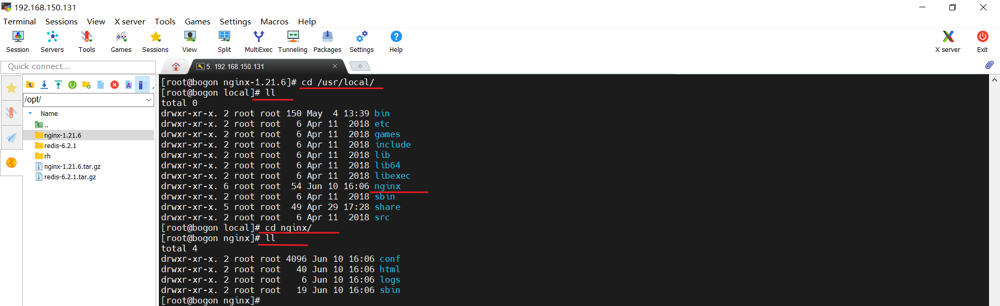
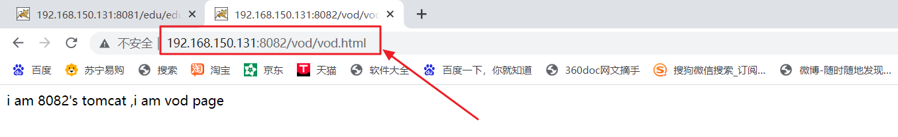
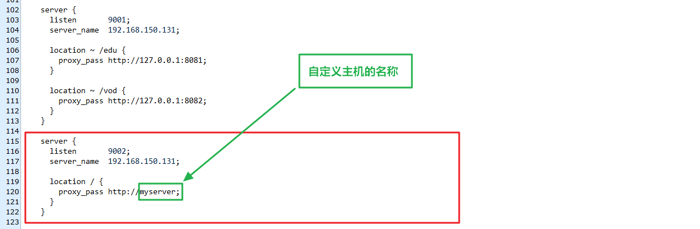

# Nginx课件

学习本课程之前请已经确保会如下知识

Linux基本操作


本课程对软硬件要求

- Centos7以及以上版本
- 内存：建议8G以上
- 磁盘：建议使用SSD
- CPU：4核以上主流即


## Nginx简介

Nginx (engine x) 是一个高性能的HTTP和反向代理web服务器，同时也提供了 IMAP/POP3/SMTP服务。Nginx是由伊戈尔·赛索耶夫为俄罗斯访问量第二的 Rambler.ru站点（俄文：Рамблер）开发的，第一个公开版本0.1.0发布于2004 年10月4日。 其将源代码以类BSD许可证的形式发布，因它的稳定性、丰富的功能集、简单的配 置文件和低系统资源的消耗而闻名。2011年6月1日，nginx 1.0.4发布。 Nginx是一款轻量级的Web 服务器/反向代理服务器及电子邮件（IMAP/POP3） 代理服务器，在BSD-like 协议下发行。其特点是**占有内存少，并发能力强**，事实 上nginx的并发能力在同类型的网页服务器中表现较好，中国大陆使用nginx网站 用户有：百度、京东、新浪、网易、腾讯、淘宝等。


### Nginx作为web服务器

Nginx可以作为静态页面的web服务器，同时还支持CGI 协议的动态语言，比如perl、php等。但是不支持 java。Java程序只能通过与tomcat配合完成。**Nginx专为性能优化而开发**，性能是其最重要的考量,实现上非常注重效率，能经受高负载的考验,有报告表明能支持高达50,000个并发连接数。 


Nginx的主要功能有如下四个

- 反向代理
- 负载均衡
- 动静分离
- 高可用


### 正向代理

客户端想要访问A服务器，因为某些原因不能直接访问，那么就必须在浏览器中配置一个代理服务器B，客户端浏览器通过访问代理服务器B，服务器B再去访问服务器A，最终将服务器A的资源返回到客户端浏览器，这就是正向代理。

好比你租一个房子（想要访问A服务器），但是你需要一个中介（因为你不认识房东），最终通过中介将房子租下来（通过服务器B将服务器A的资源返回给客户端浏览器）。


一句话总结 ： 正向代理中，客户端对于代理服务器的感知是明确的，知道的。


### 反向代理

反向代理就是你租房子，虽然你在跟中介打交道，但是你不知道和你打交道的是中介，你以为是房东本人。也就是说客户端对代理是**无感知**的，因为客户端不需要任何配置就可以访问，我们只需要将请求发送到反向代理服务器，由反向代理服务器去选择目标服务器获取数据后，在返回给客户端，此时反向代理服务器和目标服务器对外就是**一个服务器**，暴露的是代理服务器地址，隐藏了真实服务器IP地址。


一句话总结 ： 反向代理中，客户端不知道代理服务器的存在。


### 负载均衡

当用户数量足够多的时候，单个服务器难以支持这么多用户的访问，这个时候我们可以增加服务器的数量，然后将请求分发到各个服务器上，将原先请求集中到单个服务器上的情况改为将请求分发到多个服务器上，将负载分发到不同的服务器，也就是我们所说的负载均衡。


### 动静分离

为了加快网站的解析速度，可以把动态页面和静态页面由不同的服务器来解析，加快解析速度。降低原来单个服务器的压力。


### Nginx版本介绍

常用版本分为四大阵营

- Nginx开源版：http://nginx.org/

  最干净，最纯粹的官方版本

- Nginx plus 商业版：https://www.nginx.com

  官方所出，功能丰富

- Openresty ：http://openresty.org

  第三方所出，完全开源免费，功能丰富

  By taking advantage of various well-designed [Nginx](http://openresty.org/en/nginx.html) modules...

- Tengine：http://tengine.taobao.org

Tengine是由淘宝网发起的Web服务器项目。它在[Nginx](http://nginx.org/)的基础上，针对大访问量网站的需求，添加了很多高级功能和特性。Tengine的性能和稳定性已经在大型的网站如[淘宝网](http://www.taobao.com/)，[天猫商城](http://www.tmall.com)等得到了很好的检验。它的最终目标是打造一个高效、稳定、安全、易用的Web平台。

从2011年12月开始，Tengine成为一个开源项目，Tengine团队在积极地开发和维护着它。Tengine团队的核心成员来自于[淘宝](http://www.taobao.com/)、[搜狗](http://www.sogou.com/)等互联网企业。Tengine是社区合作的成果，我们欢迎大家[参与其中](http://tengine.taobao.org/source_cn.html)，贡献自己的力量。

**特性**

- 继承Nginx-1.18.0的所有特性，兼容Nginx的配置；
- 支持HTTP的[CONNECT](http://tengine.taobao.org/document_cn/proxy_connect_cn.html)方法，可用于正向代理场景；
- [支持异步OpenSSL](http://tengine.taobao.org/document_cn/ngx_http_ssl_asynchronous_mode_cn.html)，可使用硬件如:[QAT](http://tengine.taobao.org/document_cn/tengine_qat_ssl_cn.html)进行HTTPS的加速与卸载；
- 增强相关运维、监控能力,比如[异步打印日志及回滚](http://tengine.taobao.org/document_cn/ngx_log_pipe_cn.html),[本地DNS缓存](http://tengine.taobao.org/document_cn/core_cn.html),[内存监控](http://tengine.taobao.org/document_cn/ngx_debug_pool_cn.html)等；
- Stream模块支持[server_name](http://tengine.taobao.org/document_cn/stream_sni_cn.html)指令；
- 更加强大的负载均衡能力，包括[一致性hash模块](http://tengine.taobao.org/document_cn/http_upstream_consistent_hash_cn.html)、[会话保持模块](http://tengine.taobao.org/document_cn/http_upstream_session_sticky_cn.html)，[还可以对后端的服务器进行主动健康检查](http://tengine.taobao.org/document_cn/http_upstream_check_cn.html)，根据服务器状态自动上线下线，以及[动态解析upstream中出现的域名](http://tengine.taobao.org/document_cn/http_upstream_dynamic_cn.html)；
- [输入过滤器机制](http://blog.zhuzhaoyuan.com/2012/01/a-mechanism-to-help-write-web-application-firewalls-for-nginx/)支持。通过使用这种机制Web应用防火墙的编写更为方便；
- 支持设置proxy、memcached、fastcgi、scgi、uwsgi[在后端失败时的重试次数](http://tengine.taobao.org/document_cn/ngx_limit_upstream_tries_cn.html)；
- [动态脚本语言Lua](https://github.com/alibaba/tengine/blob/master/modules/ngx_http_lua_module/README.markdown)支持。扩展功能非常高效简单；
- 支持按指定关键字(域名，url等)[收集Tengine运行状态](http://tengine.taobao.org/document_cn/http_reqstat_cn.html)；
- [组合多个CSS、JavaScript文件的访问请求变成一个请求](http://tengine.taobao.org/document_cn/http_concat_cn.html)；
- [自动去除空白字符和注释](http://tengine.taobao.org/document_cn/http_trim_filter_cn.html)从而减小页面的体积
- 自动根据CPU数目设置进程个数和绑定CPU亲缘性；
- [监控系统的负载和资源占用从而对系统进行保护](http://tengine.taobao.org/document_cn/http_sysguard_cn.html)；
- [显示对运维人员更友好的出错信息，便于定位出错机器；](http://tengine.taobao.org/document_cn/http_footer_filter_cn.html)；
- [更强大的防攻击（访问速度限制）模块](http://tengine.taobao.org/document_cn/http_limit_req_cn.html)；
- [更方便的命令行参数，如列出编译的模块列表、支持的指令等](http://tengine.taobao.org/document_cn/commandline_cn.html)；
- [支持Dubbo协议](https://github.com/alibaba/tengine/blob/master/docs/modules/ngx_http_dubbo_module_cn.md)；
- 可以根据访问文件类型设置过期时间；
- ……


## Nginx安装

### 准备工作

​	

​	准备一台虚拟机，能够访问外网。

​	本课件准备的系统为Centos 7,配置的ip地址为192.168.150.131


### 开始安装


1. 将安装包上传到虚拟机中 ： 上传路径 ： /opt

2. 解压缩到当前目录 ：/opt/nginx-1.21.6

   

   

   

3. 安装nginx需要依赖的库文件

   

   **安装gcc编译器**

   ```html
   yum install -y gcc 
   ```

   

   

   

   

   **安装perl库**

   ```html
   yum install -y pcre pcre-devel
   ```

   

   

   

   **安装zlib库**

   ```html
   yum install -y zlib zlib-devel
   ```

    

   

   

4. 开始安装

   ```html
   ./configure --prefix=/usr/local/nginx
   make
   make install
   ```

     

   **进入nginx-1.21.6目录，查看所有文件**

   

   

   

   **指定安装到/usr/local/nginx目录中**

   

   

   

   **执行make命令**

   进入安装目录，开始编译

   

   

   

   **执行make install命令**

   开始安装

   

   安装完成！

   

   **进入/usr/local目录**

   可以看到，nginx目录已经生成，里边已经有安装文件

   

   

   

   

5. 启动nginx服务

   **相关命令**

   进入安装好的目录 /usr/local/nginx/sbin

   ```html
   ./nginx 启动
   ./nginx -s stop 快速停止
   ./nginx -s quit 优雅关闭，在退出前完成已经接受的连接请求
   ./nginx -s reload 重新加载配置
   ./nginx -v 查看版本号
   pcre-config --version 查看版本号
   ```

   

   

   

   **查看结果**

   

   

   

6. 编写脚本开启nginx服务

   为了以后启动nginx服务方便，我们编写lua脚本，将它安装成系统服务。

   

   **创建服务脚本**

   ```html
   vi /usr/lib/systemd/system/nginx.service
   ```

   

   **服务脚本内容**

   ```html
   [Unit]
   Description=nginx - web server
   After=network.target remote-fs.target nss-lookup.target
   [Service]
   Type=forking
   PIDFile=/usr/local/nginx/logs/nginx.pid
   ExecStartPre=/usr/local/nginx/sbin/nginx -t -c /usr/local/nginx/conf/nginx.conf
   ExecStart=/usr/local/nginx/sbin/nginx -c /usr/local/nginx/conf/nginx.conf
   ExecReload=/usr/local/nginx/sbin/nginx -s reload
   ExecStop=/usr/local/nginx/sbin/nginx -s stop
   ExecQuit=/usr/local/nginx/sbin/nginx -s quit
   PrivateTmp=true
   [Install]
   WantedBy=multi-user.target
   ```

   大家可以看到，脚本中各种路径其实都是指向了nginx的安装路径/usr/local/nginx，大家使用脚本的时候只需要将里边的路径替换成自己的nginx安装路径即可。

   

   

   **重新加载系统服务**

   ```html
   systemctl daemon-reload
   ```

   

   

   **启动服务**
   
   ```html
systemctl start nginx.service
   ```

   

   大家可以看到，使用系统服务命令，可以正常开启nginx服务了

   

   

   

   

   

   

   **配置开机启动**
   
   ```html
systemctl enable nginx.service
   ```
   
   

## Nginx的配置文件


### 配置文件位置

nginx安装路径/conf/nginx.conf


### 配置文件简介

查看上述配置文件，我们可以很明显的将nginx..conf配置文件分为三部分:

1. 全局块
2. events块
3. http块


**全局块**

从配置文件开始到events 块之间的内容，主要会设置一些影响nginx服务器整体运行的配置指令，主要包括配置运行 Nginx服务器的用户(组)、允许生成的 worker process 数，进程PID存放路径、日志存放路径和类型以及配置文件的引入等。

比如上面第一行配置∶

```html
worker_processes  1;
```

配置Nginx启动的时候，开启的进程的数量。

这是Nginx服务器并发处理服务的关键配置，worker_ processes值越大，可以支持的并发处理量也越多，但是会受到硬件、软件等设备的制约。


**events块**

events 块涉及的指令主要影响Nginx服务器与用户的网络连接，常用的设置包括 : 

是否开启对多work process下的网络连接进行序列化，

是否允许同时接收多个网络连接，

选取哪种事件驱动模型来处理连接请求，

每个 wordprocess 可以同时支持的最大连接数等。

例如原配置文件中 配置如下 ：

```html
events {
    worker_connections  1024;
}
```

上述例子就表示每个 work process支持的最大连接数为1024.
这部分的配置对Nginx的性能影响较大，在实际中应该灵活配置。


**http块**

这算是Nginx服务器配置中最频繁的部分，代理、缓存和日志定义等绝大多数功能和第三方模块的配置都在这里,
需要注意的是: http块也可以包括http全局块、server 护。

http 全局块配置的指令包括文件引入、MIME-TYPE定义、日志自定义、连接超时时间、单链接请求数上限等。


**server块**

这块和虚拟主机有密切关系，虚拟主机从用户角度看，和一台独立的硬件主机是完全一样的，该技术的产生是为了节省互联网服务器硬件成本。
每个http 块可以包括多个server 块，而每个server 块就相当于一个虚拟主机。而每个server 块也分为全局server块，以及可以同时包含多个locaton块。


**全局server块**

最常见的配置是本虚拟机主机的监听配置和本虚拟主机的名称或IP配置。


**location块**

一个server 块可以配置多个location块。
这块的主要作用是基于Nginx服务器接收到的请求字符串（例如server_name/uri-string )，对虚拟主机名称(也可以是IP别名)之外的字符串(例如前面的/uri-string )进行匹配，对特定的请求进行处理。地址定向、数据缓存和应答控制等功能，还有许多第三方模块的配置也在这里进行。+


## 实战演练-配置反向代理(一)


### 最终实现效果

打开浏览器,在浏览器地址栏输入地址www.wangxiaoka.com，跳转到liunx系统tomcat主页面中。


### 准备工作

在Linux系统中安装JDK8，并且配置好环境变量

参考博客 ：https://blog.csdn.net/fishgeneral/article/details/125320254?spm=1001.2014.3001.5501


在Linux系统中安装Tomcat，使用8080端口号

参考博客 ：https://blog.csdn.net/fishgeneral/article/details/125321314?spm=1001.2014.3001.5501


### 开始配置


**配置host文件**

我们的目的是在浏览器输入www.wangxiaoka.com能够访问到ngnix（192.168.150.131），但是我们现在没有这个域名，所以直接访问会404.为了能够正常解析到域名，我们需要在hosts文件中添加ip到域名的映射，以模拟在现实中能够正常解析该域名的目标。

配置了hosts文件中的映射以后，我们在本机上访问www.wangxiaoka.com这个域名的时候，就会去访问对应的ip主机192.168.150.131了。


注意 ： 

hosts文件在C盘系统目录中，可能没有修改权限，最好将该文件在复制到其它位置以后再进行修改，修改好以后再粘贴回来到etc目录中即可。


**配置nginx**

编辑nginx的配置文件 **安装目录/nginx/conf/nginx.conf**


**流程说明**


### **查看效果图**


**注意事项**

1. nginx服务器监听80端口，所以Linux系统要开放80端口
2. Tomcat服务器监听8080端口，所以Linux系统要开放8080端口


## 实战演练-配置反向代理(二)

### 最终实现效果

使用nginx反向代理，根据访问的路径的不同，跳转到不同端口的服务中

1. nginx监听端口为9001
2. 访问http://192.168.150.131:9001/edu/*   直接跳转到127.0.0.1:8081
3. 访问http://192.168.150.131:9001/vod/*   直接跳转到127.0.0.1:8082

即 ：通过nginx反向代理，将包含edu路径的请求转发到8081服务器，将包含vod路径的请求转发到8082服务器。


### 准备工作

1. 开放8081，8082，9001三个端口号

2. 准备两个 tomcat服务器，一个使用8081端口，一个使用8082端口（ 需要修改tomcat的配置文件中使用的端口号 ）

3. 在两个Tomcat中分别创建测试页面

   1. 8081tomcat中创建edu目录和edu.html

      ```html
      i am 8081's tomcat , i am edu page
      ```

      

   2. 8082tomcat中创建vod目录和vod.html

      ```html
      i am 8082's tomcat ,i am vod page
      ```


**效果图**

直接访问两个tomcat都可以访问到里边的资源。





### 开始配置

修改nginx配置文件，增加一个虚拟主机的配置，里边会有当前虚拟主机监听的端口信息，转发地址信息等配置。一个server块中可以配置多个location块。


### 查看效果图

通过nginx反向代理，包含edu路径的请求转发到了8081服务器，包含vod路径的请求转发到了8082服务器。


### location块指令说明


```html
location [ = | ~ | ~* | ^~ ] {

}

=  : 用于不含正则表达式的uri前，要求请求字符串与uri严格匹配，如果匹配成功，就停止继续向下搜索并立即处理该请求。
~  : 用于表示uri包含正则表达式，并且区分大小写。
~* : 用于表示uri包含正则表达式，并且不区分大小写。
^~ : 用于不含正则表达式的uri前，要求Nginx服务器找到标识uri和请求字符串匹配度最高的 location后，立即使用此 location 处理请求，而不再使用	  location块中的正则uri和请求字符串做匹配。


注意:如果uri包含正则表达式，则必须要有~或者~*标识。

```


## 实战演练-配置负载均衡

概念复习 ：增加服务器的数量，然后将请求分发到各个服务器上，将原先请求集中到单个服务器上的情况改为将请求分发到多个服务器上，将负载分发到不同的服务器，也就是我们所说的负载均衡。


### 最终实现效果


多次访问http://192.168.150.131:9002/edu/*

将一部分请求分发到到127.0.0.1:8081服务器

将另一部分请求分发到到127.0.0.1:8082服务器


### 准备工作

8081端口服务器和8082端口服务器要具有相同的web资源。

目前，我们在8081端口服务器中有edu/edu.html资源，那么，也要在8082端口服务器中创建相同的web资源


8082tomcat中创建edu目录和edu.html

```html
i am 8082's tomcat , i am edu page
```


### 开始配置

在nginx的配置文件中，http块中，添加自定义虚拟主机的配置，里边列出来负责分担多个请求的tomcat服务器。

```html
    upstream myserver{
      server 127.0.0.1:8081;
      server 127.0.0.1:8082;
    } 
```


在nginx的配置文件中添加一个虚拟主机，监听9002端口。转发地址是根路径就可以。




### 查看效果图

不断点击浏览器刷新按钮，就可以看到8081端口服务器和8082端口服务器轮流接受nginx转发过来的请求，实现了负载均衡。


### nginx分配策略


**第一种 ： 轮询（默认）**

每个请求按时间顺序逐一分配到不同的后端服务器，如果后端服务器down掉，能自动剔除。


**第二种 ： weight**

weight代表权,重默认为1,权重越高被分配的客户端越多。

指定轮询几率，weight和访问比率成正比，用于后端服务器性能不均的情况。

例如 ：

```html
   upstream myserver{
      server 127.0.0.1:8081 weight 5;
      server 127.0.0.1:8082 weight 10;
    } 
```


**第三种 ： ip_hash**

每个请求按访间ip的 hash结果分配,这样每个访客固定访问一个后端服务器，可以解决session的问题。

例如:

```html
   upstream myserver{
	  ip_hash
      server 127.0.0.1:8081 ;
      server 127.0.0.1:8082 ;
    } 
```


**第四种 ： fair**

按后端服务器的响应时间来分配请求，响应时间短的优先分配。

```html
   upstream myserver{
	  ip_hash
      server 127.0.0.1:8081 ;
      server 127.0.0.1:8082 ;
	  fair
    } 
```


## 实战演练-配置动静分离

Nginx动静分离简单来说就是把动态跟静态请求分开,不能理解成只是单纯的把动态页面和静态页面物理分离。严格意义上说应该是动态请求跟静态请求分开，可以理解成使用Nginx处理静态页面，Tomcat 处理动态页面。动静分离从目前实现角度来讲大致分为两种：

一种是纯粹把静态文件独立成单独的域名,放在独立的服务器上,也是目前主流推崇的方案;

另外一种方法就是动态跟静态文件混合在一起发布，通过nginx来分开。

通过location 指定不同的后缀名实现不同的请求转发。

通过 expires参数设置，可以使浏览器缓存过期时间，减少与服务器之前的请求和流量。

具体 Expires定义:是给一个资源设定一个过期时间,也就是说无需去服务端验证,直接通过浏览器自身确认是否过期即可，所以不会产生额外的流量。

此种方法非常适合不经常变动的资源。(如果经常更新的文件，不建议使用Expires来缓存)，我这里设置3d，表示在这3天之内访问这个URL，发送一个请求，比对服务器该文件最后更新时间没有变化，则不会从服务器抓取，返回状态码304，如果有修改，则直接从服务器重新下载，返回状态码200。


### 最终实现效果

访问http://192.168.150.131:9003/www/a.html  不再转发到tomcat服务器，而是获取Linux系统中的静态页面

访问http://192.168.150.131:9003/image/a.jpg   不再转发到tomcat服务器，而是获取Linux系统中的静态图片

也就是说，我们采用第一种方式实现动静分离 ： 将静态资源单独放置到一个独立的服务器中，这里我们就直接放在了nginx服务器所在的Linux系统中。


### 准备工作

在Linux系统的根目录中，创建一个data目录，里边分别创建www目录和images目录，用于存放静态页面和图片。


在www目录中创建a.html

```php+HTML
i am www's a.html
```


在images目录中随便放一张图片


### 开始配置

新增加一个虚拟主机，监听9003端口


### 查看效果图


## 实战演练-配置高可用

[高可用性](https://baike.baidu.com/item/高可用性/909038)H.A.（High Availability）指的是通过尽量缩短因日常维护操作（计划）和突发的系统崩溃（非计划）所导致的停机时间，以提高系统和应用的可用性。它与被认为是不间断操作的[容错技术](https://baike.baidu.com/item/容错技术/7120011)有所不同。HA系统是企业防止核心计算机系统因故障停机的最有效手段。


### 最终实现效果


高可用图解

1. 192.168.150.130 作为nginx主服务器
2. 192.168.150.131 作为nginx备份服务器
3. 用户访问使用keepalived虚拟出来的ip : 192.168.150.123
4. keepalived首先检测主服务器是否正常，如果正常，那么直接通过主服务器转发用户请求；如果主服务器宕机，那么使用备份服务器转发请求。


我们可以看到，在整个用户访问过程中，用户始终认为只有192.168.150.123，确保用户是无感知的。其次，多个nginx服务器共同工作，主服务器没宕机就始终工作，主服务器宕机就自动切换到了备份服务器工作，这样确保始终有服务器在工作，这就是高可用，也是企业防止核心计算机系统因故障停机的最有效手段。


### 准备工作

两台Linux虚拟机作为服务器，一台设置为192.168.150.130，一台设置为192.168.150.131

两台虚拟机都要安装nginx

两台虚拟机都要安装keepalived


keepalived yum 安装命令

```html
yum install keepalived -y
```


keepalived被安装在了/etc/keepalived目录中，keepalived的配置文件也在该目录中。


### 目前状态

192.168.150.131服务器是课程之前使用的服务器，里边安装了nginx，keepalived,JDK,omcat等几个软件。

其中Tomcat有三个，分别监听8080，8081，8082端口。

nginx里边配置了四个server块，分别监听了80，9001，9002，9003四个端口。


192.168.150.130服务器是新创建的，里边只安装了nginx和keepalived两个软件。我们让它监听80端口，给它的nginx配置一下反向代理。


### 开始配置


**配置两台服务器的keepalived**


将192.168.150.130主服务器中keepalived.conf文件修改成下列内容（清空文件内容，复制进去）

```html
global_defs {
	router_id xiaoka		#运行标识，目前随便写即可
}

vrrp_instance VI_1 {
	state MASTER			#主服务器上写MASTER
	interface ens33			#网卡名称，要和当前Linux系统的网卡名称一致
	virtual_router_id 51 	#主、备机的virtual router id必须相同
	priority 100			#主、备机取不同的优先级，主机值较大，备份机值较小
	advert_int 1			#检测时间间隔，发送心跳包
	authentication {        #认证信息，所有主，备份 系统中的信息需要一致
		auth_type PASS
		auth_pass 1111
	}
	virtual_ipaddress {
		192.168.150.150		#VRRP虚拟地址
	}
 }
```


在192.168.150.130主服务器的/usr/local /src/路径中创建nginx_check.sh文件，该脚本用于检测nginx是否还在正常运行。

```html
# !/ bin/bashl
A=`ps -c nginx -no-header |wc -l`
if [$A -eq 0 ] ; then
  /usr/local/nginx/sbin/nginx
  sleep 2
if [ `ps -C nginx --no-header |wc -l`-eq 0 ] ;then
  killall keepalived
  fi
fi
```


将192.168.150.131备份服务器中keepalived.conf文件修改成下列内容（清空文件内容，复制进去）

```html
global_defs {
	router_id xiaoxiao
}

vrrp_instance VI_1 {
	state BACKUP			#备份服务器写BACKUP
	interface ens33			#网卡
	virtual_router_id 51 	#主、备机的virtual router id必须相同
	priority 90				#主、备机取不同的优先级，主机值较大，备份机值较小
	advert_int 1
	authentication {
		auth_type PASS
		auth_pass 1111
	}
	virtual_ipaddress {
		192.168.150.150		#VRRP H虚拟地址
	}
 }
```


在192.168.150.131备份服务器的/usr/local /src/路径中创建nginx_check.sh文件，该脚本用于检测nginx是否还在正常运行。

```html
# !/ bin/bashl
A=`ps -c nginx -no-header |wc -l`
if [$A -eq 0 ] ; then
  /usr/local/nginx/sbin/nginx
  sleep 2
if [ `ps -C nginx --no-header |wc -l`-eq 0 ] ;then
  killall keepalived
  fi
fi
```


开启两台服务器的nginx

开启两台服务器的keepalived

开启备份服务器中的Tomcat(因为我们的备份服务器中的Nginx要跳转到它里边的Tomcat中，这是之前课程中设置好的)

**keepalived相关命令**

```html
systemctl start keepalived.service
systemctl stop keepalived.service
systemctl status keepalived.service 查看keepalived状态
```


### 查看效果图

因为主服务器中没有配置nginx跳转，所以在主服务器开启的情况下，访问虚拟IP，返回的是nginx的默认界面。


关闭主服务器，访问虚拟ip，返回的则是备份服务器中nginx，而它配置了跳转，所以展示的不是nginx的默认界面。


刻意让两台服务器的nginx展示不同的界面，充分说明了两台nginx已经变成了主-备份的形式，实现了高可用的集群效果。

至于，主服务器和备份服务器中的nginx，没有人规定它们必须跳转到相同的地方，也没有人规定它们必须跳转到不同的地方，所以，keepalived只是负责将主-备份服务器中的nginx“联系”起来，至于它们分别要跳转到什么地方，完全由自己的业务决定。


需要说明的是，到这里nginx的学习才刚刚开始，而不是结束，想要成为一名nginx专家，同学们还有许多路要走，你我共勉！


<h1 align="center">全书(完)</h1>
