# Git课件


## 概述

### Git简介

Git 是一个**免费的、开源的分布式版本控制系统**，可以快速高效地处理从小型到大型的各种项目。 

Git 易于学习，占地面积小，性能极快。 它具有廉价的本地库，方便的暂存区域和多个工作 流分支等特性。

其性能优于 Subversion、CVS、Perforce 和 ClearCase 等版本控制工具。


### 何为版本控制


版本控制是一种记录文件内容变化，以便将来查阅特定版本修订情况的系统。 版本控制其实最重要的是可以记录文件修改历史记录，从而让用户能够查看历史版本， 方便版本切换。


### 为什么需要版本控制

我们写的代码不可能一蹴而就，肯定要更新，那么每次更新都需要如下图一样备份一份出来，太麻烦了。

更重要的是，开发过程中是团队协作，多个人共同参与一套代码的开发，很显然，没有一个“软件工具”来管理的话，这将会是一场“灾难”。


而版本控制工具则可以帮我们很好的解决团队开发所带来的各种各样的问题。


### 常见的版本控制工具

1. 集中式版本控制工具
2. 分布式版本控制工具


**集中式版本控制工具**

CVS、SVN(Subversion)、VSS…… 集中化的版本控制系统诸如 CVS、SVN 等，都有一个单一的集中管理的服务器，保存 所有文件的修订版本，而协同工作的人们都通过客户端连到这台服务器，取出最新的文件或 者提交更新。多年以来，这已成为版本控制系统的标准做法。 这种做法带来了许多好处，每个人都可以在一定程度上看到项目中的其他人正在做些什 么。而管理员也可以轻松掌控每个开发者的权限，并且管理一个集中化的版本控制系统，要 远比在各个客户端上维护本地数据库来得轻松容易。 事分两面，有好有坏。这么做显而易见的缺点是中央服务器的单点故障。如果服务器宕 机一小时，那么在这一小时内，谁都无法提交更新，也就无法协同工作。


**分布式版本控制工具**

Git、Mercurial、Bazaar、Darcs…… 像 Git 这种分布式版本控制工具，客户端提取的不是最新版本的文件快照，而是把代码 仓库完整地镜像下来（本地库）。这样任何一处协同工作用的文件发生故障，事后都可以用 其他客户端的本地仓库进行恢复。因为每个客户端的每一次文件提取操作，实际上都是一次 对整个文件仓库的完整备份。 分布式的版本控制系统出现之后,解决了集中式版本控制系统的缺陷: 1. 服务器断网的情况下也可以进行开发（因为版本控制是在本地进行的） 2. 每个客户端保存的也都是整个完整的项目（包含历史记录，更加安全）


###  Git 简史


###  Git 工作机制


### Git 和代码托管中心

代码托管中心是基于网络服务器的远程代码仓库，一般我们简单称为远程库。 

➢ 局域网 

​	GitLab 

➢ 互联网 

​	GitHub（外网） 

​	Gitee 码云（国内网站）


## Git 安装

官网地址： https://git-scm.com/ 

查看 GNU 协议，可以直接点击下一步。


选择 Git 安装位置，要求是非中文并且没有空格的目录，然后下一步。

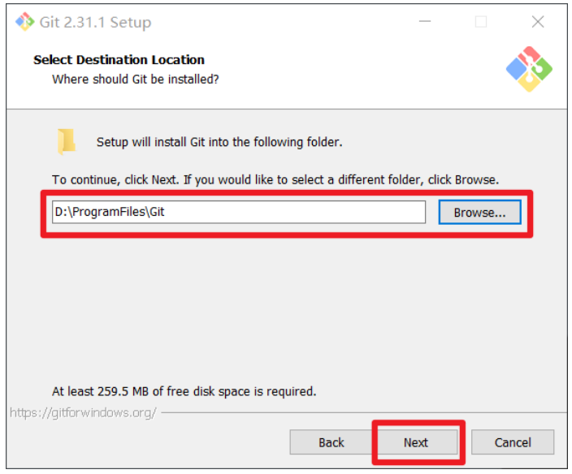


Git 选项配置，推荐默认设置，然后下一步。


Git 安装目录名，不用修改，直接点击下一步

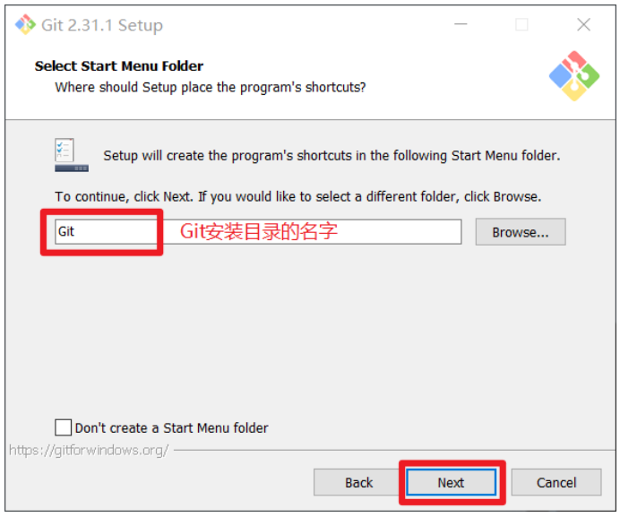


Git 的默认编辑器，建议使用默认的 Vim 编辑器，然后点击下一步。


默认分支名设置，选择让 Git 决定，分支名默认为 master，下一步。


修改 Git 的环境变量，选第一个，不修改环境变量，只在 Git Bash 里使用 Git。


选择后台客户端连接协议，选默认值 OpenSSL，然后下一步。


配置 Git 文件的行末换行符，Windows 使用 CRLF，Linux 使用 LF，选择第一个自动 转换，然后继续下一步。


选择 Git 终端类型，选择默认的 Git Bash 终端，然后继续下一步


选择 Git pull 合并的模式，选择默认，然后下一步


选择 Git 的凭据管理器，选择默认的跨平台的凭据管理器，然后下一步。


其他配置，选择默认设置，然后下一步


实验室功能，技术还不成熟，有已知的 bug，不要勾选，然后点击右下角的 Install 按钮，开始安装 Git。


点击 Finsh 按钮，Git 安装成功


右键任意位置，在右键菜单里选择 Git Bash Here 即可打开 Git Bash 命令行终端。


在 Git Bash 终端里输入 git --version 查看 git 版本，如图所示，说明 Git 安装成功


## Git 常用命令


| 命令名称                                                | 作用                                  |
| ------------------------------------------------------- | ------------------------------------- |
| git config --配置文件范围 user.name 用户名              | 设置用户签名                          |
| git config --配置文件范围 user.email 邮箱               | 设置用户签名邮箱                      |
| git config --配置文件范围--unset user.name              | 取消用户签名                          |
| git config --配置文件范围--unset user.email             | 取消用户签名邮箱                      |
| git config --配置文件范围 -l                            | 查看用户签名信息(最后那个是L)         |
| <font color=red>git init</font>                         | <font color=red>初始化本地库</font>   |
| <font color=red>git status </font>                      | <font color=red>查看本地库状态</font> |
| <font color=red>git add 文件名 </font>                  | <font color=red>添加到暂存区</font>   |
| <font color=red>git commit -m "日志信息" 文件名 </font> | <font color=red>提交到本地库</font>   |
| <font color=red>git reflog </font>                      | <font color=red>查看历史记录</font>   |
| <font color=red>git reset --hard 版本号 </font>         | <font color=red>版本穿梭</font>       |


### 创建本地版本库

什么是版本库呢？版本库又名仓库，英文名**repository**，你可以简单理解成一个目录，这个目录里面的所有文件都可以被Git管理起来。

所以，创建一个本地版本库就是让git管理一个目录而已。这个目录中所有的文件的修改、删除，Git都能跟踪，以便任何时刻都可以追踪历史，或者在将来某个时刻可以“还原”。

所以，这永远是git操作的第一步！

**基本语法**

```html
git init
```


**操作演示**

第一步 ：

```html
创建一个空的目录作为git管理的目录，例如d:/gitworkspace，如果你使用Windows系统，为了避免遇到各种莫名其妙的问题，请确保目录名（包括父目录）不包含中文。
```

第二步 ：

```html
通过`git init`命令把这个目录变成Git可以管理的仓库
```

瞬间Git就把仓库建好了，而且告诉你是一个空的仓库（empty Git repository），细心的读者可以发现当前目录下多了一个`.git`的目录，这个目录是Git来跟踪管理版本库的，没事千万不要手动修改这个目录里面的文件，不然改乱了，就把Git仓库给破坏了。

如果你没有看到`.git`目录，那是因为这个目录默认是隐藏的，用`ls -ah`命令就可以看见。

```html
注意 ：一台电脑上可以创建多个本地版本库
```


**图示结果**

图片一


图片二


### 设置用户签名


设置用户签名的含义就是说当前仓库是谁在操作。

说明： 签名的作用是区分不同操作者身份，所以随便给自己设置一个用户名称和邮箱即可。

用户的签名信息在每一个版本的提交信息中能够看 到，以此确认本次提交是谁做的。Git 首次安装必须设置一下用户签名，否则无法提交代码。 

※注意：这里设置用户签名和将来登录 GitHub（或其他代码托管中心）的账号没有任 何关系。


**基本语法** 

```html
git config --配置文件范围 user.name 用户名 

git config --配置文件范围 user.email 邮箱
```

```html
配置文件范围有三个取值 ：
local : 本地配置是对单个Git仓库的配置,即:项目级别/仓库级别，仅在当前本地仓库有效 ,
system : 系统级别的配置,对应的是所有操作系统的用户
golbal : 全局配置对应的是单个系统用户对所有Git仓库的配置 即 ：系统用户级别，全局配置（登录当前操作系统的用户范围）

所以综上所述，在一台计算机中，系统用户只能有一个，全局用户是每一个用户可以设置一个，本地用户可以设置多个（一个本地版本库对应一个）。
```


**操作演示**

在上一节内容，我们创建了三个版本库，D:/gitA,D:/gitB,D:/gitworkspace

现在，我们分别在gitA,gitB中设置本地用户签名，在gitworkspace中设置全局用户签名。设置好以后再分别查看所有的用户签名。


**设置局部用户签名**

```html
git config  user.name 用户名 

git config  user.email 邮箱
```


**设置全局用户签名**

```html
git config --global user.name 用户名

git config --global user.email 邮箱
```


查看三个仓库中的用户签名状态


因为gitworkspace只设置了全局用户签名，没有本地用户签名，所以它只能看到全局用户签名

因为gitA/gitB设置了本地用户签名，所以可以看到自己的本地用户签名和全局用户签名。

所以，用户签名的作用就是设置一个“标志”，设置一个“符号”，设置一个“身份证”，用来记录当前仓库中是谁在操作而已。跟自然人没有任何关系。

在实际开发中，我们是不会给每一个仓库设置一个本地用户的，又因为全局用户可以在所有的仓库中都看到，所以我们直接设置一个全局用户来操作所有的仓库即可。

因为在你自己的电脑上，无论有多少个仓库，永远只有你自己在操作，别人是不会碰你的电脑的。所以只要能区分出来你和其它人即可，所以完全没必要给每个仓库设置一个用户，那样只会把自己搞迷糊了。


所以，在接下来的学习中，如果非必要，我们所有的操作都在全局用户签名的gitworkspace中进行操作，这更符合实际工作中的状态。

如图所示


### 查看本地库状态


**基本语法**

```html
git status
```


**操作演示**


第一步 ：首次查看（工作区没有任何文件）


第二步 ：新创建一个文件，并输入内容


第三步 ：再次查看（检测到未追踪的文件）


红色状态的文件，表示git现在没有对其进行管理。


### 添加暂存区


添加倒暂存区的文件就可以被git管理了


**基本语法**

```html
git add 文件名
```


**操作演示**


添加到暂存区并再次查看本地库状态


可以看到文件名称已经不再是红色了，这表示该文件已经被git管理起来了。


### 提交本地库


**将暂存区的文件提交到本地库**

**基本语法**

```html
git commit -m "日志信息" 文件名
```


**操作演示**

提交到本地库，并且再次查看本地库的状态


可以看到，本地库状态说“没有文件需要提交”


### 修改文件


**操作演示**

现在对文件做出修改


查看本地库状态

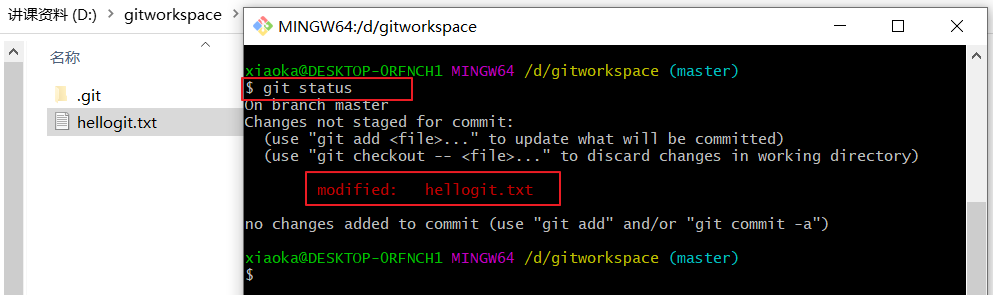

可以看到，文件的状态又变成了红色，并且提示该文件被修改过


再次将文件添加到暂存区


可以看到，文件颜色又变成了绿色，并且提示文件被修改过。

这种状态下的文件，我们才可以提交到本地版本库。


### 历史版本

为了方便学习该章节知识点，我们重新创建一个git的本地版本库，并创建一个文件，生成五次提交记录。如下图


**查看历史版本**


**基本语法**


查看历史版本信息

```html
git reflog 
```


查看版本详细信息

```
git log 
```


**操作演示**

git reflog 操作演示


可以看到，一共有五次提交记录，并且是简要信息


git log 操作演示


可以看到，五次提交的详细信息


### 版本回退


**基本语法**

```html
git reset --hard 版本号
```


**操作演示**


## 分支操作


### 分支的概念


所以分支其实就是对主分支代码的“备份”，我们在分支中开发代码，期间无论出现了多少的错误，bug都无所谓，都不会影响主分支的代码，只有我们将自己分支的代码调整的没问题了，再将分支的代码合并到主分支中，然后再将主分支的代码打包发布到服务器运行。


而实际工作中，通常是以这样的形式存在。


###  分支的操作命令

| 命令名称            | 作用                         |
| ------------------- | ---------------------------- |
| git branch 分支名   | 创建分支                     |
| git branch -v       | 查看分支                     |
| git checkout 分支名 | 切换分支                     |
| git merge 分支名    | 把指定的分支合并到当前分支上 |


**查看分支**

**基本语法**

```html
git branch -v
```

**操作演示**


可以看到只有一个master分支，这个就是默认的主分支。


**创建分支**

**基本语法**

```
git branch 分支名 
```

**操作演示**

创建fenzhia,fenzhib,fenzhic三个分支，并再查看本地版本库的分支


**切换分支**

**基本语法**

```html
git checkout 分支名 
```


**操作演示**


**删除分支**

**基本语法**

```html
git branch -d 分支名称
```

**强制删除分支语法**

```html
git branch -D 分支名称
```


**操作演示**


随后补齐


### 分支操作演练-重要

在分支的概念章节，我们介绍了分支的作用 ： 同一个项目的开发（同一份代码），不同的人员使用不同的分支开发不同的功能，最后再将所有分支的代码合并到主分支中，从而最终组成一个完整的系统 ： “分而治之，互不影响，最终又合二为一“。


**前期准备**


在主分支master中创建一个learngit.txt，内容如下（前期章节已经创建完毕）

```html
i am learn git now 1!
i am learn git now 2!
i am learn git now 3!
i am learn git now 4!
i am learn git now 5!
```

创建三个分支，fenzhia,fenzhib,fenzhic分别代表三个开发人员。（上一章节已经创建）


**操作演示**

切换到fenzhia，编辑legrngit.txt文件，保存退出，代表了我们对原来代码的修改。

```html
i am learn git now 1!
i am learn git now 2!
i am learn git now 3!
i am learn git now 4!
i am learn git now 5!
i am fenzhia
i am coding function a!
```

然后再新增加一个文件fenahia.txt文件，进行简单的编辑,保存退出，代表了我们新增加了新的文件和功能。

```html
这是分支a新创建的文件
代表了分支a新增加的功能
```

然后分别将原文件和新增加的文件进行add,commit

最后，我们可以看到

1. 在fenzhia中新增加了一个文件fenzhia.txt
2. 无论在git控制台查看，还是查看本地文件，在分支a中legrngit.txt文件都得到了修改，

现在，最主要的操作来了，我们切换到其它三个分支中都可以看到，

1. 无论在控制台还是在git工作区中，原始文件learngit.txt都保持了原样
2. fenzhia新增加的文件，无论是在控制台还是在git工作区的本地目录中都无法看到。

到此，分支的”分而治之“体现出来。在稍后我们将再演示”合二为一“。


**演示结果一**


**演示结果二**


继续对fenzhib，fenzhic做类似的操作 ： 

1. 对原文件learngit.txt进行修改
2. 新增加一个文件

注意，通常master分支是主分支，用于保存“完好”的代码，所以，从来不在mater分支下操作。


**fenzhib的最终操作**

learngit.txt

```html
i am learn git now 1!
i am learn git now 2!
i am learn git now 3!
i am learn git now 4!
i am learn git now 5!
i am fenzhib
i am coding function b!
```

fenzhib.txt

```html
这是分支b新创建的文件
代表了分支b新增加的功能
```


**fenzhic的最终操作**

learngit.txt

```html
i am learn git now 1!
i am learn git now 2!
i am learn git now 3!
i am learn git now 4!
i am learn git now 5!
i am fenzhic
i am coding function c!
```

fenzhic.txt

```html
这是分支c新创建的文件
代表了分支c新增加的功能
```


到这里以后，我们可以更加深刻的体会到"分而治之"的思想，目前我们应该是这样的一个状态：

1. 在master分支下只能看到learngit.txt文件，且内容是

   ```html
   i am learn git now 1!
   i am learn git now 2!
   i am learn git now 3!
   i am learn git now 4!
   i am learn git now 5!
   ```

   

2. 在fenzhia分支下只能看到learngit.txt和fenzhia.txt文件，且内容是

   ```html
   i am learn git now 1!
   i am learn git now 2!
   i am learn git now 3!
   i am learn git now 4!
   i am learn git now 5!
   i am fenzhia
   i am coding function a!
   ```

   ```html
   这是分支a新创建的文件
   代表了分支a新增加的功能
   ```

   

3. 在fenzhib分支下只能看到learngit.txt和fenzhib.txt文件，且内容是

   ```html
   i am learn git now 1!
   i am learn git now 2!
   i am learn git now 3!
   i am learn git now 4!
   i am learn git now 5!
   i am fenzhib
   i am coding function b!
   ```

   ```html
   这是分支b新创建的文件
   代表了分支b新增加的功能
   ```

   

4. 在fenzhic分支下只能看到learngit.txt和fenzhic.txt文件，且内容是

   ```html
   i am learn git now 1!
   i am learn git now 2!
   i am learn git now 3!
   i am learn git now 4!
   i am learn git now 5!
   i am fenzhic
   i am coding function c!
   ```

   ```html
   这是分支c新创建的文件
   代表了分支c新增加的功能
   ```

   


### 分支操作-合并分支

分支操作演练-重要这一章节中，我们充分体会到了“分而治之，互不影响”，接下来，应该让各个分支的代码合并到主分支master中，从而实现“合二为一”，最终变成一个完整的"系统"。


**基本语法**

```html
git merge 分支名
```

有A,B,C三个分支，加入我们要将C分支代码合并到A分支中，那么应该切换到A分支以后，再执行合并分支的命令。而通常，我们都是将分支代码合并到主分支master中，所以，通常我们是切换到master分支以后，进行分支合并的操作。


**操作演练**

我们在master分支中来合并fenzhia。


我们可以看到，在主分支master下可以看到fenzhia中的内容了。


### 冲突和解决冲突


继续合并fenzhib，这个时候我们发现，fenzhib.txt正常添加到了主分支中，但是learngit.txt文件却产生了冲突。


冲突产生的表现：后面状态为 MERGING

冲突产生的原因： 

合并分支时，两个分支在同一个文件的同一个位置有两套完全不同的修改。

Git 无法替 我们决定使用哪一个。必须人为决定新代码内容。 查看状态（检测到有文件有两处修改）

冲突产生的结果 ：

```html
i am learn git now 1!
i am learn git now 2!
i am learn git now 3!
i am learn git now 4!
i am learn git now 5!
<<<<<<< HEAD
i am fenzhia
i am coding function a!
=======
i am fenzhib
i am coding funtion b!
>>>>>>> fenzhib
```


特殊符号：

<<<<<<< HEAD 当前分支的代码 

======= 合并过来的代码 >>>>>>> fenzhib


文件中描述的很清楚，主分支中的内容是

```html
i am fenzhia
i am coding function a!
```

fenzhib中的内容是

```html
i am fenzhib
i am coding funtion b!
```

这些冲突的内容出现在了文件的同一个位置（都位于文件的最后两行），留下哪些内容，删除哪些内容，git当然没有办法替我们做主，所以，git提示合并分支产生冲突，需要人工手动决定留下哪些，删除哪些。


**解决冲突**

解决冲突非常简单，首先把三个分割符号<<<<<<<HEAD,=======,>>>>>>> 给删除，然后手动删除不需要的内容，留下需要的内容，然后再合并即可。


这里我们选择删除

```html
i am coding function a!
i am coding funtion b!
```

用于演示主分支和次分支都有留下和删除的东西。


把文件编辑好以后，不需要再次进行合并操作，只需要在主分支中进行add和commit操作即可。

注意，此时commit操作不需要加文件名称。


如法炮制，将fenzhic也合并到主分支中，这样三个分支就都合并到了主分支中，实现了全部的“二合一”。


## 多人协作机制

截至到目前为止，我们都是一个人在自己的PC端进行各种各样的分支，合并等操作，那么我们如何跟坐在旁边的同事协同工作呢？

这就涉及到本章的内容了 ： 多人协作机制，它具体分为团队内协作和跨团队协作。


**团队内协作**

顾名思义，就是大家在同一个公司中共同进行代码开发。其具体工作机制如图所示


**跨团队协作**

顾名思义，就是大家分别属于不同的公司中共同进行代码开发。其具体工作机制如图所示


通过两幅图，我们可以看到，无论是团队内协作还是跨团队的协作，都离不开一个很重要的部分，那就是远程仓库。所以，接下来的重中之中就是首先创建远程仓库。


### 远程仓库


GitHub是一个面向[开源](https://baike.baidu.com/item/开源/20720669)及私有[软件](https://baike.baidu.com/item/软件/12053)项目的托管平台，因为只支持Git作为唯一的版本库格式进行托管，故名GitHub。通常远程仓库就创建在这个网站。

所以，创建远程仓库，首先应该在GitHub上（网址：https://github.com/）注册一个账号。然后登陆上去。注意，该网站在国外，网络可能会卡顿。


**创建远程仓库**

登陆上github账号


远程仓库创建完成。


### 远程仓库常用命令

| 命令名称                           | 作用                                                     |
| ---------------------------------- | -------------------------------------------------------- |
| git remote -v                      | 查看当前所有远程地址别名                                 |
| git remote add 别名 远程地址       | 起别名                                                   |
| git push 别名 分支                 | 推送本地分支上的内容到远程仓库                           |
| git clone 远程地址                 | 将远程仓库的内容克隆到本地                               |
| git pull 远程库地址别名 远程分支名 | 将远程仓库对于分支最新内容拉下来后与当前本地分支直接合并 |


### **查看本地库关联的远程仓库**

**基于语法**

```html
git remote -v 
```


**操作演示**


### **添加远程仓库**

**基本语法**

```html
git remote add 别名 远程地址
```


**操作演示**

首先我们应该复制一下远程仓库的地址，它有两个地址，这两个地址都可以使用，打开github中的远程仓库就可以看到。


### **推送本地分支到远程仓库**


**基本语法**

```html
git push 远程仓库别名 分支名称 
```


**操作演示**


本地仓库已经提交到远程仓库中


系统中的认证凭据已经被保存


### 拉取远程库内容


**基本语法**

```html
git pull 远程库地址别名 远程分支名
```


**操作演示**
首先，我们直接在远程仓库对“代码”进行修改，模拟其它人对代码进行了修改和提交。


然后，再在本地仓库拉取远程仓库中的内容，可以看到，远程仓库的内容合并到了本地仓库中。


### 克隆远程仓库到本地

**基本语法**

```html
git clone 远程地址
```


**操作演示**

新创建一个目录D:/gitC,注意，然后再gitC目录中执行clone命令（不需要在这个目录中执行git init命令）。


小结：

1. 克隆操作是读取权限，对于公共仓库的代码，可以随意读取
2. 因为你不知道公司的github账号名称和仓库名称，所以克隆的地址通常由别人提供给你
3. clone 会做如下操作：

- 初始化本地仓库
- 拉取代码
- 创建远程仓库别名


### 团队内协作

截至到目前为止，所有的操作都是自己在本地操作然后再关联自己的远程仓库，还没有跟第二个人一起协同操作。

接下来，我们就正式进入多人协作机制 -- 团队内协作


**操作演示**


登陆 gitC这个gitHub账号

然后在浏览器地址栏上运行收到的邀请函（一个链接地址），点击接受邀请即可。


成功之后可以在 gitC这个账号上看到 git-Test 的远程仓库。

这样gitHub账号gitC就是git-Test 的团队内成员了。以后就可以编辑，提交代码资源到git-Test远程仓库了。


**操作演示**

在gitC目录中进行

--编辑 clone 下来的文件

--将编辑好的文件添加到暂存区

--将暂存区的文件上传到本地库

--将本地库的内容 push 到远程仓库

回到 fishgeneral的 GitHub 远程仓库中可以看到，最后一次是 gitC提交的

注意 ： windows只能保存一个凭据，所以，在往远程仓库push的时候，请先删除之前的凭据，否则你往A账号push，但是windows记录的是B账号的凭据，就会提示权限错误。


**总结**

我们在学习阶段通常是在一台电脑上进行如下的操作的。有两台电脑更好，更方便一些。


### **跨团队协作**


将远程仓库的地址复制，发给邀请跨团队协作的人，比如gitouter


在gitouter的 GitHub 账号里的地址栏复制收到的链接，然后点击 Fork 将项目叉到自 己的本地仓库。


叉成功后可以看到当前仓库信息。

gitouter就可以在线编辑叉取过来的文件。


编辑完毕后，填写描述信息并点击左下角绿色按钮提交


接下来点击上方的 Pull 请求，并创建一个新的请求


回到岳岳 fishgeneral账号可以看到有一个 Pull request 请求。


如果代码没有问题，可以点击 Merge pull reque 合并代码。


### SSH免密登陆

我们可以看到远程仓库中还有一个 SSH 的地址，因此我们也可以使用 SSH 进行访问。


**操作演示**

**第1步：**创建SSH Key。在用户主目录下，看看有没有.ssh目录，如果有，再看看这个目录下有没有`id_rsa`和`id_rsa.pub`这两个文件，如果已经有了，可直接跳到下一步。如果没有，打开Shell（Windows下打开Git Bash），创建SSH Key：

```html
$ ssh-keygen -t rsa -C "youremail@example.com"
```

你需要把邮件地址换成你自己的邮件地址，然后一路回车，使用默认值即可，由于这个Key也不是用于军事目的，所以也无需设置密码。

如果一切顺利的话，可以在用户主目录里找到`.ssh`目录，里面有`id_rsa`和`id_rsa.pub`两个文件，这两个就是SSH Key的秘钥对，`id_rsa`是私钥，不能泄露出去，`id_rsa.pub`是公钥，可以放心地告诉任何人。

**第2步：**登陆GitHub，打开“Account settings”，“SSH Keys”页面：

然后，点“Add SSH Key”，填上任意Title，在Key文本框里粘贴`id_rsa.pub`文件的内容：


接下来再往远程仓库 push 东西的时候使用 SSH 连接就不需要登录了。


##  IDEA 集成 Git

### 配置 Git 忽略文件

在实际开发中，我们会用IDE工具进行开发，这里边有很多是与项目无关的文件， 这些文件并不需要推送到远程仓库进行版本控制，所以我们要忽略这些文件。


**操作演示**

**第一步：**创建忽略规则文件 xxxx.ignore（前缀名随便起，建议是 git.ignore） 

这个文件的存放位置原则上在哪里都可以，为了便于让~/.gitconfig 文件引用，建议也放在用 户家目录下


git.ignore 文件模版内容如下：

```html
# Compiled class file
*.class
# Log file
*.log
# BlueJ files
*.ctxt
# Mobile Tools for Java (J2ME)
.mtj.tmp/
# Package Files #
*.jar
*.war
*.nar
*.ear
*.zip
*.tar.gz
*.rar
# virtual machine crash logs, see 
http://www.java.com/en/download/help/error_hotspot.xml
hs_err_pid*
.classpath
.project
.settings
target
.idea
*.iml
```


**第二步：**在.gitconfig 文件中引用忽略配置文件（此文件在 Windows 的家目录中）

```html
[user]
	name = wangxiaoka
	email = xiaoka@163.com
[core]
	excludesfile = C:/Users/xiaoka/git.ignore
```

```html
注意：这里要使用“正斜线（/）”，不要使用“反斜线（\）
```


**第三步 ：**在idea中配置git


### 初始化本地库

创建一个工程，例如：gitdemo

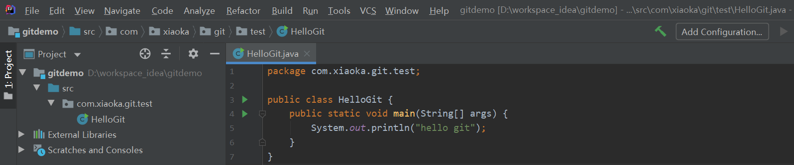


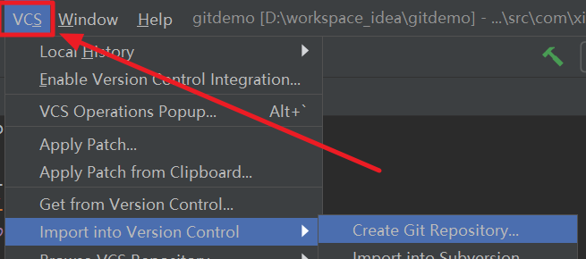


到这里，在idea中创建本地仓库就完成了。


### 添加暂存区

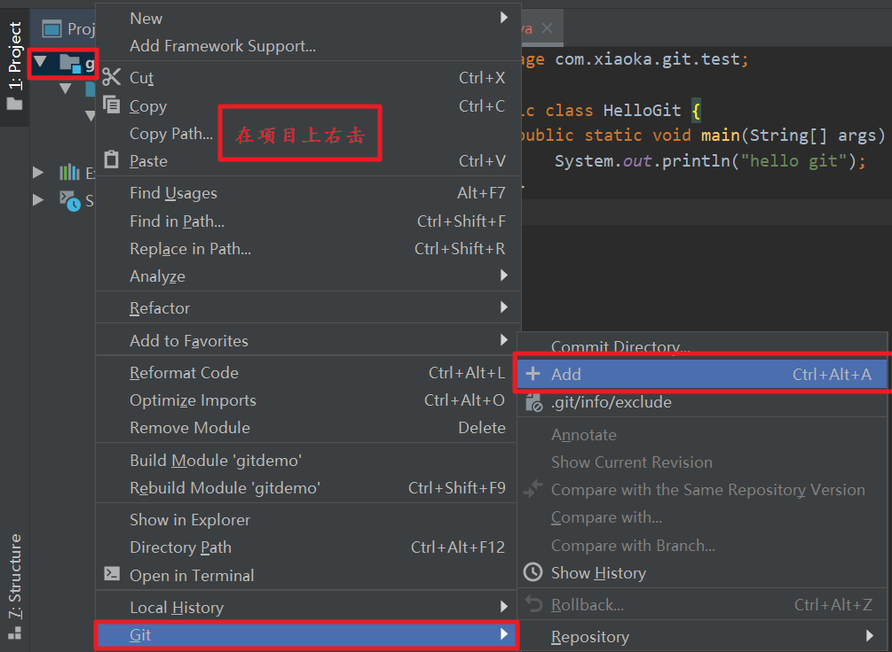


添加到暂存区以后，文件的状态就变成了绿色了。


### 提交本地库


提交本地库以后，文件的颜色又变成了正常的黑灰色。


### 切换版本


首先应该产生第二个版本

**操作演示**

1.正常对文件进行编辑 ： 例如


我们发现，只要文件和本地库不一样，就是蓝色的。


2.进行提交，生成第二个版本。


接下来，进行版本切换。


在IDEA的最下边，有version control的按钮，点击它，可以看到提交的日志。


### 创建分支


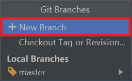


我们一共创建两个分支 ：fenzhiyi,fenzhier


### 切换分支


### 分支合并

现在，我们分别把master分支，fenzhiyi,fenzhier代码进行修改，并提交本地库


**master分支**

```html
public class HelloGit {
    public static void main(String[] args) {
        System.out.println("hello git");
        System.out.println("这是第二个版本");
        System.out.println("这是第二个版本");
        System.out.println("这是第二个版本");
        System.out.println("这是第三个版本");
        System.out.println("这是第三个版本");
        System.out.println("这是第三个版本");
        System.out.println("这是master分支");
        System.out.println("这是master分支");
    }
}
```


**fenzhiyi代码**

```html
public class HelloGit {
    public static void main(String[] args) {
        System.out.println("hello git");
        System.out.println("这是第二个版本");
        System.out.println("这是第二个版本");
        System.out.println("这是第二个版本");
        System.out.println("这是第三个版本");
        System.out.println("这是第三个版本");
        System.out.println("这是第三个版本");
        System.out.println("这是fenzhi  yi");
        System.out.println("这是fenzhi  yi");
    }
}
```


**fenzhier代码**

```html
public class HelloGit {
    public static void main(String[] args) {
        System.out.println("hello git");
        System.out.println("这是第二个版本");
        System.out.println("这是第二个版本");
        System.out.println("这是第二个版本");
        System.out.println("这是第三个版本");
        System.out.println("这是第三个版本");
        System.out.println("这是第三个版本");
        System.out.println("这是分支2");
        System.out.println("这是分支2");
    }
}
```


看看此时的日志情况 ： 分支和master没有合并到一起。


**开始合并**

随便选择一个分支合并到master中即可。这里我们随机选择了fenzhiyi


### **冲突产生**

冲突产生的原因之前学过了 ：要合并的两个分支在同一个文件的同一个位置有两套完全不同的修改。

我们在分支合并章节中，故意对三个分支的同一个文件的同一个位置进行了不同的修改，并且三个分支的代码都提交到了本地库，那么，合并的时候就一定会产生冲突。

如图所示


分支一合并进来到master分支以后，我们进行一次提交动作

然后再合并fenzhier,当然肯定会产生冲突。


**注意 ：** 

```html
分支合并以后自动提交本地库的，我们之所以fenzhiyi合并以后刻意提交一次，就是为了告诉大家fenzhier的一个合并状态和想象中的不一样。

合并分支不产生冲突就自动合并了，没啥可演示的
```


## IDEA集成GitHub


**创建Token**


去IDEA中进行登陆


点击登陆，就可以看到立即登陆成功。


## 分享工程到GitHub

分享工程到github其实就是做两件事情 ： 

1. 创建远程仓库
2. 将本地仓库push到远程仓库


```html
通常我们让远程仓库名称，远程仓库别名都和工程名称保持一致
以方便我们记忆操作
```


来到 GitHub 中发现已经帮我们创建好了 gitdemo 的远程仓库。

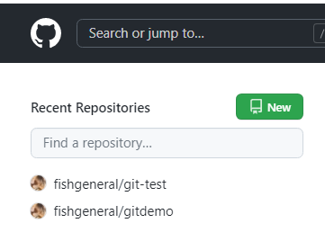


##  push 推送本地库到远程库


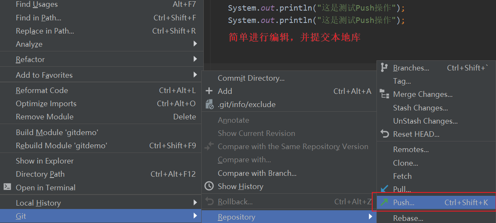


**复制远程仓库的SSH地址**


**填入到IDEA中**


注意 ： 使用SSH协议push到远程仓库，应该配置好本地账户使用SSH协议免密登陆。


**配置SSH协议免密登陆**

**第1步：**创建SSH Key。在用户主目录下，看看有没有.ssh目录，如果有，再看看这个目录下有没有`id_rsa`和`id_rsa.pub`这两个文件，如果已经有了，可直接跳到下一步。如果没有，打开Shell（Windows下打开Git Bash），创建SSH Key：


**命令**

```html
ssh-keygen -t rsa -C 你的邮箱(最好通过git config参数查看一下)
```


如果一切顺利的话，可以在用户主目录里找到`.ssh`目录，里面有`id_rsa`和`id_rsa.pub`两个文件，这两个就是SSH Key的秘钥对，`id_rsa`是私钥，不能泄露出去，`id_rsa.pub`是公钥，可以放心地告诉任何人。


**第2步：**登陆GitHub，打开“Account settings”，“SSH Keys”页面：

然后，点“Add SSH Key”，填上任意Title，在Key文本框里粘贴`id_rsa.pub`文件的内容：

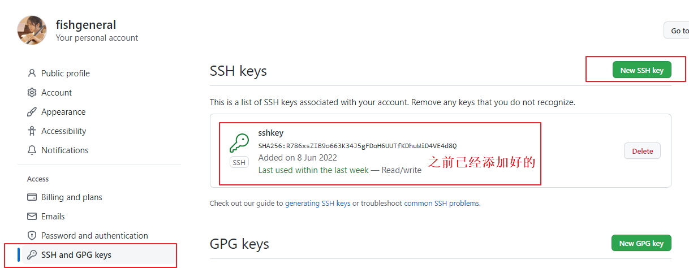

为什么GitHub需要SSH Key呢？因为GitHub需要识别出你推送的提交确实是你推送的，而不是别人冒充的，而Git支持SSH协议，所以，GitHub只要知道了你的公钥，就可以确认只有你自己才能推送。

当然，GitHub允许你添加多个Key。假定你有若干电脑，你一会儿在公司提交，一会儿在家里提交，只要把每台电脑的Key都添加到GitHub，就可以在每台电脑上往GitHub推送了。


```html
注意：push 是将本地库代码推送到远程库，如果本地库代码跟远程库代码版本不一致， push 的操作是会被拒绝的。也就是说，要想 push 成功，一定要保证本地库的版本要比远程 库的版本高！因此一个成熟的程序员在动手改本地代码之前，一定会先检查下远程库跟本地 代码的区别！如果本地的代码版本已经落后，切记要先 pull 拉取一下远程库的代码，将本地 代码更新到最新以后，然后再修改，提交，推送！
```


##  pull 拉取远程库到本地库


右键点击项目，可以将远程仓库的内容 pull 到本地仓库


```html
注意：pull 是拉取远端仓库代码到本地，如果远程库代码和本地库代码不一致，会自动
合并，如果自动合并失败，还会涉及到手动解决冲突的问题
```


##  clone 克隆远程库到本地

首先复制远程仓库的地址，因为你不知道人家的仓库在哪里，所以这个地址通常由别人提供给你。


## IDEA集成码云

众所周知，GitHub 服务器在国外，使用 GitHub 作为项目托管网站，如果网速不好的话， 严重影响使用体验，甚至会出现登录不上的情况。针对这个情况，大家也可以使用国内的项 目托管网站-码云。

码云是开源中国推出的基于 Git 的代码托管服务中心，网址是 https://gitee.com/ ，使用 方式跟 GitHub 一样，而且它还是一个中文网站，如果你英文不是很好它是最好的选择。


请大家自行注册账号


### 码云创建远程库


填写仓库名称，路径和选择是否开源（共开库或私有库）


最后根据需求选择分支模型，然后点击创建按钮


远程库创建好以后，就可以看到 HTTPS 和 SSH 的链接。

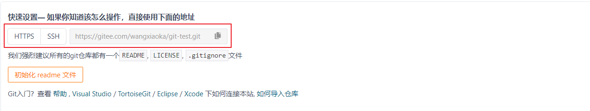


### IDEA 安装码云插件

Idea 默认不带码云插件，我们第一步要安装 Gitee 插件。 

如图所示，在 Idea 插件商店搜索 Gitee，然后点击右侧的 Install 按钮。


dea 重启以后在 Version Control 设置里面看到 Gitee，说明码云插件安装成功。

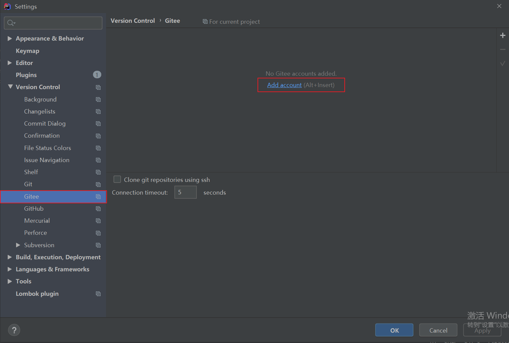


然后在码云插件里面添加码云帐号，我们就可以用 Idea 连接码云了。


### IDEA 连接码云

Idea 连接码云和连接 GitHub 几乎一样，首先在 Idea 里面创建一个工程，初始化 git 工 程，然后将代码添加到暂存区，提交到本地库，这些步骤上面已经讲过，此处不再赘述。


**将本地代码 push 到码云远程库**

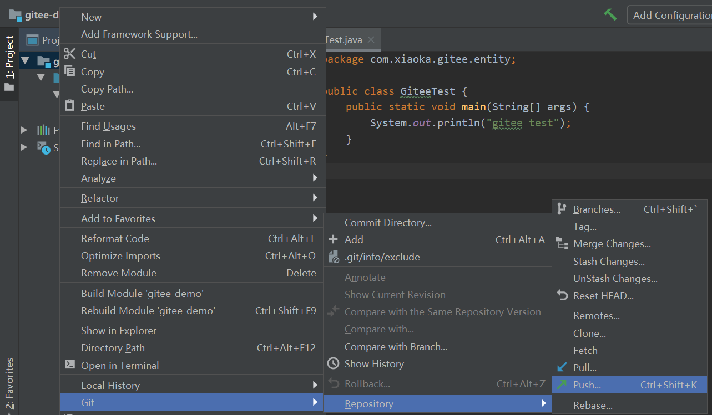


**自定义远程库链接**


给远程库链接定义个 name，然后再 URL 里面填入码云远程库的 HTTPS 链接即可。码云服务器在国内，用 HTTPS 链接即可，没必要用 SSH 免密链接。


**去码云远程库查看代码**


只要码云远程库链接定义好以后，对码云远程库进行 pull 和 clone 的操作和 Github 一 致，此处不再赘述。


##  **码云复制 GitHub 项目**


码云提供了直接复制 GitHub 项目的功能，方便我们做项目的迁移和下载。


**操作演示**

在码云创建仓库界面有导入github项目的按钮


将 GitHub 的远程库 HTTPS 链接复制过来，点击创建按钮即可。


如果 GitHub 项目更新了以后，在码云项目端可以手动重新同步，进行更新！


## 自建代码托管平台-GitLab


### GitLab简介

GitLab 是由 GitLabInc.开发，使用 MIT 许可证的基于网络的 Git 仓库管理工具，且具有 wiki 和 issue 跟踪功能。使用 Git 作为代码管理工具，并在此基础上搭建起来的 web 服务。 GitLab 由乌克兰程序员 DmitriyZaporozhets 和 ValerySizov 开发，它使用 Ruby 语言写 成。后来，一些部分用 Go 语言重写。截止 2018 年 5 月，该公司约有 290 名团队成员，以 及 2000 多名开源贡献者。GitLab 被 IBM，Sony，JülichResearchCenter，NASA，Alibaba， Invincea，O’ReillyMedia，Leibniz-Rechenzentrum(LRZ)，CERN，SpaceX 等组织使用。


GitLab 官网地址 官网地址：https://about.gitlab.com/ 

安装说明：https://about.gitlab.com/installation


### GitLab 安装

 **服务器准备** 

准备一个系统为 CentOS7 以上版本的服务器，要求内存 4G，磁盘 50G。

 关闭防火墙，并且配置好主机名和 IP，保证服务器可以上网。 

此教程使用虚拟机：主机名：gitlab-server IP 地址：192.168.6.200


**安装包准备**

Yum 在线安装 gitlab- ce 时，需要下载几百 M 的安装文件，非常耗时，所以最好提前把 所需 RPM 包下载到本地，然后使用离线 rpm 的方式安装。


下载地址：

```html
https://packages.gitlab.com/gitlab/gitlabce/packages/el/7/gitlab-ce-13.10.2-ce.0.el7.x86_64.rpm
```

使用如下教程，必须将将此包上传到服务器/opt/module 目录下，因为后面的安装脚本需要该目录。


**编写安装脚本**

安装 gitlab 步骤比较繁琐，因此我们可以参考官网编写 gitlab 的安装脚本。

```html
[root@gitlab-server module]# vim gitlab-install.sh
sudo rpm -ivh /opt/module/gitlab-ce-13.10.2-ce.0.el7.x86_64.rpm
sudo yum install -y curl policycoreutils-python openssh-server cronie
sudo lokkit -s http -s ssh
sudo yum install -y postfix
sudo service postfix start
sudo chkconfig postfix on
curl https://packages.gitlab.com/install/repositories/gitlab/gitlabce/script.rpm.sh | sudo bash
sudo EXTERNAL_URL="http://gitlab.example.com" yum -y install gitlabce

```


**给脚本增加执行权限**

```html
[root@gitlab-server module]# chmod +x gitlab-install.sh
[root@gitlab-server module]# ll
总用量 403104
-rw-r--r--. 1 root root 412774002 4 月 7 15:47 gitlab-ce-13.10.2-
ce.0.el7.x86_64.rpm
-rwxr-xr-x. 1 root root 416 4 月 7 15:49 gitlab-install.sh
```


然后执行该脚本，开始安装 gitlab-ce。注意一定要保证服务器可以上网。

```html
[root@gitlab-server module]# ./gitlab-install.sh 
警告：/opt/module/gitlab-ce-13.10.2-ce.0.el7.x86_64.rpm: 头 V4 
RSA/SHA1 Signature, 密钥 ID f27eab47: NOKEY
准备中... ################################# 
[100%]
正在升级/安装...
 1:gitlab-ce-13.10.2-ce.0.el7 
################################# [100%]
```


**初始化 GitLab 服务**

执行以下命令初始化 GitLab 服务，过程大概需要几分钟，耐心等待…

```html
[root@gitlab-server module]# gitlab-ctl reconfigure
。 。 。 。 。 。
Running handlers:
Running handlers complete
Chef Client finished, 425/608 resources updated in 03 minutes 08 
seconds
gitlab Reconfigured!

```


**启动 GitLab 服务**

执行以下命令启动 GitLab 服务，如需停止，执行 gitlab-ctl stop

```html
[root@gitlab-server module]# gitlab-ctl start
```


### 使用浏览器访问 GitLab

使用主机名或者 IP 地址即可访问 GitLab 服务。如果使用主机名称访问，需要提前配一下 windows 的 hosts 文件。


**windows的host文件**


然后使用修改后的密码登录 GitLab。


### GitLab 创建远程库


### IDEA 集成 GitLab


**安装 GitLab 插件**


**设置 GitLab 插件**


只要 GitLab 的远程库连接定义好以后，对 GitLab 远程库进行 pull 和 clone 的操作和 Github 和码云一致，此处不再赘述.

注意 ： gitlab 网页上复制过来的链接地址是一个模板：

```html
http://gitlab.example.com/root/git-test.git， 
```

需要手动修改为：

```html
http://gitlab-server/root/git-test.git
```


<p align="center" style="font-size:100px" >全书完！</p>

